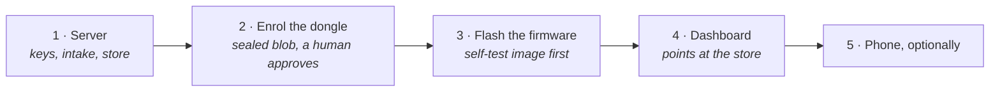

# Installing and building Cairn

Cairn is built from source; there are no prebuilt release artifacts yet, for any part.
(Publishing a flashable dongle image, and flashing it from a browser, is
[Phase 32](ROADMAP.md#phase-32--release-engineering-flash-it-from-a-browser--planned).)

**Each part lives in its own repository, and each repository's README is the authority on
building it.** This page is the order to do them in, and the few things that are only true
across repositories. Where this page and a repository's README disagree, the README is right.

| Part | Repository | Toolchain |
|---|---|---|
| Server, admin tools, the analytical store | [cairn-vehicle-server](https://github.com/ParkWardRR/cairn-vehicle-server) | Go; a C toolchain for `cairn-tsdb` (DuckDB via cgo); PostgreSQL with PostGIS for the decode tests only |
| Dongle firmware, and the emulator | [cairn-esp32-device-firmware](https://github.com/ParkWardRR/cairn-esp32-device-firmware) | PlatformIO (Arduino on ESP-IDF); Rust for the emulator; a C compiler for the host test suites |
| Web dashboard | [cairn-vehicle-web-dashboard](https://github.com/ParkWardRR/cairn-vehicle-web-dashboard) | Node.js, Nuxt |
| iPhone app | [cairn-ios-companion-app](https://github.com/ParkWardRR/cairn-ios-companion-app) | Xcode and Swift, on a Mac — `CairnRuntime` imports CoreBluetooth, CoreLocation, UIKit and CryptoKit, so it will not build on Linux |
| Modules and their generator | [cairn-modules](https://github.com/ParkWardRR/cairn-modules) | Rust for `modgen` |
| This repository's tools | here, [`tools/`](tools/README.md) | Go |

## What you need

- **A computer to run the server on.** A spare mini PC or a Raspberry Pi class machine is
  enough. It holds the keys and the trip history, so it should be a machine you keep.
- **A dongle.** A Freematics ONE+ (Model B if you want the cellular modem) and a microSD card.
- **A car with an OBD-II port.** Cairn reads standard OBD-II, and ships engine profiles for
  the BMW N20 and B58. Another engine means writing a profile, not editing firmware.
- **An iPhone, optionally.** The phone lends the dongle its GPS and can carry trips home. It
  is not required: the dongle records with nothing else present, and on a Model B it can
  upload over cellular by itself.

## The order

Do these in order; each one needs the one before it.



1. **Stand up the server.** Follow its README, then its
   [deploying guide](https://github.com/ParkWardRR/cairn-vehicle-server/blob/main/docs/deploying.md).
   This is where the receipt signing key and the keystore master key are created. **Back both
   up before anything else:** the dongle pins the receipt key in firmware, so losing it means
   reflashing every device, and destroying a storage root crypto-shreds that device's history
   in every copy, including backups.
2. **Enrol the dongle**, following
   [device-provisioning](https://github.com/ParkWardRR/cairn-vehicle-server/blob/main/docs/device-provisioning.md).
   The dongle emits a blob — its public key plus its storage root, sealed to the server's
   enrolment key — and a human approves it after comparing the fingerprint the dongle shows.
   No unauthenticated endpoint creates trust.
3. **Flash the firmware.** Flash the self-test image first: it checks CRC-32 through the ROM
   path, SHA-256, Ed25519 signing and verification, a framed write to the card, a seal and a
   live sync, and it is how you find out the card slot or the GNSS path is unhappy before a
   drive does.
   [flashing-and-testing](https://github.com/ParkWardRR/cairn-esp32-device-firmware/blob/main/docs/flashing-and-testing.md)
   has the bench procedure, and
   [hardware-roundtrip](https://github.com/ParkWardRR/cairn-esp32-device-firmware/blob/main/docs/hardware-roundtrip.md)
   the first end-to-end run.
4. **Point the dashboard at the store** and create your first passkey. See its README and
   [auth.md](https://github.com/ParkWardRR/cairn-vehicle-web-dashboard/blob/main/docs/auth.md).
   You can also just run its demo first, on invented drives, with no car and no dongle.
5. **Install the app**, if you want one. One QR code from the dashboard's Add-a-phone page
   configures it.

**Remote access is Tailscale on the server host**, never a port forward. One narrow exception
exists and it is deliberate: a raw-TCP Tailscale Funnel ingress for the dongle's cellular
uplink, where TLS is *not* terminated at the edge, so the mutual authentication survives end
to end and the Funnel edge carries ciphertext it cannot read. The **app** listener rejects
Funnel-marked requests outright.

## The contracts, and why every repository fetches them

Nothing vendors a protocol. Each repository pins a contracts release by **tag and commit** in
its `contracts.lock` and fetches it:

```bash
scripts/fetch-contracts.sh      # in any consuming repository
```

Both the tag and the commit are verified, so a moved tag cannot change what a build was
checked against. To change a contract and an implementation together on one machine, point
`CAIRN_CONTRACTS` at a local checkout's `contracts/` directory; release builds refuse the
override. Which repository is pinned to what, and what a bump would unblock, is in the
[README](README.md) and the [roadmap](ROADMAP.md#contract-pins-and-what-a-bump-unblocks).

Two consequences that will catch you out:

- **The firmware's engine schema lives here**, not in the firmware. A firmware change needing
  a new capture field is gated on a maintainer tagging a contracts release; `make
  engines-check` fails until then.
- **Adding a capture field means editing two files** —
  `contracts/engine/v1/acquisition.schema.json` (`$defs/field`) and
  `contracts/module/v1/module.schema.json` (`$defs/engine_field`) — or the vocabulary check
  fails CI by design. It has already caught one drift.

## Working on this repository

```bash
cd tools
go vet ./... && go test ./...
go run ./cmd/contract-check ../contracts           # every protocol version complete and valid
go run ./cmd/link-check -check -root ..            # every relative link in every .md resolves
go run ./cmd/pin-dashboard --readme ../README.md   # regenerate the pins block (--check to only test)
```

Links inside a repository are relative; links across repositories must be absolute URLs, and
`docs.yml` enforces it.

## Further reading

| Document | Contents |
|---|---|
| [README.md](README.md) | What Cairn is, how the pieces fit, the trust model in one page |
| [ROADMAP.md](ROADMAP.md) | The single roadmap for all six repositories |
| [docs/architecture.md](docs/architecture.md) | The component map: system diagram, core rules, listeners, data flow |
| [docs/trust-model-v3.md](docs/trust-model-v3.md) | Keys, identities, transports, and what is *not* claimed |
| [docs/threat-model.md](docs/threat-model.md) | Every threat with its mitigation and residual risk |
| [contracts/README.md](contracts/README.md) | The protocol table, versioning rules, and how a contract changes |
| [contracts/format/v3/spec.md](contracts/format/v3/spec.md) | The bundle format, normatively |
