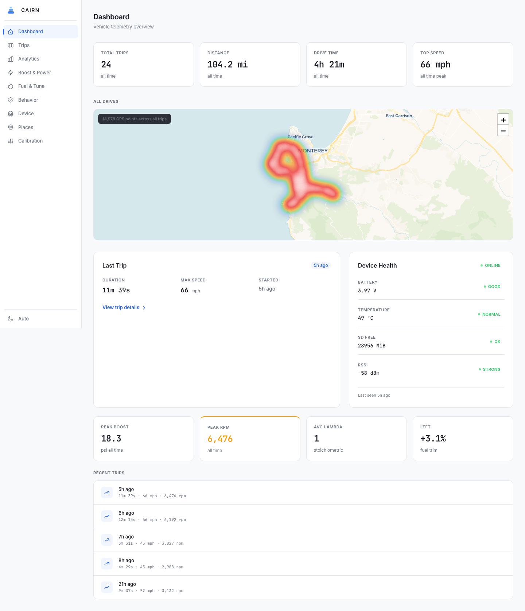
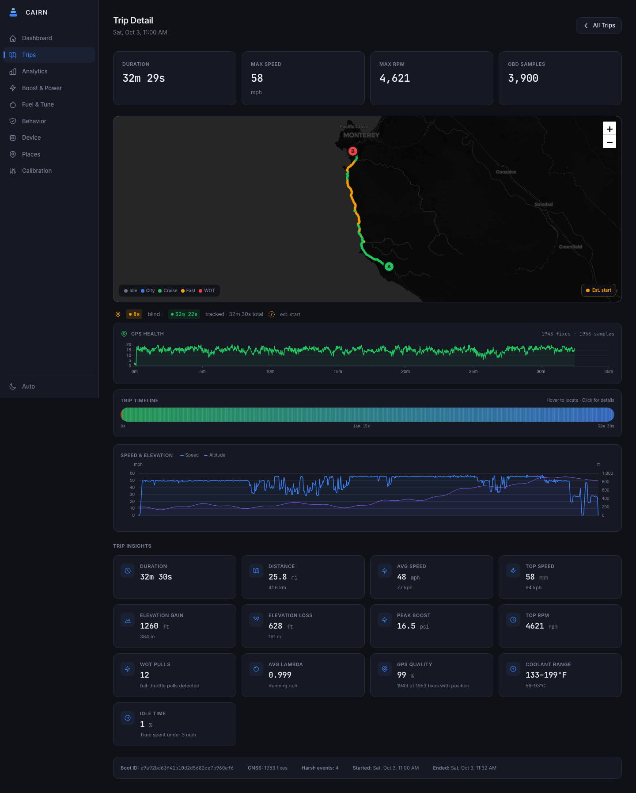
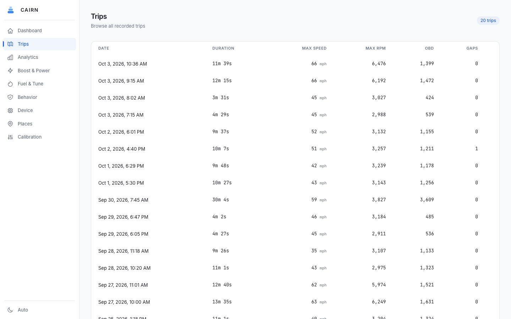
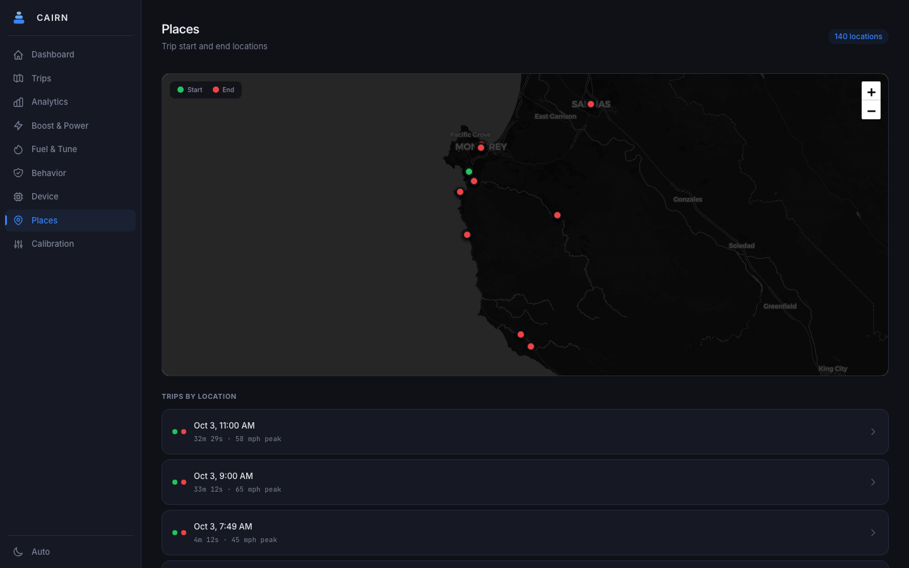
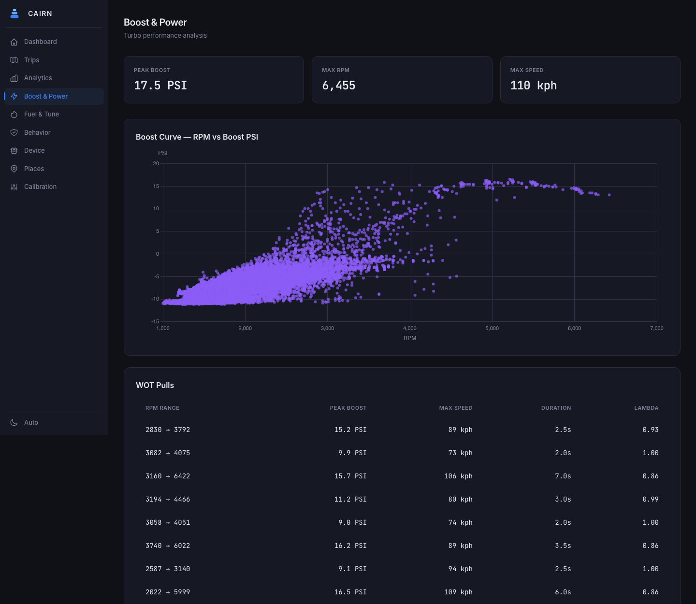
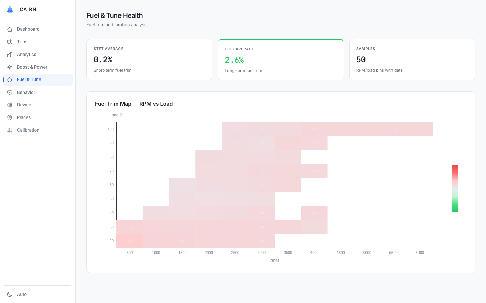
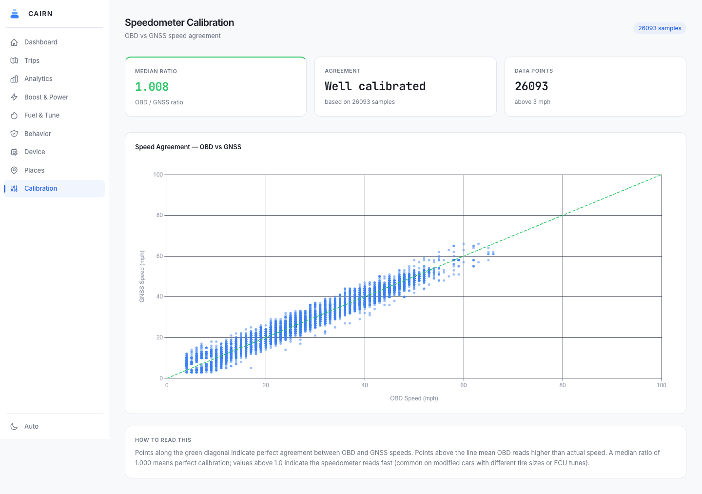

<p align="center">
  
</p>

<h1 align="center">Cairn</h1>
<p align="center"><strong>Offline-first car journal for your homelab</strong></p>
<p align="center"><em>Your drives. Your data. Your server. No cloud required.</em></p>

<p align="center">
  <a href="https://blueoakcouncil.org/license/1.0.0"></a>
  <a href="ROADMAP.md"></a>
  <a href="https://github.com/ParkWardRR/Cairn/actions"></a>
</p>

<p align="center">
  
  
  
  
  
  
  
  
</p>

<p align="center">
  
  
  
  
</p>

---

<p align="center">
  
</p>
<p align="center"><sub>Dashboard with trip totals, drive heatmap, last trip and device health (synthetic data)</sub></p>

---

## Screenshots

The Nuxt 3 dashboard (`ui/`) running against **invented data**: a fictional owner in Carmel-by-the-Sea, Monterey County, California, and two weeks of errands, beach and Mission runs, Point Lobos, Pebble Beach and Carmel Valley Road, all within a few miles of home. The roads are real; the drives, car and device are not. Nothing here comes from a real capture.

<table>
  <tr>
    <td width="50%"><a href="docs/screenshots/dashboard.png"></a><br><sub><b>Dashboard</b> — all-time totals, drive heatmap, last trip, device health</sub></td>
    <td width="50%"><a href="docs/screenshots/trip-detail.png"></a><br><sub><b>Trip detail</b> — speed-coloured route, GPS acquisition timing, estimated start, insights</sub></td>
  </tr>
  <tr>
    <td><a href="docs/screenshots/trips.png"></a><br><sub><b>Trips</b> — every boot with duration, peaks and capture gaps</sub></td>
    <td><a href="docs/screenshots/places.png"></a><br><sub><b>Places</b> — trip start and end locations</sub></td>
  </tr>
  <tr>
    <td><a href="docs/screenshots/boost.png"></a><br><sub><b>Boost &amp; Power</b> — boost curve and detected full-throttle pulls</sub></td>
    <td><a href="docs/screenshots/fuel.png"></a><br><sub><b>Fuel &amp; Tune</b> — fuel-trim map by RPM and load</sub></td>
  </tr>
  <tr>
    <td><a href="docs/screenshots/analytics.png"></a><br><sub><b>Analytics</b> — per-trip speed, RPM, boost, lambda, trims and temperatures</sub></td>
    <td><a href="docs/screenshots/behavior.png"></a><br><sub><b>Behavior</b> — G-force distribution and vibration from the IMU</sub></td>
  </tr>
  <tr>
    <td><a href="docs/screenshots/calibration.png"></a><br><sub><b>Calibration</b> — OBD speed against GNSS speed</sub></td>
    <td><a href="docs/screenshots/system.png"></a><br><sub><b>Device</b> — health history, decoded bundles, store status</sub></td>
  </tr>
</table>

<details>
<summary>Regenerating them</summary>

The data comes from `server/cmd/cairn-tsdb-demo`, which builds the production tsdb schema and views in memory and fills them with simulated drives along real road geometry (cached in `routes.json`; refresh with `-fetch`). It serves the same HTTP API as `cairn-tsdb`, so the UI cannot tell the difference.

```bash
cd server && go run ./cmd/cairn-tsdb-demo        # synthetic store on 127.0.0.1:8480
cd ui && npx nuxt dev                            # in a second terminal
cd ui && node scripts/screenshots.mjs http://localhost:3000 ../docs/screenshots
```

Put a CARTO key in `ui/.env` (`NUXT_PUBLIC_CARTO_KEY=...`, gitignored) so the maps use CARTO's Voyager tiles; without one the capture script falls back to OpenStreetMap tiles. Map data © [OpenStreetMap](https://www.openstreetmap.org/copyright) contributors, basemap © CARTO.

</details>

---

## Next: v3 — encrypted, enrolled, multi-vehicle

Started 2026-10-05, breaking by design (no migration, v2 recordings were test
data). One trust model instead of three features:

- **Encrypted storage.** Every frame on the SD card is sealed with
  XChaCha20-Poly1305 under keys derived per segment and per vehicle. The card
  alone is ciphertext; torn tails, CRCs, the chain and the Merkle root still
  verify without a key. ([Format v3](docs/bundle-format-v3.md))
- **An enrolled iPhone.** The app is its own client with a Secure-Enclave key and
  signed requests, reachable on the LAN or over **Tailscale** (reachability, not
  authorisation; never Funnel). ([Protocol](docs/app-sync-protocol.md),
  [Tailscale setup](docs/tailscale-deployment.md))
- **More than one car.** Vehicles and device assignments are first-class; every
  bundle carries its vehicle, assignment and a monotonic device counter, so a
  restored card or a cloned dongle is caught. A 2017 M240i (B58) joins the N20.

**Status (2026-10-05):**

| | |
|---|---|
| Server | **Deployed on the Cairn VM.** Vehicles, device counters, escrowed keys, intake binding, the app API (LAN TLS verified end to end), sealed device enrolment, `cairn-admin` and `cairn-provision` |
| Format v3 | Go reference, Rust emulator and C firmware agree on 33 conformance vectors; the emulator's fault matrix passes 20/20 against a live v3 server |
| Derived layers | `vehicle_id` through decode, PostgreSQL (non-destructive migration), tsdb, the snapshot and the UI; analysis never blends two cars |
| The car's dongle | v3 provisioned and **enrolled** over USB (root escrowed, assigned to the 428i); capture, seal and storage checks pass on the real unit with its SD card. **No Wi-Fi, no network credentials**: trips leave over BLE via the phone. The Wi-Fi-free build passes the host suites and builds, but is **not flashed yet** (the unit needs a USB replug), and the BLE offload is specified, not written ([Phase 26](ROADMAP.md#phase-26--no-wi-fi-the-phone-is-the-uplink--in-progress), [runbook](docs/hardware-roundtrip.md)) |
| Tailscale | Installed on the host; the login is waiting for approval |
| iOS app | Adopting (issues #1–#14); **the BLE bundle offload (#14) is the critical path** |
| Not done | BLE session authentication (firmware Phase 22), ESP32 secure boot / flash encryption (Phase 24, gated; the chip is revision v1.0, so V1 only), the hardware round trip |

Full design: [docs/trust-model-v3.md](docs/trust-model-v3.md); provisioning:
[docs/device-provisioning.md](docs/device-provisioning.md); plan:
[ROADMAP.md](ROADMAP.md) Phases 19–25.

---

## Status: v2 running on real hardware

The v2 rebuild (Phases 1–15) is built and deployed. As of **2026-10-01** the
whole loop has run end to end on the actual dongle — capture → seal → offer →
commit → receipt issued → receipt verified against the pinned key → prune — with
the server ledger reporting **0 refusals or failures**. The analytical store,
analysis views, BLE companion, and the Nuxt 3 dashboard have shipped since. See
[ROADMAP.md](ROADMAP.md) for what is done and what is ahead, and
[docs/deploying.md](docs/deploying.md) for what is deployed.

What is verified:

- the [bundle format specification](docs/bundle-format-v3.md), with **three
  independent implementations** — Go, Rust and the firmware's portable C — that
  agree byte-for-byte across **25** committed conformance vectors;
- the **v2 ingest server** (`server/`), running as a hardened systemd unit with
  mutual TLS on `:8443` against a private CA, receipt-gated durability, and a
  client certificate bound to the device id inside the signed manifest;
- **fault-injection property matrices** — 22 rows in Rust (`emulator/`) and 30
  in the firmware's host suite — proving what survives power cuts, torn writes,
  network loss, duplicate uploads, clock jumps and reboots mid-prune;
- the **decode pipeline** (`server/internal/decode`, `cmd/cairn-worker`) — a
  three-layer schema with partitioned sample tables, an idempotent and
  reproducible decoder, derived trips and semantic MQTT, verified against real
  PostGIS and a real broker;
- the **in-memory analytical store** (`server/internal/tsdb`, `cmd/cairn-tsdb`)
  — DuckDB rebuilt from the CAS and the SD card, reproducibility-gated, with
  Parquet snapshot export;
- the **BLE companion** — phone GPS reinforcement via NimBLE GATT, golden-vector
  validated; bundle offload is specified ([docs/ble-offload.md](docs/ble-offload.md)), not yet written;
- the local CLI tooling and the web UI.

### What first contact with hardware actually found

Worth recording, because every one of these was invisible to a green test suite
and three of the four are the kind that stay invisible until much later.

| Defect | Why nothing caught it sooner |
|---|---|
| The ESP32 ROM CRC-32 wrapper dropped the final xorout, returning the raw shift register | Internally consistent: frames written with the wrong CRC scan back cleanly on the same device. Only a cross-implementation check disagrees — and the server would have rejected every trip ever recorded |
| Sealing overflowed Arduino's 8 KB loop-task stack and tripped the canary | Needs the real Merkle + CBOR + Ed25519 path on the real stack. Because the firmware resumes its capture at boot, the panic became a reboot loop that re-appended frames each cycle |
| The standby blocker logged every 20 ms — 160 KB of a 174 KB capture | Correct output, wrong volume. It buried every transition and sync result around it, and would roll the 16 MiB card log long before anything useful could be found |
| `-dev` minted an ephemeral receipt key even when a persistent seed existed | Both sides behaved exactly as written. The server signed receipts under a key no device had pinned, the device rejected all of them and never pruned, and nothing logged an error |

The firmware now runs a **known-answer check on CRC-32 and SHA-256 at boot and
refuses to capture if either disagrees with the specification** — a device whose
primitives are wrong cannot produce a verifiable bundle, so refusing is the
honest outcome. Measured stack headroom is logged after every seal.

Mutual TLS is verified on the device itself, not just server-side: it ran offer,
chunk upload and commit over HTTPS on 8443, and the server attributed all three
to `device=8777228e`, which it can only know from the client certificate's
CommonName. Standby and wake-on-motion are verified too — `woke after 62015 ms
and 50 polls: MOTION`, found in the card logs rather than over serial, which is
the reason those logs exist.

**Still outstanding:** parked current draw. It needs a meter rather than a
terminal, and is the single most useful measurement left.

---

## What is Cairn?

Cairn is an **offline-first vehicle trip journal** built on the [Freematics ONE+ Model B](https://freematics.com/pages/products/freematics-one-plus/). It captures GPS, motion, and OBD-II engine data while you drive, stores everything locally on the device's microSD card, and syncs to your homelab **only when you return to your home Wi-Fi**.

No phone. No cloud. No cellular. No subscription. An append-only record of your driving history, owned entirely by you.

| Moment | What Happens |
|--------|-------------|
| **Get in and drive** | Device wakes on motion, starts a local trip session |
| **During the drive** | GNSS + IMU + OBD-II captured at adaptive rates, written to microSD |
| **Park away from home** | Trip finalized locally; device sleeps; nothing transmitted |
| **Back in range of your phone** | The enrolled iPhone pulls sealed trips over BLE and uploads them to the server, then hands back the server's signed receipt so the dongle can free space. The dongle has **no Wi-Fi and no network credentials** |
| **After sync** | Server validates, deduplicates, and exposes trips in the web UI |
| **Review later** | Browse history, maps, parking, route stats, and export data |

### Design Principles

- **Device never needs the server** — every trip is valid on microSD before any transfer
- **No WAN dependency** — the entire system runs on your LAN
- **Append-only, hash-verified bundles** — SHA-256 + Ed25519 from device to archive
- **Privacy by architecture** — no cloud, no tracking, no third-party data access
- **Each language earns its place** — every tool and service uses the best language for the job

### Invariants the v2 rebuild enforces

1. **A sealed bundle is never mutated.** It is either locally recoverable,
   remotely receipt-confirmed, or both.
2. **No byte is deleted without a locally verified signed receipt.** Time,
   storage pressure and operator impatience are all insufficient justification.
3. **Ordering truth is `(boot_id, seq)`, never wall-clock UTC.** GNSS time jumps;
   UTC is an annotation with an uncertainty, not an index.
4. **Honest incompleteness beats fabricated continuity.** A trip with a marked
   GNSS gap is useful; a route interpolated from stale fixes is not.

---

## Architecture — v2 target

```
┌─────────────────────────────────────────────────────────────────────┐
│  Vehicle — Freematics ONE+ Model B (classic ESP32, WROVER + PSRAM)  │
│                                                                     │
│  Capture plane                                                      │
│    GNSS/IMU/OBD → framed append-only segments on microSD            │
│    frame: boot_id + monotonic seq + CRC-32 + prev_crc32 chain       │
│                                                                     │
│  Seal plane                                                         │
│    segments → canonical CBOR manifest + chunk hashes + content_root │
│    Ed25519-signed; atomic state: .open → .sealed                    │
│                                                                     │
│  Transfer plane                                                     │
│    BLE → enrolled phone → relay → manifest-first, hash-addressed    │
│    signed receipt verified on the dongle before any prune           │
│                                                                     │
│  Resilience: automatic boot recovery · power-cut safe · OTA A/B     │
└───────────────────────────────┬─────────────────────────────────────┘
                                │ LAN only
                                ▼
┌─────────────────────────────────────────────────────────────────────┐
│  Homelab                                                            │
│                                                                     │
│  Go ingest — validate, store, receipt, return. Nothing more.        │
│  mTLS identity · chunk verification · dedupe on content_root        │
│         │                                                           │
│    ┌────┴──────────────┐                                            │
│    ▼                   ▼                                            │
│  Raw object store    Durable ingest outbox                          │
│  content-addressed         │                                        │
│  on ZFS                    ▼                                        │
│                      Decode / normalize workers                     │
│                            │                                        │
│      ┌─────────────────────┼──────────────────────┐                │
│      ▼                     ▼                      ▼                │
│  PostgreSQL          Derived trips,          MQTT → Home            │
│  + PostGIS           events, rollups         Assistant              │
│  raw / normalized                            semantic events only   │
│  / derived                                                          │
│      │                                                              │
│      │   In-memory analytical store (DuckDB)                        │
│      │   CAS + SD card → decode twice → reproducibility gate        │
│      │   cairn-tsdb on :8480 · Parquet snapshot export              │
│      │               │                                              │
│      └───────┬───────┘                                              │
│              ▼                                                      │
│  Nuxt 3 dashboard · ledger · maps                                   │
│                                                                     │
│  Local tools: cairn-verify (card, no server) · cairn-push · ledger  │
│  Emulator:    Rust — conformance, power-loss and network faults     │
└─────────────────────────────────────────────────────────────────────┘
```

**Raw data stays authoritative.** A decoder bug can be fixed and every affected
trip re-derived without re-uploading anything. Ingest stays boring: it does not
parse, map, detect events or publish MQTT while the device waits. A failed
decoder job never implies a failed upload.

The v1 path — synchronous parse-and-insert on the upload request, plain HTTP,
time-based pruning — has been replaced, and its code is gone from the tree. The
v2 rebuild is complete and running on hardware per [ROADMAP.md](ROADMAP.md).

---

## Services and Tools

### Bundle Format v2 and Go Reference Implementation (`server/`)

The foundation of the v2 rebuild. Three implementations — firmware (C), server
(Go) and emulator (Rust) — must agree byte-for-byte, so the format ships as a
[normative specification](docs/bundle-format-v3.md) with a reference
implementation and committed conformance vectors rather than prose.

| Component | Details |
|---|---|
| **Spec** | [`docs/bundle-format-v3.md`](docs/bundle-format-v3.md) — byte layouts for the segment header, frame envelope, nine payload schemas, manifest, receipt and transfer protocol |
| **Reference impl** | `server/format/` — recovery scanner, domain-separated Merkle tree, strict deterministic-CBOR codec, manifest and receipt sign/verify |
| **Vectors** | `fixtures/format-v3/` — 33 vectors with machine-readable structural and keyed verdicts, generated deterministically by `server/cmd/mkvectors`. Go, Rust and C all run all 33 |

### v2 Device Firmware (`firmware/cairn-v2/`)

A ground-up rebuild for the Freematics ONE+ Model B. It writes framed, chained,
CRC-checked segments, signs a manifest over a Merkle root of the bundle's
members, and **deletes nothing without a locally verified signed receipt**.

| Component | Role |
|---|---|
| `lib/cairn_format` | The third implementation of format v2, portable C11 with no IDF dependency — so exactly the code the device runs is compiled natively and checked against the committed vectors. 25/25, clean under ASan and UBSan |
| `lib/cairn_log` | Verbose dual-sink logging. RAM-buffered before the card mounts so a mount failure is itself diagnosable; capped and self-suspending so a testing aid cannot cost a trip |
| `lib/cairn_store` | Framed append, segment rotation, crash-safe seal, and a boot recovery that truncates a torn tail and reports the exact byte count |
| `lib/cairn_prune` | The receipt gate. Portable C, away from the HTTP code, because a wrongly authorized prune deletes data permanently and reports success |
| `lib/cairn_fs` | Filesystem and key-value abstraction — SD/NVS on the device, POSIX under test, so the storage layer's crash claims are testable rather than asserted |
| `lib/cairn_sync` | Offer → transfer → commit, with chunks addressed by hash and streamed from the card |
| `src/lifecycle.cpp` | Four independent regions — capture, bundle, connectivity, health — each transitioning on its own evidence and journalling the policy version in force |
| `src/sensor_task.cpp` | Sensing on its own core, reporting facts. One controller owns all state and is the only thing that touches the card |
| `src/preroll.c` | 45 s pre-trip ring, so the start of a drive is not lost to the start dwell |
| `src/ble_companion.cpp` | Phone GPS reinforcement via NimBLE GATT, passkey-protected (bundle offload to follow) |

Three details carry most of the correctness weight. The recovery scan is
*streaming*, so a segment larger than DRAM is recoverable and the buffer-based
entry point the vectors drive is a thin wrapper over it — the device and the
test exercise one body of code, not two that resemble each other. Because
Ed25519 is deterministic, the vendored signer is checked by reproducing a
Go-generated signature byte-for-byte, which a verify-only test would not catch.
And the storage layer is portable C over a filesystem abstraction, so a
**20-row property matrix** tears real files mid-frame, forges receipts and
interrupts seals against exactly the code the device runs. It is
mutation-checked: deleting the receipt signature check fails two rows, skipping
the torn-tail truncation fails three.

Running on hardware since 2026-10-01. Cold boot is ~3 s. See
[docs/v2-firmware-testing.md](docs/v2-firmware-testing.md) for the bench
procedure and [docs/flashing-and-testing.md](docs/flashing-and-testing.md) for
bugs found and fixed.

### v2 Ingest Server (`server/`)

Ingest validates, durably stores, receipts and returns. Nothing else — decoding,
trip building, event detection and MQTT all happen later, driven by the outbox,
so request latency never scales with trip length and a decoder bug can never
fail an upload.

| Component | Role |
|---|---|
| `internal/cas` | Content-addressed raw store. Atomic, fsynced writes; digest verified on put and optionally on read, so bit rot is detected rather than passed through |
| `internal/intake` | The offer → transfer → commit protocol. Verifies the manifest signature against the *enrolled* key, rejects self-contradictory manifests, reassembles members from chunks and recomputes `content_root` before committing |
| `internal/receipts` | Signs and persists receipts **before** returning them. Refuses to start with an ephemeral key outside dev mode, since that would invalidate every receipt already issued |
| `internal/devices` | Enrolment and revocation. Reloads on change, so revoking a stolen unit takes effect without a restart |
| `internal/outbox` | Durable append-only decode queue. Unacknowledged work is redelivered, so a worker crash costs a repeat rather than a lost job |
| `internal/mtls` | TLS with `RequireAndVerifyClientCert` against a private CA |
| `internal/decode` | Raw bundle → normalized samples + derived trips. Idempotent and reproducible: a digest over the output makes re-derivation checkable |
| `internal/store` | PostgreSQL persistence. Every write upserts on a deterministic key or deletes-then-inserts in one transaction |
| `internal/worker` | Drains the outbox in its own process, so a decoder bug cannot affect a sync |
| `internal/mqtt` | Semantic state only — never raw samples |
| `cmd/cairn-ledger` | Reads the lifecycle ledger — what happened to a bundle and why. The refusals matter most: an unenrolled device, a quota, a bad signature and a self-contradictory manifest all look identical from the device's side |
| `cmd/cairn-signfw` | Signs firmware images offline with the update key, which deliberately never lives on the server |
| `internal/ledger` | Append-only lifecycle record. On disk, not in PostgreSQL, so the audit trail cannot give ingest a database dependency |
| `cmd/cairn-verify` | Verifies bundles straight off an SD card with no server — separates "did the firmware record this correctly" from "did the upload work", which look identical in the device's own logs |
| `cmd/cairn-push` | Ingests sealed v2 bundles from an SD card into the server via mTLS, for when the dongle cannot sync on its own |

Two properties make the transfer protocol crash-safe with no bookkeeping: the
set of missing chunks is **derived** from the raw store rather than tracked, so
there is no progress state to lose; and idempotency is keyed on `content_root`,
so a device that re-offers identical data gets back the receipt it already
earned no matter how the retry is framed.

```bash
# Builds with GOAMD64=v3 where the CPU supports it, falling back to v1 with a
# warning. Worth +15.7% on segment scanning; see server/Makefile for the table.
cd server && make build

# The receipt-signing key a device pins. Losing the seed behind this means
# reflashing every device, so back up /var/lib/cairn/keys/receipt.seed.
./bin/cairn-server -data /var/lib/cairn -print-receipt-key

# Enrol a device (effective immediately, even while the server is running)
./bin/cairn-server -data /var/lib/cairn -enroll <32-hex-device-id> -enroll-key <64-hex-pubkey>

# Issue the mTLS chain. The client CommonName must be the device id, or the
# server returns a 403 that looks nothing like a certificate problem.
../deploy/make-certs.sh init cairn.example.lan
../deploy/make-certs.sh device <32-hex-device-id>

# Run with mutual TLS
./bin/cairn-server -data /var/lib/cairn -addr :8443 \
  -tls-cert certs/server.pem -tls-key certs/server-key.pem \
  -tls-client-ca certs/ca.pem

# Drive a full sync against it with a synthetic bundle
go run ./cmd/cairn-syncdemo -server https://cairn.example.lan:8443 \
  -ca ca.crt -cert device.crt -key device.key
```

In production it runs from `deploy/systemd/cairn-server.service` as a dedicated
`cairn` system user, with flags in `/etc/cairn/server.env` so switching
transport does not mean editing a unit. **The ingest listener is deliberately
not behind a reverse proxy:** the handler authenticates a device by reading
`r.TLS.PeerCertificates` off the connection, and terminating TLS upstream
reduces that to trusting a forwardable header. Caddy serves the web UI only.
[docs/deploying.md](docs/deploying.md) covers the reasoning and the failure
modes.

| Method | Path | Purpose |
|---|---|---|
| `GET` | `/api/v2/health` | Status, format version, decode backlog |
| `GET` | `/api/v2/server/receipt-key` | Receipt verification key, for device provisioning |
| `POST` | `/api/v2/bundles/offer` | Offer a signed manifest; returns the missing chunk indices |
| `PUT` | `/api/v2/bundles/{id}/chunks/{sha256}` | Upload one chunk, addressed by content hash |
| `POST` | `/api/v2/bundles/{id}/commit` | Verify, store, receipt; returns the receipt as raw CBOR |

### Decode Pipeline (`server/internal/decode`, `cmd/cairn-worker`)

A separate process from ingest, deliberately. Ingest validates, stores, receipts
and returns with **no database dependency at all**; the expensive, fallible work
happens here. A crash loop, a decoder bug or a Postgres outage therefore delays
the derived view and nothing more — a sync still completes and still yields a
verifiable receipt.

Two properties define the decoder, and both are tested rather than asserted:

| Property | How |
|---|---|
| **Idempotent** | One transaction that deletes the bundle's rows before reinserting. Re-decoding four times leaves identical row counts |
| **Reproducible** | `derived.decode_runs.output_digest` hashes the output; 20 consecutive decodes give an identical digest. A decoder upgrade is a second row at a higher version, so comparing digests shows exactly which bundles a change altered |
| **Sanitized** | GNSS null-island rows (module reports fix but no coordinates) are dropped at decode; outliers filtered from UI views |

That second property is what makes a decoder bug tractable: fix it, re-derive
everything from raw, and no device re-uploads a byte.

```bash
cd deploy/migrations && for f in *.sql; do psql -d cairn -f "$f"; done

cd server && go build ./cmd/cairn-worker
./cairn-worker -data /var/lib/cairn -dsn postgres://cairn@localhost/cairn   -mqtt localhost:1883

# After fixing a decoder bug: re-derive everything from raw
./cairn-worker -data ... -dsn ... -reprocess-all
```

#### Schema

| Layer | Tables | Notes |
|---|---|---|
| **raw** | `bundles`, `bundle_members`, `bundle_chunks`, `ingest_receipts`, `devices`, `audit_events` | Written once, never mutated. Authoritative |
| **norm** | `position_samples`, `imu_samples`, `obd_samples`, `device_status`, `state_transitions` | Range-partitioned by month; `geom` is a generated column so it cannot drift from the coordinates |
| **derived** | `trips`, `trip_segments`, `events`, `gaps`, `daily_rollups`, `decode_runs`, `retention_policy` | Recomputable. Dashboard cards read rollups rather than scanning telemetry |

Every OBD column is nullable, and NULL means *the ECU did not answer* — distinct
from a reported zero. GNSS accuracy fields are NULL where the receiver gave no
estimate, never a plausible guess. A `GNSS_GAP` record survives into
`derived.gaps` and becomes its own trip segment, so a map renders a
discontinuity instead of joining across it.

Three identifiers are kept deliberately distinct, because the reviews were right
that a content hash makes a poor operational handle:

| Identifier | Job |
|---|---|
| `bundle_id` | ULID. Retries, receipts, support, directory naming, log correlation |
| `content_root` | Merkle root over bundle members. Identity of the *data* — deduplication, idempotency, the signed commitment |
| `transfer_hash` | SHA-256 of a transferred stream. Transport integrity only; never an identity |

### In-Memory Analytical Store (`server/internal/tsdb`, `cmd/cairn-tsdb`)

A derived view for speed, boost and fuel-trim analysis. It copies the committed
bundles from the server's data directory and any sealed v2 bundles from the SD
card into a throwaway CAS, decodes each one **twice** through the production
decoder, and loads the result into an in-memory DuckDB. Nothing is persisted:
raw bundles stay authoritative, and a restart rebuilds the whole store in well
under a second.

| Property | How |
|---|---|
| Reproducible | Each bundle is decoded twice and the two `OutputDigest`s must match; per-bundle row counts are re-read from the database and compared with what the decoder produced. A build that fails either check is **not served** (`-serve-unreproduced` overrides) |
| Keyed on `(boot_id, mono_ms)` | Never wall-clock UTC. `observed_at` rides along as an annotation. Ordering truth stays `(boot_id, seq)` |
| Honest about staleness | `v_telemetry` ASOF-joins boost and GNSS onto each OBD poll and exposes `boost_age_ms` / `gnss_age_ms`, so a stale pick is visible rather than silently interpolated |
| Deduplicated | Keyed on `content_root`; a bundle on both the card and the server loads once |
| v1 ignored | The card's `trips/` directory is never read. v1 is dead |
| Contained | Loopback by default (the data includes GNSS positions); one read-only statement per request; the engine runs with external file/network access disabled and its configuration locked |

```bash
# Check the SD card reproduces, straight off the card
cd server && go run ./cmd/cairn-tsdb -sd /Volumes/CAIRN/cairn -verify

# Ask it something
go run ./cmd/cairn-tsdb -sd /Volumes/CAIRN/cairn -query \
  "SELECT rpm//500*500 AS rpm, round(avg(boost_psi),1) psi, round(avg(stft_pct),1) stft
   FROM v_telemetry WHERE boost_age_ms < 1000 GROUP BY 1 ORDER BY 1"

# Serve it (deploy/systemd/cairn-tsdb.service does this on the VM)
cairn-tsdb -data /var/lib/cairn -sd /var/lib/cairn-tsdb/sd -addr 127.0.0.1:8480
curl -X POST localhost:8480/query -d 'SELECT count(*) FROM obd'
curl -X POST localhost:8480/reload   # rebuild from the CAS and the card
curl localhost:8480/metrics          # Prometheus text: bundles, reproduced, problems, rows
curl localhost:8480/snapshot -o snapshot.tar.gz   # Parquet export of every table

# -watch 5s rebuilds on its own when a receipt or a card bundle appears. A rebuild
# that fails or does not reproduce leaves the previous store serving.

# Mirror a card to the host and rebuild; additive, so pruned bundles are kept
deploy/tsdb-mirror.sh user@cairn.example.lan /Volumes/CAIRN/cairn

# Push bundles from an SD card into the server via mTLS
cairn-push -server https://cairn.example.lan:8443 \
  -ca ca.crt -cert device.crt -key device.key /Volumes/CAIRN/cairn
```

Tables: `bundles`, `position`, `imu`, `obd`, `boost`, `status`, `transition`,
`gap`; views `v_telemetry`, `v_reproducibility`. It needs cgo (DuckDB is linked
statically) so it is built separately from `make build`: `make build-tsdb`.

### Nuxt 3 Dashboard (`ui/`)

Telemetry dashboard built with Nuxt 3, Vue 3, ECharts and Leaflet. Server-side
API routes proxy to `cairn-tsdb`, so the browser never hits the analytical store
directly and never sends arbitrary SQL.

- **Dashboard** — trip totals, drive heatmap (CARTO Voyager with dark filter), last trip, device health
- **Trips** — list with mini route maps; trip detail with speed-coloured route, interactive timeline, GPS health, point inspection, estimated start
- **Boost & Power** — boost curve and detected full-throttle pulls
- **Fuel & Tune** — fuel-trim map by RPM and load, ethanol blend context
- **Fuel Economy** — MPG estimation with tuning context
- **Analytics** — per-trip speed, RPM, boost, lambda, trims and temperatures
- **Behavior** — G-force distribution and vibration from the IMU
- **Calibration** — OBD speed against GNSS speed
- **Places** — trip start/end locations with GPS acquisition timing
- **Device** — health history, decoded bundles, store status

### Rust Emulator and Fault Matrix (`emulator/`)

An independent Rust implementation of bundle format v2, plus the property matrix
that proves the architecture's failure behaviour. The architecture's value lives
at failure boundaries, not on the happy path, so the harness interrupts the
device at named points and asserts what survived — against durable state, never
against stdout.

```bash
cd emulator

# Does this implementation agree with the specification?
cargo run --release -- conformance --vectors ../fixtures/format-v3

# Local durability rows need no server
cargo run --release -- fault-matrix --verbose

# Protocol rows need a running instance
cargo run --release -- fault-matrix --server http://cairn.example.lan:8443

# Server crash during commit, including signing-key rotation
../tests/server-crash-during-commit.sh
```

| Row | Property proven |
|---|---|
| `power-cut-during-capture` | Every frame durably written is recoverable; only an incomplete tail is lost |
| `power-cut-during-seal` | A sealing failure never discards captured data |
| `torn-tail` | A partial frame is isolated; preceding frames survive and the discarded byte count is exact |
| `corrupted-storage-bytes` | A flipped bit is detected at its own frame; earlier frames remain usable |
| `clock-reset-gnss-jump` | A backwards UTC jump leaves ordering intact, flagged, with accuracy marked unknown |
| `prune-without-receipt` | **No verified receipt ⇒ never pruned** |
| `reboot-after-receipt-before-prune` | Payload and receipt both survive; the prune happens later |
| `reboot-mid-prune` | Fully present or fully pruned; the journal explains which |
| `network-loss-per-chunk` | The device resumes rather than restarts, and earns a receipt |
| `corrupt-chunk-in-transit` | Rejected; the retry succeeds with no operator action |
| `duplicate-upload` | Same receipt, zero chunks re-sent, decode backlog unchanged |
| `receipt-lost-in-transit` | A retry returns the already-committed receipt |
| server crash during commit | Un-receipted or durably recoverable; a retry converges to exactly one receipt |
| signing-key rotation | A rotated key cannot induce a prune |

The emulator has exactly two subcommands, `conformance` and `fault-matrix`; it does not
simulate drives.

---

## Technology Stack

| Language | Role | Why |
|----------|------|-----|
| **C** | Firmware: format, store, prune, sync, OTA, provisioning (`firmware/cairn-v2/lib`, `src/*.c`) | Portable C11 with no IDF dependency, so exactly the code the device runs is compiled natively and checked against the committed vectors under ASan and UBSan |
| **C++** | ESP32 firmware glue: lifecycle, sensors, BLE, console (Arduino-on-IDF) | Shortest path to the vendored Freematics drivers and the vendor hardware |
| **Go** | Server: ingest, app API, decode worker, MQTT, analytical store, operator CLIs | Single-binary deploys, strong networking and crypto stdlib, zero-dep MQTT |
| **Rust** | Device emulator: independent format-v3 implementation, conformance runner, fault matrix | Memory safety without GC; a second implementation that cannot drift with the Go one |
| **Nuxt 3** | Web UI (telemetry dashboard) | Vue 3, ECharts, server-side API proxy to the analytical store |
| **SQL** | PostgreSQL + PostGIS schema (`deploy/migrations`) | Raw / normalized / derived layers, partitioned sample tables |
| **Shell** | Deploy, certificates, SD-card mirroring, crash tests | `deploy/*.sh`, `tests/*.sh` |

### Why not Python?

Every language in this stack was chosen for deterministic resources, strong static types, single-binary deployment, and native performance. This repo contains zero Python. All emulation tooling is written in Rust; the rest is Go, C and shell.

---

## Repository Layout

```
Cairn/
├── docs/bundle-format-v3.md     # Normative bundle format spec (v3)
├── server/                      # Go server
│   ├── Makefile                 #   make build / build-tsdb / test / vet (GOAMD64 baseline)
│   ├── format/                  #   Bundle format reference implementation
│   ├── internal/cas/            #   Content-addressed raw object store
│   ├── internal/intake/         #   offer -> transfer -> commit protocol
│   ├── internal/receipts/       #   Receipt signing, persisted before returned
│   ├── internal/devices/        #   Enrolment, revocation, quotas
│   ├── internal/outbox/         #   Durable decode queue
│   ├── internal/mtls/           #   Mutual TLS configuration
│   ├── internal/decode/         #   Raw bundle -> normalized samples + derived trips
│   ├── internal/mqtt/           #   Semantic-event publisher (raw MQTT 3.1.1)
│   ├── internal/tsdb/           #   In-memory DuckDB analytical store
│   ├── cmd/cairn-server/        #   The ingest and app-API daemon
│   ├── cmd/cairn-admin/         #   Vehicles, assignments, device administration
│   ├── cmd/cairn-provision/     #   Device provisioning over USB
│   ├── cmd/cairn-worker/        #   Decode pipeline worker
│   ├── cmd/cairn-tsdb/          #   In-memory analytical store (DuckDB)
│   ├── cmd/cairn-tsdb-demo/     #   Synthetic data generator for screenshots
│   ├── cmd/cairn-ledger/        #   Lifecycle ledger reader
│   ├── cmd/cairn-verify/        #   Verify bundles straight off an SD card
│   ├── cmd/cairn-push/          #   SD card bundle ingestion via mTLS
│   ├── cmd/cairn-signfw/        #   Offline firmware signing
│   ├── cmd/cairn-fsq/           #   Foursquare OS Places slice for the UI (place naming)
│   ├── cmd/cairn-syncdemo/      #   Reference sync client for verification
│   └── cmd/mkvectors/           #   Deterministic conformance vector generator
├── fixtures/format-v3/          # 33 conformance vectors (structural + keyed verdicts)
├── firmware/
│   ├── cairn-v2/                #   ESP32 firmware (PlatformIO, C/C++)
│   │   ├── lib/                 #     cairn_format, _store, _prune, _sync, _fs, _log, _ota, _power, _prov
│   │   ├── src/                 #     Lifecycle, sensors, BLE companion, provisioning console
│   │   ├── include/             #     Board config; secrets.h.example (copy to untracked secrets.h)
│   │   └── test/host/           #     Native conformance, fault-matrix and ASan/UBSan suites
│   └── freematics-base/lib/     #   Vendored FreematicsPlus drivers (BSD) and TinyGPS, via lib_extra_dirs
├── emulator/                    # Rust emulator: independent format-v3 impl + fault matrix
│   └── src/
│       ├── format/              #   Independent Rust implementation of the format
│       ├── conformance.rs       #   Runner against the committed vectors
│       └── v2/                  #   Device lifecycle, fault injection, matrix
├── ui/                          # Nuxt 3 + Vue 3 telemetry dashboard
│   ├── app/pages/               #   Dashboard, trips, boost, fuel, economy, analytics, etc.
│   ├── server/                  #   API routes proxying to cairn-tsdb
│   ├── scripts/                 #   Screenshot automation
│   ├── nuxt.config.ts           #   Nuxt config with tsdb URL
│   └── package.json             #   Nuxt 3, Vue 3, ECharts, Leaflet, Pinia
├── deploy/                      # Infrastructure
│   ├── caddy/Caddyfile          #   HTTPS reverse proxy for the web UI only
│   ├── migrations/              #   SQL: 001_raw .. 005_vehicle
│   ├── systemd/                 #   Service units (server, tsdb, ui) and env examples
│   └── *.sh                     #   deploy-v3, deploy-ui, make-certs, tsdb-mirror, backup-places
├── tests/                       # CI runner-policy check; server-crash-during-commit test
├── docs/                        # Architecture, protocols, threat model
├── .github/workflows/ci.yml     # CI: Go server, PostGIS decode, Rust emulator, firmware, fault matrix
├── INSTALL.md                   # Install guide (written for the v0.1.0 tools release)
├── ROADMAP.md                   # Phased roadmap with checklists
└── LICENSE                      # Blue Oak Model License 1.0.0
```

---

## Data Model

PostgreSQL + PostGIS, applied in order from `deploy/migrations/`: `001_raw`,
`002_normalized`, `003_derived`, `004_boost_samples`, `005_vehicle`. The three
layers (`raw`, `norm`, `derived`) and their tables are described under
[Decode Pipeline](#decode-pipeline-serverinternaldecode-cmdcairn-worker) above;
`004_boost_samples` adds the OBD-extended boost table, and `005_vehicle`
puts `vehicle_id` on every raw, normalized and derived row (non-destructively:
older rows are labelled with the all-zero "unassigned" vehicle) so analysis
never blends two cars.

## Trip Bundle Format (v1 — dead)

**v1 is dead.** No code reads it, nothing migrates it, and the tools that wrote
it are gone. The `trips/` directories on an SD card are v1 leftovers that every
current tool ignores. See [Bundle Format v3](docs/bundle-format-v3.md).

---

## Home Assistant Integration

Cairn publishes semantic MQTT events to your local MQTT broker (Mosquitto, say) when
`cairn-worker` is started with `-mqtt host:port`:

```
cairn/vehicle/{id}/trip_ended        # distance, duration, end place
cairn/vehicle/{id}/sync_completed    # trip count, total bytes
```

```json
{
  "vehicle_id": "mazda",
  "trip_id": "01J9YTVPAK6WWZQGBQQN8PB7B8",
  "event": "trip_ended",
  "ended_at": "2026-09-26T06:05:24Z",
  "distance_km": 18.42,
  "duration_s": 1934,
  "end_place": "home",
  "local_only": true
}
```

---

## API Endpoints

The device-facing ingest API is `/api/v2/*`, served by `cairn-server` on port
8443 with mutual TLS; the endpoint table is under [v2 Ingest
Server](#v2-ingest-server-server) above. The enrolled iOS app's API is specified
in [docs/app-sync-protocol.md](docs/app-sync-protocol.md). The web UI's own
routes (`ui/server/`) proxy to `cairn-tsdb` and are not a public API.

---

## Quick Start

> **Deploying?** See **[docs/deploying.md](docs/deploying.md)** for the systemd
> units, the mTLS chain and the Tailscale/Caddy split, and
> **[docs/device-provisioning.md](docs/device-provisioning.md)** for enrolling a
> dongle.

### Prerequisites

- [Freematics ONE+ Model B](https://freematics.com/pages/products/freematics-one-plus/) with microSD card
- Homelab server (Linux) running the Go server under systemd; PostgreSQL + PostGIS only if you run the decode worker
- Toolchains for what you build: Go (see `server/go.mod`), Rust (emulator), Node + npm (UI), PlatformIO (firmware)
- An iPhone running the Cairn companion app: it is the dongle's only route to the server (the dongle has no Wi-Fi)

### Firmware Configuration

Build-time values live in an untracked `secrets.h`, so nothing
environment-specific is ever committed. It holds trust anchors only (the server's
enrolment and receipt public keys, the BLE passkey): the dongle has **no Wi-Fi and no
network credentials**. Its vehicle assignment is provisioned over USB
([docs/device-provisioning.md](docs/device-provisioning.md)).

```bash
cd firmware/cairn-v2
cp include/secrets.h.example include/secrets.h   # then edit it
pio run -e cairn
```

The project reuses the vendored FreematicsPlus drivers from
`firmware/freematics-base/lib` (`lib_extra_dirs`). Flash `pio run -e
cairn-selftest -t upload` first: it runs the boot self-test and a storage/format
smoke check, prints the result over serial and to the SD log, then stops. See
[docs/v2-firmware-testing.md](docs/v2-firmware-testing.md) for the bench
procedure.

### Server Setup

```bash
git clone https://github.com/ParkWardRR/Cairn.git
cd Cairn/server

make build          # cairn-server, cairn-admin, cairn-verify, cairn-ledger, cairn-signfw
make build-tsdb     # cairn-tsdb (needs cgo; DuckDB is linked statically)
make test

# Optional, for the decode worker: apply database migrations in order
cd ../deploy/migrations && for f in *.sql; do psql -d cairn -f "$f"; done
```

Certificates, enrolment, running with mutual TLS and the systemd units are in
[v2 Ingest Server](#v2-ingest-server-server) above and
[docs/deploying.md](docs/deploying.md). The web UI is served by Caddy from
`deploy/caddy/Caddyfile` and installed with `deploy/deploy-ui.sh`.

### Build from Source

```bash
# Go server
cd server && make build && make build-tsdb

# Nuxt 3 dashboard
cd ui && npm install && npm run build

# Rust emulator
cd emulator && cargo build --release

# ESP32 firmware
cd firmware/cairn-v2 && pio run -e cairn
```

### Test

```bash
# Server tests
cd server && make test

# Firmware host suites: format conformance + storage fault matrix (add `asan` for ASan/UBSan)
make -C firmware/cairn-v2/test/host

# Does the Rust implementation agree with the committed vectors?
cd emulator && cargo run --release -- conformance --vectors ../fixtures/format-v3

# Fault-injection matrix (local durability rows need no server)
cd emulator && cargo run --release -- fault-matrix --verbose
```

---

## Explicit Non-Goals

| Excluded | Reason |
|----------|--------|
| LTE / cellular / WAN upload | Cost, external dependency, privacy leakage |
| Cloud account or third-party backend | Contradicts local-first ownership |
| Live vehicle tracking | Requires persistent connectivity |
| Mobile native app | LAN PWA is sufficient until a clear need emerges |
| Automatic emergency dispatch | High liability and no WAN by design |
| Python | See [technology decisions](#technology-stack) |

## Acceptance Criteria

| Test | Pass Condition |
|------|---------------|
| Normal week | Every meaningful drive appears on the dashboard after returning home |
| No phone | Trips work with no phone paired, carried, or charged |
| No internet | WAN disconnected; local sync and UI still work |
| Power interruption | Previously finalized data survives; incomplete trip recoverable — proven by the fault matrix |
| Multi-day trip | Device retains all data without attempting WAN upload |
| Return home | Pending trips upload once; no duplicates after retries/reboots |
| Bad GNSS | Garage/tunnel segments marked uncertain, not fabricated |
| Storage pressure | Unsynced trips preserved; alert emitted on next home arrival |
| Server restart | Client resumes upload cleanly after server restarts |
| Backup restore | Restore into fresh environment; browse and export all historical trips |

## CI Pipeline

The [CI workflow](.github/workflows/ci.yml) runs on the self-hosted `cairn` runner (never a GitHub-hosted one; `tests/check-runners.sh` enforces it) and validates the whole stack:

| Job | What it builds/tests |
|-----|---------------------|
| `runner-policy` | `tests/check-runners.sh`: every job runs on the self-hosted `cairn` runner |
| `build-server` | Go server: build, vet, gofmt, tests, and a check that regenerating the conformance vectors produces no diff |
| `decode-pipeline` | The SQL migrations and decode store against a real PostGIS service container |
| `format-conformance` | The emulator's Rust format implementation (unit tests, then `conformance`) against the same committed vectors |
| `vector-determinism` | Regenerating `fixtures/format-v3` with `mkvectors` must leave the committed files unchanged |
| `firmware-conformance` | The firmware's portable C against the vectors and the storage fault matrix, natively, then under ASan and UBSan |
| `firmware-build` | PlatformIO builds for the ESP32: capture image, self-test image, and a build with OTA enabled |
| `fault-matrix` | The emulator's local durability rows, the protocol rows against a dev-mode server with an enrolled device, vehicle and assignment, and the server-crash-during-commit test |
| `build-rust` | Rust emulator release build + binary verification |

## Documentation

| Document | Description |
|----------|-------------|
| [Install Guide](INSTALL.md) | Written for the v0.1.0 tools release; predates the v3 stack |
| [Flashing & Testing](docs/flashing-and-testing.md) | Hardware profile, bench results, bugs found and fixed |
| **[v2 Firmware Testing](docs/v2-firmware-testing.md)** | **Flashing the v2 firmware, reading its self-test and SD logs, and the destructive tests worth running** |
| **[Guarantee Audit](docs/guarantee-audit.md)** | **Every documented guarantee mapped to the test row that verifies it — and an explicit list of what is not covered** |
| **[Deploying](docs/deploying.md)** | **The systemd unit, the mTLS chain, and why a reverse proxy cannot front device ingest** |
| [Secure OTA](docs/ota.md) | Update descriptor format, the four preconditions, and the ordering argument |
| [v2 Hardware Mapping Audit](docs/v2-hardware-mapping-audit.md) | Firmware checked against the vendor guide, the vendored library and measured values — what matched, what was wrong, and what is deliberately left alone |
| **[Trust Model v3](docs/trust-model-v3.md)** | **Encrypted storage, enrolled app, Tailscale, vehicles — one trust model, with the threat table** |
| **[Bundle Format v3](docs/bundle-format-v3.md)** | **Normative spec — byte layouts, AEAD frames, manifest, receipt, transfer protocol** |
| **[Device Provisioning](docs/device-provisioning.md)** | **The sealed enrolment blob, the USB console protocol and its rules, the operator procedure** |
| [Hardware Round Trip](docs/hardware-roundtrip.md) | Runbook for the one check the host suites cannot make |
| **[BLE Bundle Offload](docs/ble-offload.md)** | **How sealed bundles leave a dongle with no network: phone pulls over BLE, relays, returns the receipt** |
| **[App Sync Protocol](docs/app-sync-protocol.md)** | **The iOS client's contract: signing, enrolment, operations, cursor — with test vectors** |
| [Tailscale Deployment](docs/tailscale-deployment.md) | Host install, Serve, ACLs, Funnel off |
| [ESP32 Hardening](docs/esp32-hardening.md) | Flash encryption, secure boot, irreversibility, what the chip can and cannot do |
| [Architecture](docs/architecture.md) | Component map, listeners, data flow (updated for v3) |
| [Threat Model](docs/threat-model.md) | Security boundaries, device identity, transport security |
| [Retention & Backup](docs/retention-and-backup.md) | Data lifecycle from device spool to archive |
| [Emulation Spec](docs/freematics-emulation-spec.md) | Freematics ONE+ hardware and sensor reference (the emulator no longer simulates drives) |
| [RTOS Evaluation](docs/rtos-evaluation.md) | Zephyr/NuttX feasibility research (not adopted) |
| [Roadmap](ROADMAP.md) | Phased development plan with checklists |

## Contributing

Cairn is an early-stage personal project. Contributions, ideas, and feedback are welcome.

1. Fork the repository
2. Create a feature branch
3. Commit your changes
4. Open a pull request

Please read the [Architecture](docs/architecture.md) and [Roadmap](ROADMAP.md) before contributing.

## License

[Blue Oak Model License 1.0.0](https://blueoakcouncil.org/license/1.0.0) — see [LICENSE](LICENSE).

A permissive license designed by lawyers, for clarity. Broad permission to use, share, and modify with no conditions beyond preserving the license notice.

---

<p align="center">
  <sub>Built for the joy of driving and the sovereignty of owning your data.</sub>
</p>
