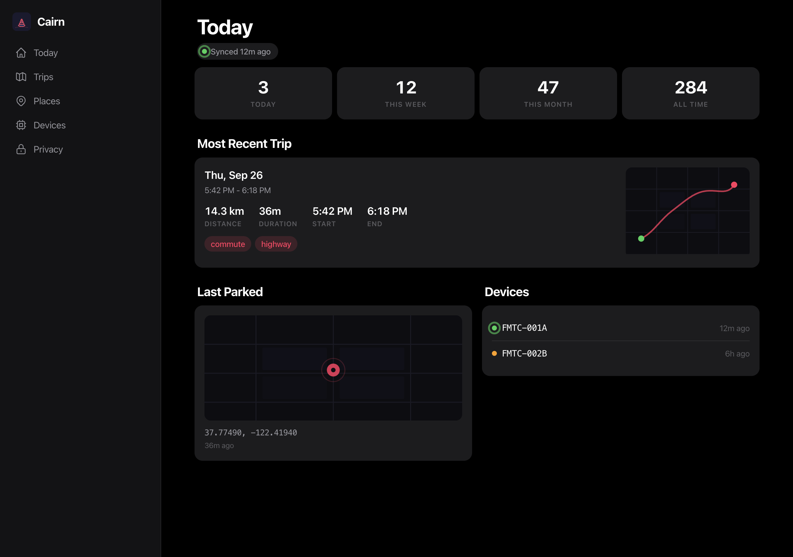

<p align="center">
  
</p>

<h1 align="center">Cairn</h1>
<p align="center"><strong>Offline-first car journal for your homelab</strong></p>
<p align="center"><em>Your drives. Your data. Your server. No cloud required.</em></p>

<p align="center">
  <a href="https://blueoakcouncil.org/license/1.0.0"></a>
  <a href="https://github.com/ParkWardRR/Cairn/releases/tag/v0.1.0"></a>
  <a href="ROADMAP.md"></a>
  <a href="https://github.com/ParkWardRR/Cairn/actions"></a>
</p>

<p align="center">
  
  
  
  
  
  
  
  
  
  
</p>

<p align="center">
  
  
  
  
</p>

---

<p align="center">
  
</p>
<p align="center"><sub>Today dashboard — Apple HIG dark theme with live sync status, trip stats, route maps, and device health</sub></p>

---

## Status: v2 rebuild in progress

Two architecture reviews found that v1's design is sound but only correct on the
happy path. Cross-checking them against the code surfaced three live defects, so
the core data path is being **rebuilt from a clean slate**. See
[ROADMAP.md](ROADMAP.md) for the phased plan.

**Known defects in v1 — do not rely on these guarantees:**

| Claim | Reality |
|---|---|
| Trip bundles sync to the server | Only `samples.bin` is uploaded. OBD, IMU-summary, health and event data is silently discarded on every sync |
| mTLS upload on port 8443 | Transport is plain HTTP on port 8080. No TLS, no client certificate, no server identity check |
| Data is pruned only after a durable receipt | Pruning is not receipt-gated. Retention is measured with `millis()`, which resets on every deep sleep; the Ed25519 receipt signature is never verified |

What is solid today:

- the [bundle format v2 specification](docs/bundle-format-v2.md), with **two
  independent implementations** (Go and Rust) that agree byte-for-byte across 20
  committed conformance vectors;
- the **v2 ingest server** (`server/`) — manifest-first content-addressed upload
  over mTLS with receipt-gated durability, verified end to end against a running
  instance;
- a **fault-injection property matrix** (`emulator/`) — 16 rows proving what
  survives power cuts, torn writes, network loss, duplicate uploads, clock jumps
  and reboots mid-prune;
- the local CLI tooling and the web UI.

---

## What is Cairn?

Cairn is an **offline-first vehicle trip journal** built on the [Freematics ONE+ Model B](https://freematics.com/pages/products/freematics-one-plus/). It captures GPS, motion, and OBD-II engine data while you drive, stores everything locally on the device's microSD card, and syncs to your homelab **only when you return to your home Wi-Fi**.

No phone. No cloud. No cellular. No subscription. An append-only record of your driving history, owned entirely by you.

| Moment | What Happens |
|--------|-------------|
| **Get in and drive** | Device wakes on motion, starts a local trip session |
| **During the drive** | GNSS + IMU + OBD-II captured at adaptive rates, written to microSD |
| **Park away from home** | Trip finalized locally; device sleeps; nothing transmitted |
| **Return home** | Device detects trusted Wi-Fi, uploads pending trips via mTLS |
| **After sync** | Server validates, deduplicates, and exposes trips in the web UI |
| **Review later** | Browse history, maps, parking, route stats, and export data |

### Design Principles

- **Device never needs the server** — every trip is valid on microSD before any transfer
- **No WAN dependency** — the entire system runs on your LAN
- **Append-only, hash-verified bundles** — SHA-256 + Ed25519 from device to archive
- **Privacy by architecture** — no cloud, no tracking, no third-party data access
- **Each language earns its place** — every tool and service uses the best language for the job

### Invariants the v2 rebuild enforces

1. **A sealed bundle is never mutated.** It is either locally recoverable,
   remotely receipt-confirmed, or both.
2. **No byte is deleted without a locally verified signed receipt.** Time,
   storage pressure and operator impatience are all insufficient justification.
3. **Ordering truth is `(boot_id, seq)`, never wall-clock UTC.** GNSS time jumps;
   UTC is an annotation with an uncertainty, not an index.
4. **Honest incompleteness beats fabricated continuity.** A trip with a marked
   GNSS gap is useful; a route interpolated from stale fixes is not.

---

## Architecture — v2 target

```
┌─────────────────────────────────────────────────────────────────────┐
│  Vehicle — Freematics ONE+ Model B (classic ESP32, WROVER + PSRAM)  │
│                                                                     │
│  Capture plane                                                      │
│    GNSS/IMU/OBD → framed append-only segments on microSD            │
│    frame: boot_id + monotonic seq + CRC-32 + prev_crc32 chain       │
│                                                                     │
│  Seal plane                                                         │
│    segments → canonical CBOR manifest + chunk hashes + content_root │
│    Ed25519-signed; atomic state: .open → .sealed                    │
│                                                                     │
│  Transfer plane                                                     │
│    trusted Wi-Fi → mTLS → manifest-first, hash-addressed upload     │
│    signed receipt verified locally before any prune                 │
│                                                                     │
│  Resilience: automatic boot recovery · power-cut safe · OTA A/B     │
└───────────────────────────────┬─────────────────────────────────────┘
                                │ LAN only
                                ▼
┌─────────────────────────────────────────────────────────────────────┐
│  Homelab                                                            │
│                                                                     │
│  Go ingest — validate, store, receipt, return. Nothing more.        │
│  mTLS identity · chunk verification · dedupe on content_root        │
│         │                                                           │
│    ┌────┴──────────────┐                                            │
│    ▼                   ▼                                            │
│  Raw object store    Durable ingest outbox                          │
│  content-addressed         │                                        │
│  on ZFS                    ▼                                        │
│                      Decode / normalize workers                     │
│                            │                                        │
│      ┌─────────────────────┼──────────────────────┐                │
│      ▼                     ▼                      ▼                │
│  PostgreSQL          Derived trips,          MQTT → Home            │
│  + PostGIS           events, rollups         Assistant              │
│  raw / normalized                            semantic events only   │
│  / derived                                                          │
│      │               Optional edges: Gleam, WASM plugins —          │
│      ▼               these may fail freely without affecting        │
│  API + SvelteKit     a drive or a receipt                           │
│  ledger · maps                                                      │
│                                                                     │
│  Local tools: Odin trip-inspector, trip-diff, trip-replay,         │
│               route-density, sd-recover                             │
│  Emulator:    Rust — protocol, power-loss and network fault tests   │
└─────────────────────────────────────────────────────────────────────┘
```

**Raw data stays authoritative.** A decoder bug can be fixed and every affected
trip re-derived without re-uploading anything. Ingest stays boring: it does not
parse, map, detect events or publish MQTT while the device waits. A failed
decoder job never implies a failed upload, and a plugin failure is a recorded
result rather than a reason to reject a valid bundle.

The v1 path — synchronous parse-and-insert on the upload request, plain HTTP,
time-based pruning — is being replaced phase by phase per [ROADMAP.md](ROADMAP.md).

---

## Services and Tools

### Bundle Format v2 and Go Reference Implementation (`server/`)

The foundation of the v2 rebuild. Three implementations — firmware (C), server
(Go) and emulator (Rust) — must agree byte-for-byte, so the format ships as a
[normative specification](docs/bundle-format-v2.md) with a reference
implementation and committed conformance vectors rather than prose.

| Component | Details |
|---|---|
| **Spec** | [`docs/bundle-format-v2.md`](docs/bundle-format-v2.md) — byte layouts for the segment header, frame envelope, nine payload schemas, manifest, receipt and transfer protocol |
| **Reference impl** | `server/format/` — recovery scanner, domain-separated Merkle tree, strict deterministic-CBOR codec, manifest and receipt sign/verify |
| **Vectors** | `fixtures/format-v2/` — 20 vectors with machine-readable verdicts, generated deterministically by `server/cmd/mkvectors` |

### v2 Ingest Server (`server/`)

Ingest validates, durably stores, receipts and returns. Nothing else — decoding,
trip building, event detection and MQTT all happen later, driven by the outbox,
so request latency never scales with trip length and a decoder bug can never
fail an upload.

| Component | Role |
|---|---|
| `internal/cas` | Content-addressed raw store. Atomic, fsynced writes; digest verified on put and optionally on read, so bit rot is detected rather than passed through |
| `internal/intake` | The offer → transfer → commit protocol. Verifies the manifest signature against the *enrolled* key, rejects self-contradictory manifests, reassembles members from chunks and recomputes `content_root` before committing |
| `internal/receipts` | Signs and persists receipts **before** returning them. Refuses to start with an ephemeral key outside dev mode, since that would invalidate every receipt already issued |
| `internal/devices` | Enrolment and revocation. Reloads on change, so revoking a stolen unit takes effect without a restart |
| `internal/outbox` | Durable append-only decode queue. Unacknowledged work is redelivered, so a worker crash costs a repeat rather than a lost job |
| `internal/mtls` | TLS with `RequireAndVerifyClientCert` against a private CA |

Two properties make the transfer protocol crash-safe with no bookkeeping: the
set of missing chunks is **derived** from the raw store rather than tracked, so
there is no progress state to lose; and idempotency is keyed on `content_root`,
so a device that re-offers identical data gets back the receipt it already
earned no matter how the retry is framed.

```bash
cd server && go build ./cmd/cairn-server

# Enrol a device (effective immediately, even while the server is running)
./cairn-server -data /var/lib/cairn -enroll <32-hex-device-id> -enroll-key <64-hex-pubkey>

# Run with mutual TLS
./cairn-server -data /var/lib/cairn -addr :8443 \
  -tls-cert server.crt -tls-key server.key -tls-client-ca ca.crt

# Drive a full sync against it with a synthetic bundle
go run ./cmd/cairn-syncdemo -server https://cairn.example.lan:8443 \
  -ca ca.crt -cert device.crt -key device.key
```

| Method | Path | Purpose |
|---|---|---|
| `GET` | `/api/v2/health` | Status, format version, decode backlog |
| `GET` | `/api/v2/server/receipt-key` | Receipt verification key, for device provisioning |
| `POST` | `/api/v2/bundles/offer` | Offer a signed manifest; returns the missing chunk indices |
| `PUT` | `/api/v2/bundles/{id}/chunks/{sha256}` | Upload one chunk, addressed by content hash |
| `POST` | `/api/v2/bundles/{id}/commit` | Verify, store, receipt; returns the receipt as raw CBOR |

Three identifiers are kept deliberately distinct, because the reviews were right
that a content hash makes a poor operational handle:

| Identifier | Job |
|---|---|
| `bundle_id` | ULID. Retries, receipts, support, directory naming, log correlation |
| `content_root` | Merkle root over bundle members. Identity of the *data* — deduplication, idempotency, the signed commitment |
| `transfer_hash` | SHA-256 of a transferred stream. Transport integrity only; never an identity |

### Go Ingest Service (`zig/ingest/` — v1, being replaced)

> The directory name is a historical artifact: it contains Go, not Zig. The v2
> server lives in `server/`.

The v1 server — receives trip bundles from the device and serves the read API.

| Capability | Details |
|------------|---------|
| **Upload** | Resumable chunked uploads with SHA-256 verification and Ed25519 receipts |
| **Read API** | 16 endpoints: stats, trips, route GeoJSON, events, devices, places CRUD, tags, delete |
| **Export** | GPX, GeoJSON, and CSV per trip |
| **MQTT** | Raw MQTT 3.1.1 publisher (zero external deps) for Home Assistant events |
| **Plugins** | WASM plugin host via wazero — classify trips, redact routes, run custom enrichments |
| **CORS** | Built-in middleware for PWA access |

### SvelteKit Web App (`web/`)

Apple HIG dark-theme web UI built with SvelteKit 2 + Svelte 5. Statically generated via `@sveltejs/adapter-static` — deploys as plain HTML/CSS/JS with no server-side runtime.

- **Today** — dashboard with trip stats (today/week/month/all time), most recent trip with route map, last parked location, device health, live sync status
- **Trips** — filterable list with mini route maps, date/device/tag filters, pagination
- **Trip detail** — full route with speed-colored polyline, events timeline, info table, tags CRUD, GPX/GeoJSON/CSV export
- **Places** — interactive Leaflet map with click-to-set geofences, CRUD
- **Devices** — device cards with status indicators, firmware, trip count, total distance
- **Privacy & Data** — data summary, bulk export, trip management, bulk delete

Design system: Apple HIG 2017 dark mode — `#000000` base, elevated surfaces, SF Pro/Inter font stack, 13px card radii, 0.5px separators, spring animations, vibrancy blur, filled/outlined icon states. Leaflet maps use dark CARTO tiles.

An [animated hero demo](web/static/screenshots/hero-animation.html) cycles through Today → Trips → Devices views.

### Legacy PWA (`pwa/`)

Original vanilla HTML/CSS/JS web UI (no build tools). Superseded by the SvelteKit app above.

### Gleam Trip Orchestrator (`gleam/trip-orchestrator/`)

Five periodic OTP actor workers running on the Erlang VM:

| Worker | Interval | Purpose |
|--------|----------|---------|
| Lifecycle | 30s | Trip lifecycle state projection |
| Quality | 60s | Flag impossible GNSS jumps, GPS loss, clock drift |
| Scheduler | 120s | Retry queue for reprocessing with version tracking |
| Notifier | 60s | Evaluate sync/device/storage issues for notification |
| Automation | 60s | Execute user-defined rules (e.g., "on arrival home, update HA presence") |

### WASM Plugins (`plugins/`)

MoonBit plugins compiled to WASM, executed in a sandboxed wazero runtime. No WASI — plugins cannot access the database, network, or filesystem.

| Plugin | Input | Output |
|--------|-------|--------|
| **trip-classifier** | Trip summary + route samples | Labels with confidence: commute, errand, road trip, canyon drive, night drive, loop trip |
| **privacy-redactor** | Route points + privacy zones | Redacted route with zone-center snapping, triggered zones, redaction stats |

Plugin ABI: `alloc(size) → ptr`, then `entry(ptr, len) → result_ptr`. Length-prefixed UTF-8 JSON over WASM linear memory. 16 MB memory limit, 30s execution timeout, fresh instance per call.

### Odin Native Tools (`odin/`)

Five standalone CLI tools for offline bundle inspection and debugging:

| Tool | Purpose |
|------|---------|
| **trip-inspector** | Full bundle inspection: manifest, SHA-256 integrity, GNSS/IMU stats, quality flags, events, timing |
| **trip-diff** | Side-by-side bundle comparison with Haversine route divergence, timing/speed diff, prefix detection |
| **trip-replay** | Replay bundles into the ingest server with speedup control, dry-run mode, POSIX tar packaging |
| **route-density** | SVG heatmap from GNSS data with configurable grid size and heat/blue color schemes |
| **sd-recover** | Scan microSD for incomplete bundles, detect truncation/corruption, reconstruct manifests and hashes |

### Rust Emulator and Fault Matrix (`emulator/`)

An independent Rust implementation of bundle format v2, plus the property matrix
that proves the architecture's failure behaviour. The architecture's value lives
at failure boundaries, not on the happy path, so the harness interrupts the
device at named points and asserts what survived — against durable state, never
against stdout.

```bash
cd emulator

# Does this implementation agree with the specification?
cargo run --release -- conformance --vectors ../fixtures/format-v2

# Local durability rows need no server
cargo run --release -- fault-matrix --verbose

# Protocol rows need a running instance
cargo run --release -- fault-matrix --server http://cairn.example.lan:8443

# Server crash during commit, including signing-key rotation
../tests/server-crash-during-commit.sh
```

| Row | Property proven |
|---|---|
| `power-cut-during-capture` | Every frame durably written is recoverable; only an incomplete tail is lost |
| `power-cut-during-seal` | A sealing failure never discards captured data |
| `torn-tail` | A partial frame is isolated; preceding frames survive and the discarded byte count is exact |
| `corrupted-storage-bytes` | A flipped bit is detected at its own frame; earlier frames remain usable |
| `clock-reset-gnss-jump` | A backwards UTC jump leaves ordering intact, flagged, with accuracy marked unknown |
| `prune-without-receipt` | **No verified receipt ⇒ never pruned** |
| `reboot-after-receipt-before-prune` | Payload and receipt both survive; the prune happens later |
| `reboot-mid-prune` | Fully present or fully pruned; the journal explains which |
| `network-loss-per-chunk` | The device resumes rather than restarts, and earns a receipt |
| `corrupt-chunk-in-transit` | Rejected; the retry succeeds with no operator action |
| `duplicate-upload` | Same receipt, zero chunks re-sent, decode backlog unchanged |
| `receipt-lost-in-transit` | A retry returns the already-committed receipt |
| server crash during commit | Un-receipted or durably recoverable; a retry converges to exactly one receipt |
| signing-key rotation | A rotated key cannot induce a prune |

The driving-scenario path (`cargo run -- scenario`) still uses the v1 capture
format and is retired as the v2 device lands in the firmware phases.

### Rust Trajectory Tool (`rust/trajectory/`)

Offline trajectory analysis experiments for recorded trip bundles. Five subcommands:

| Subcommand | Purpose |
|------------|---------|
| **similarity** | Route similarity clustering via Hausdorff distance — find repeated commutes |
| **places** | DBSCAN-style endpoint clustering to discover recurring locations |
| **segments** | Stop/errand segmentation — split a trip into drive/stop phases |
| **anomalies** | GNSS anomaly detection: impossible jumps, GPS loss, clock drift, HDOP spikes |
| **density** | Driving style analysis: acceleration/deceleration profiles, turn rates, style classification |

---

## Technology Stack

| Language | Role | Why |
|----------|------|-----|
| **Zig** | Bundle format, common types, CLI (`tripctl`) | Low-level control, deterministic resources, cross-compilation |
| **Go** | Ingest service, read API, MQTT, WASM plugin host | Single-binary deploys, strong networking stdlib, zero-dep MQTT |
| **Rust** | Device emulator, trajectory analysis, crypto verification | Memory safety without GC, excellent for system simulation and numeric analysis |
| **Gleam** | Background event processing, job scheduling | Clean distributed-systems model with OTP fault isolation |
| **MoonBit** | WASM plugins: trip classifier, privacy redactor | Portable sandboxed components via WASM, compiles to 62-94 KB |
| **Odin** | Offline CLI tools: inspector, diff, replay, density, recovery | Pleasant native tooling with explicit memory, fast compilation |
| **SvelteKit** | Web UI (Apple HIG dark theme) | Svelte 5 runes, static adapter, zero runtime overhead |
| **C++** | Freematics ESP32 firmware | Shortest path to real driving data on vendor hardware |

### Why not Python?

Every language in this stack was chosen for deterministic resources, strong static types, single-binary deployment, and native performance. This repo contains zero Python. All emulation and test tooling is written in Rust.

---

## Repository Layout

```
Cairn/
├── docs/bundle-format-v2.md     # Normative bundle format spec (v2 rebuild)
├── server/                      # v2 Go server
│   ├── format/                  #   Bundle format v2 reference implementation
│   ├── internal/cas/            #   Content-addressed raw object store
│   ├── internal/intake/         #   offer -> transfer -> commit protocol
│   ├── internal/receipts/       #   Receipt signing, persisted before returned
│   ├── internal/devices/        #   Enrolment, revocation, quotas
│   ├── internal/outbox/         #   Durable decode queue
│   ├── internal/mtls/           #   Mutual TLS configuration
│   ├── cmd/cairn-server/        #   The ingest daemon
│   ├── cmd/cairn-syncdemo/      #   Reference sync client for verification
│   └── cmd/mkvectors/           #   Deterministic conformance vector generator
├── fixtures/format-v2/          # 20 conformance vectors with expected verdicts
├── firmware/                    # ESP32 / Freematics firmware (C++)
│   └── freematics-base/         #   PlatformIO project using vendored FreematicsPlus
│       ├── lib/FreematicsPlus/  #     Vendored Freematics hardware drivers (BSD)
│       ├── lib/TinyGPS/         #     Vendored NMEA parser
│       └── src/                 #     Cairn state machine, config, trip types
│           └── secrets.h.example #    Template for untracked local credentials
├── zig/                         # Core services and libraries
│   ├── common/                  #   Shared types: GnssSample (32B), ImuSummary (24B), OBDSnapshot (20B), Haversine
│   ├── bundle/                  #   Trip bundle parse / validate / sign
│   ├── ingest/                  #   Go ingest service (mTLS upload, read API, MQTT, plugins)
│   ├── cli/                     #   tripctl: generate, validate, inspect, export
│   └── api/                     #   Legacy Zig API (superseded by Go endpoints in ingest)
├── emulator/                    # Rust emulator: format v2 impl + fault matrix
│   └── src/
│       ├── format/              #   Independent Rust implementation of format v2
│       ├── conformance.rs       #   Runner against the committed vectors
│       └── v2/                  #   Device lifecycle, fault injection, matrix
├── rust/
│   └── trajectory/              # Rust trajectory analysis CLI (5 subcommands)
├── gleam/
│   └── trip-orchestrator/       # Gleam/OTP event processing (5 actor workers)
├── plugins/                     # MoonBit → WASM plugins
│   ├── trip-classifier/         #   6 classification heuristics with confidence scoring
│   └── privacy-redactor/        #   Haversine zone detection, coordinate snapping
├── odin/                        # Native CLI tools (Odin)
│   ├── trip-inspector/          #   Bundle inspection and integrity verification
│   ├── trip-diff/               #   Side-by-side bundle comparison
│   ├── trip-replay/             #   Replay bundles into ingest server
│   ├── route-density/           #   SVG heatmap generation
│   └── sd-recover/              #   MicroSD recovery for incomplete bundles
├── web/                         # SvelteKit 2 + Svelte 5 web app (Apple HIG dark)
│   ├── src/
│   │   ├── app.css              #   Apple HIG dark design system tokens
│   │   ├── app.html             #   Shell with Leaflet CDN + Google Fonts
│   │   ├── lib/                 #   API client, stores, shared components
│   │   └── routes/              #   SvelteKit pages: today, trips, places, devices, settings, hero
│   ├── static/                  #   Icons, manifest, hero screenshots
│   ├── svelte.config.js         #   adapter-static with SPA fallback
│   └── package.json             #   SvelteKit 2, Svelte 5, Vite 5
├── pwa/                         # Legacy vanilla HTML/CSS/JS web UI
│   ├── index.html               #   SPA shell with Leaflet 1.9.4
│   ├── app.js                   #   Router, API client, 6 views
│   ├── style.css                #   Dark theme, responsive layout
│   ├── sw.js                    #   Service worker for offline caching
│   └── manifest.json            #   PWA manifest
├── deploy/                      # Infrastructure
│   ├── compose.yaml             #   PostgreSQL, Caddy, Mosquitto MQTT
│   ├── caddy/                   #   Reverse proxy + PWA static serving
│   ├── mosquitto/               #   MQTT broker config
│   ├── migrations/              #   SQL: init, functions, Gleam tables
│   └── systemd/                 #   Service units
├── tests/                       # Shell smoke tests
├── fixtures/                    # Test data (raw, synthetic, expected)
├── docs/                        # Architecture, protocols, threat model
├── .github/workflows/ci.yml     # CI: Zig, Go, Rust, Gleam, MoonBit, Odin, PWA
├── INSTALL.md                   # Install guide for the v0.1.0 tools release
├── ROADMAP.md                   # Phased roadmap with checklists
└── LICENSE                      # Blue Oak Model License 1.0.0
```

---

## Data Model

PostgreSQL + PostGIS:

| Table | Purpose |
|-------|---------|
| `devices` | Public key, metadata, last-seen, firmware version |
| `uploads` | Content hash, upload state, receipt ID, storage path |
| `trips` | Stable trip ID, start/end time and location, distance, duration, bundle hash |
| `location_samples` | Raw GNSS with accuracy, altitude, speed, heading, satellites |
| `motion_samples` | IMU summaries or downsampled aggregates |
| `trip_events` | Start/stop/pause/sync/quality events with location |
| `places` | Named locations with PostGIS geography and configurable radius |
| `trip_tags` | Labels: personal, business, road-trip, private |
| `derivations` | Algorithm version, output hash, reproducibility |
| `trip_lifecycle` | Gleam lifecycle state projection |
| `trip_quality_flags` | GNSS anomalies, GPS loss, clock drift flags |
| `reprocess_queue` | Retry queue for algorithm upgrades |
| `notifications` | Sync/device/storage issue notifications |
| `automation_rules` | User-defined trigger/action rules |

## Trip Bundle Format (v1 — superseded)

> Superseded by [Bundle Format v2](docs/bundle-format-v2.md). The layout below
> has no record framing, so a power cut mid-write cannot be distinguished from
> valid data, and the firmware only ever uploads `samples.bin`.

Each trip is a self-contained directory on the device's microSD:

```
trip/
  manifest.json       # Trip metadata, device info, VIN, DTC codes, schema v2
  samples.bin         # GNSS samples — 32 bytes each, little-endian, fixed-width
  imu_summary.bin     # IMU summaries — 24 bytes each, rolling windows
  obd.bin             # OBD-II snapshots — 20 bytes each (speed, RPM, throttle, etc.)
  health.bin          # Device health — 16 bytes each (battery, temp, RSSI)
  events.json         # Start/stop/pause/quality/ECU-off/thermal events with location
  sha256sums.txt      # Per-file content hashes (ESP32 hardware-accelerated SHA-256)
```

GNSS samples encode latitude and longitude as `degrees * 10^7` (i32), altitude in centimeters (i32), speed in cm/s (u16), with fix quality, satellite count, HDOP, and accuracy fields. OBD snapshots capture speed, RPM, throttle, engine load, coolant/intake temp, fuel pressure, and timing advance. At 1 Hz a 30-minute trip produces ~57 KB GNSS + ~36 KB OBD data.

---

## Home Assistant Integration

Cairn publishes semantic MQTT events to your local Mosquitto broker:

```
cairn/vehicle/{id}/trip_ended        # distance, duration, end place
cairn/vehicle/{id}/sync_completed    # trip count, total bytes
```

```json
{
  "vehicle_id": "mazda",
  "trip_id": "01J9YTVPAK6WWZQGBQQN8PB7B8",
  "event": "trip_ended",
  "ended_at": "2026-09-26T06:05:24Z",
  "distance_km": 18.42,
  "duration_s": 1934,
  "end_place": "home",
  "local_only": true
}
```

---

## API Endpoints

All endpoints served by the Go ingest service on port 8443.

| Method | Path | Description |
|--------|------|-------------|
| `GET` | `/api/v1/health` | Health check |
| `POST` | `/api/v1/upload/init` | Init chunked upload |
| `PUT` | `/api/v1/upload/{id}/chunk` | Upload chunk |
| `POST` | `/api/v1/upload/{id}/finalize` | Finalize with SHA-256 verification |
| `GET` | `/api/v1/stats` | Dashboard stats |
| `GET` | `/api/v1/trips` | List trips (filter by device, tag, date range) |
| `GET` | `/api/v1/trips/{id}` | Trip detail with tags |
| `GET` | `/api/v1/trips/{id}/route` | Route as GeoJSON |
| `GET` | `/api/v1/trips/{id}/events` | Trip events |
| `GET` | `/api/v1/trips/{id}/export/gpx` | GPX export |
| `GET` | `/api/v1/trips/{id}/export/geojson` | GeoJSON export with speed/altitude |
| `GET` | `/api/v1/trips/{id}/export/csv` | CSV export |
| `DELETE` | `/api/v1/trips/{id}` | Delete trip and all samples |
| `POST` | `/api/v1/trips/{id}/tags` | Add tag |
| `DELETE` | `/api/v1/trips/{id}/tags/{tag}` | Remove tag |
| `POST` | `/api/v1/trips/{id}/classify` | Run trip-classifier plugin |
| `POST` | `/api/v1/trips/{id}/redact` | Run privacy-redactor plugin |
| `GET` | `/api/v1/devices` | List devices with trip counts |
| `GET` | `/api/v1/places` | List places with visit counts |
| `POST` | `/api/v1/places` | Create place |
| `PUT` | `/api/v1/places/{id}` | Update place |
| `DELETE` | `/api/v1/places/{id}` | Delete place |
| `GET` | `/api/v1/plugins` | List loaded WASM plugins |
| `POST` | `/api/v1/plugins/{name}/run` | Execute plugin with arbitrary input |

---

## Quick Start

> **Installing?** See **[INSTALL.md](INSTALL.md)** for the full guide.
> [**v0.1.0**](https://github.com/ParkWardRR/Cairn/releases/tag/v0.1.0) ships
> prebuilt CLI tools for macOS arm64 and Linux x86_64 plus the ESP32 firmware
> image. The server and web UI are not in that release yet — the tools work
> standalone against bundles on disk, no server required.

### Prerequisites

- [Freematics ONE+ Model B](https://freematics.com/pages/products/freematics-one-plus/) with microSD card
- Homelab server (Linux) with Podman or Docker
- Home Wi-Fi network on **2.4 GHz** — the ESP32 has no 5 GHz radio

### Firmware Configuration

WiFi credentials and the server hostname live in an untracked `secrets.h`, so
nothing environment-specific is ever committed:

```bash
cd firmware/freematics-base
cp src/secrets.h.example src/secrets.h   # then edit it
pio run -e freematics
```

A missing value fails open to "no network configured" and still compiles, so
flash `pio run -e freematics-selftest` first — it joins WiFi, resolves the
server and fetches `/api/v1/health` over serial, and on failure lists every SSID
the radio can see. Note that `cairn.local` requires mDNS, which the ESP32
resolver does not do; use a name your router's DNS actually serves.

### Server Setup

```bash
git clone https://github.com/ParkWardRR/Cairn.git
cd Cairn

# Start the stack: PostgreSQL, Caddy, Mosquitto
cd deploy
docker compose up -d

# Apply database migrations
cat migrations/001_init.sql migrations/002_functions.sql migrations/003_gleam_tables.sql \
  | docker exec -i cairn-postgres psql -U cairn -d cairn

# The PWA is served at https://cairn.local
```

### Build from Source

```bash
# SvelteKit web app
cd web && npm install && npm run build

# Go ingest service
cd zig/ingest && go build ./cmd/ingestd/

# Zig CLI tools
cd zig/cli && zig build

# Rust emulator
cd emulator && cargo build --release

# Rust trajectory tool
cd rust/trajectory && cargo build --release

# Gleam orchestrator
cd gleam/trip-orchestrator && gleam build

# MoonBit plugins
cd plugins/trip-classifier && moon build --target wasm
cd plugins/privacy-redactor && moon build --target wasm

# Odin tools
for tool in trip-inspector trip-diff trip-replay route-density sd-recover; do
  odin build "odin/$tool/" -o:speed
done
```

### Test with the Emulator

```bash
# Generate a realistic trip and upload to local server
./emulator/target/release/cairn-emulator \
  --scenario normal_commute \
  --server http://localhost:8443 \
  --speedup 1000

# Inspect a local bundle
odin build odin/trip-inspector/ -o:speed
./trip-inspector /path/to/trip/bundle/

# Generate a route density heatmap
odin build odin/route-density/ -o:speed
./route-density /path/to/bundles/ --output heatmap.svg

# Trajectory analysis on recorded bundles
cd rust/trajectory && cargo build --release
./target/release/cairn-trajectory anomalies --bundle /path/to/trip/bundle/
./target/release/cairn-trajectory places --bundles /path/to/bundles/ --min-visits 2
./target/release/cairn-trajectory similarity --bundles /path/to/bundles/
```

---

## Explicit Non-Goals

| Excluded | Reason |
|----------|--------|
| LTE / cellular / WAN upload | Cost, external dependency, privacy leakage |
| Cloud account or third-party backend | Contradicts local-first ownership |
| Live vehicle tracking | Requires persistent connectivity |
| Mobile native app | LAN PWA is sufficient until a clear need emerges |
| Automatic emergency dispatch | High liability and no WAN by design |
| Python | See [technology decisions](#technology-stack) |

## Acceptance Criteria

| Test | Pass Condition |
|------|---------------|
| Normal week | Every meaningful drive appears on the dashboard after returning home |
| No phone | Trips work with no phone paired, carried, or charged |
| No internet | WAN disconnected; local sync and UI still work |
| Power interruption | Previously finalized data survives; incomplete trip recoverable — proven by the fault matrix |
| Multi-day trip | Device retains all data without attempting WAN upload |
| Return home | Pending trips upload once; no duplicates after retries/reboots |
| Bad GNSS | Garage/tunnel segments marked uncertain, not fabricated |
| Storage pressure | Unsynced trips preserved; alert emitted on next home arrival |
| Server restart | Client resumes upload cleanly after server restarts |
| Plugin sandboxing | WASM plugins cannot access database, network, or filesystem |
| Backup restore | Restore into fresh environment; browse and export all historical trips |

## CI Pipeline

The [CI workflow](.github/workflows/ci.yml) runs on a self-hosted runner and validates all languages:

| Job | What it builds/tests |
|-----|---------------------|
| `build-zig` | Zig common, bundle, CLI + smoke test |
| `build-go` | v1 Go ingest service + `go vet` |
| `build-server` | v2 server: build, vet, gofmt, 161 tests, and a check that regenerating the conformance vectors produces no diff |
| `format-conformance` | The emulator's Rust format implementation against the same committed vectors |
| `fault-matrix` | 16 property rows plus the server-crash-during-commit test |
| `build-rust` | Rust emulator + binary verification |
| `build-trajectory` | Rust trajectory tool build + tests |
| `build-gleam` | Gleam trip-orchestrator build + test |
| `build-plugins` | MoonBit trip-classifier + privacy-redactor → WASM |
| `build-odin` | All 5 Odin tools + trip-inspector smoke test |
| `validate-pwa` | PWA file presence check |
| `emulator-test` | Emulator scenarios against live ingest |
| `integration-test` | End-to-end smoke test |

## Documentation

| Document | Description |
|----------|-------------|
| [Install Guide](INSTALL.md) | Installing the v0.1.0 tools and flashing firmware |
| [Flashing & Testing](docs/flashing-and-testing.md) | Hardware profile, bench results, bugs found and fixed |
| **[Bundle Format v2](docs/bundle-format-v2.md)** | **Normative spec for the v2 rebuild — byte layouts, manifest, receipt, transfer protocol** |
| [Architecture](docs/architecture.md) | System design, data flow, component responsibilities (describes v1) |
| [Device Protocol](docs/device-protocol.md) | Firmware states, sensor rates, sync protocol (describes v1) |
| [Trip File Format](docs/trip-file-format.md) | v1 bundle schema — superseded by Bundle Format v2 |
| [Threat Model](docs/threat-model.md) | Security boundaries, device identity, transport security |
| [Retention & Backup](docs/retention-and-backup.md) | Data lifecycle from device spool to archive |
| [Home Wi-Fi Deployment](docs/home-wifi-deployment.md) | Network setup, mDNS, certificates, provisioning |
| [Emulation Spec](docs/freematics-emulation-spec.md) | Rust emulator driving scenarios and protocol |
| [Test Plan](docs/test-plan.md) | Hardware testing guide |
| [RTOS Evaluation](docs/rtos-evaluation.md) | Zephyr/NuttX feasibility research (not adopted) |
| [Roadmap](ROADMAP.md) | Phased development plan with checklists |

## Contributing

Cairn is an early-stage personal project. Contributions, ideas, and feedback are welcome.

1. Fork the repository
2. Create a feature branch
3. Commit your changes
4. Open a pull request

Please read the [Architecture](docs/architecture.md) and [Roadmap](ROADMAP.md) before contributing.

## License

[Blue Oak Model License 1.0.0](https://blueoakcouncil.org/license/1.0.0) — see [LICENSE](LICENSE).

A permissive license designed by lawyers, for clarity. Broad permission to use, share, and modify with no conditions beyond preserving the license notice.

---

<p align="center">
  <sub>Built for the joy of driving and the sovereignty of owning your data.</sub>
</p>
