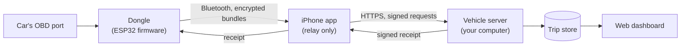

<h1 align="center">Cairn</h1>

<strong>A driving log for your own car, kept on your own computer.</strong>

  
  
  
  

  

The dashboard, on invented data: a fictional owner's two weeks of errands and weekend drives.

---

## What it is, in plain words

You plug a small device into your car's diagnostic port (the one under the dashboard that a
mechanic uses). It quietly records every drive: where you went, how fast, and how the engine
was behaving. When you get home, your iPhone carries those recordings to a small server that
**you** run (a spare mini PC or a Raspberry Pi is enough). You then open a web page and see
your drives: a map of everywhere you have been, your trips by day, and detailed engine
information if you care about it.

Nothing is sent to a company. There is no account to create and no subscription. If you stop
using it, your data is in files you already own.

Cairn is built first for car enthusiasts who like to look at their own data, and it is meant
to be approachable enough for anyone who simply wants a private record of their driving.

## Why use it

1. **Useful automatic capture.** Plug it in and drive. Trips are recorded without opening
   any app, and they appear on their own.
2. **Detailed vehicle information.** The engine data behind every trip is there to browse,
   per trip and per vehicle: boost, fuel trims, temperatures, how the car responds when you
   push it.
3. **Control of your data.** It lives on your hardware. Nothing needs an account or a cloud
   service. (Export, import and backup exist today for saved places and for the whole
   store; extending that to every kind of data is a roadmap theme.)
4. **Adaptability.** More than one car, more than one phone. The file and wire formats are
   public and tested ([contracts](contracts/)), so you can read your own data with your own
   tools or extend the system without reverse-engineering it.
5. **Private by design.** The device has no Wi-Fi and no network password to leak; data is
   encrypted on the device before it leaves, and only your server can read it.

## Where to start

| You want to... | Start here |
|---|---|
| See what it looks like | The screenshots in the [web dashboard](https://github.com/ParkWardRR/cairn-vehicle-web-dashboard) repository |
| Run it yourself | [INSTALL.md](INSTALL.md), then the [server](https://github.com/ParkWardRR/cairn-vehicle-server) repository's deploy guide |
| Understand how it stays safe | [Threat model](docs/threat-model.md) and [trust model](docs/trust-model-v3.md) |
| Build on it | The map below, and the [contracts](contracts/) |
| See where it is going | [ROADMAP.md](ROADMAP.md) |

## How the pieces fit

The dongle deletes a recording only after the server has returned a signed receipt for exactly
that recording, checked against a key built into the dongle. The phone only carries bytes: it
cannot read, alter or forge them.

## The repositories

Cairn is several repositories, each of which can be built, tested and released alone.

| Repository | What it is |
|---|---|
| **this one** | The front door: system documentation, the roadmap, and the [contracts](contracts/) the others agree on |
| [cairn-vehicle-server](https://github.com/ParkWardRR/cairn-vehicle-server) | Verifies, decrypts and stores trips; serves the phone and the dashboard (Go) |
| [cairn-vehicle-web-dashboard](https://github.com/ParkWardRR/cairn-vehicle-web-dashboard) | The browser dashboard (Nuxt) |
| [cairn-esp32-device-firmware](https://github.com/ParkWardRR/cairn-esp32-device-firmware) | The in-car dongle's firmware, with a host test suite and an emulator (C, Rust) |
| [cairn-companion-ios-esp32-obd2-gps-ble](https://github.com/ParkWardRR/cairn-companion-ios-esp32-obd2-gps-ble) | The iPhone app that relays between the dongle and the server (Swift) |
| [cairn-original-monorepo-archive](https://github.com/ParkWardRR/cairn-original-monorepo-archive) | The original single repository, preserved read-only. Every component repository keeps its history |

### The contracts

[`contracts/`](contracts/) holds the specifications and test vectors that the repositories
share: the bundle format, device enrolment, the phone's sync protocol and the Bluetooth
protocol. A repository does not copy them; it pins a release by tag **and** commit
(`contracts.lock`) and fetches that, so a change to a contract cannot reach an implementation
unnoticed. The pins below are generated from each repository's lock file.

<!-- pins:start -->
| Repository | Contracts it is pinned to | Protocols | Also pinned |
|---|---|---|---|
| [cairn-vehicle-server](https://github.com/ParkWardRR/cairn-vehicle-server) | `contracts-v0.1.0` (`56d980b`) | ble v1, enrolment v1, format v3, sync v1 | firmware `a3fe7ef` (interop) |
| [cairn-vehicle-web-dashboard](https://github.com/ParkWardRR/cairn-vehicle-web-dashboard) | `contracts-v0.1.0` (`56d980b`) | store v1 | vehicle server `b0deb01` |
| [cairn-esp32-device-firmware](https://github.com/ParkWardRR/cairn-esp32-device-firmware) | `contracts-v0.1.0` (`56d980b`) | ble v1, enrolment v1, format v3 | none |
<!-- pins:end -->

## Where things stand

Capture, encrypted storage and sealing work on the real dongle (bench-tested with its SD
card). The server, the phone relay and the dashboard work and are tested end to end with a
simulated radio, and the dashboard runs on invented demo data. Running the Bluetooth hand-off
over the air on real hardware, and so the first real trip arriving on the dashboard, is the
next milestone. [ROADMAP.md](ROADMAP.md) has the detail and what comes after.

Because the repository is public, no real host names or keys are ever committed: the examples
use placeholders, and the real values live in ignored local files.

## Licence

[Blue Oak Model License 1.0.0](LICENSE).
