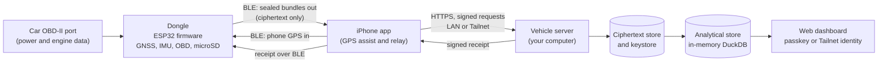
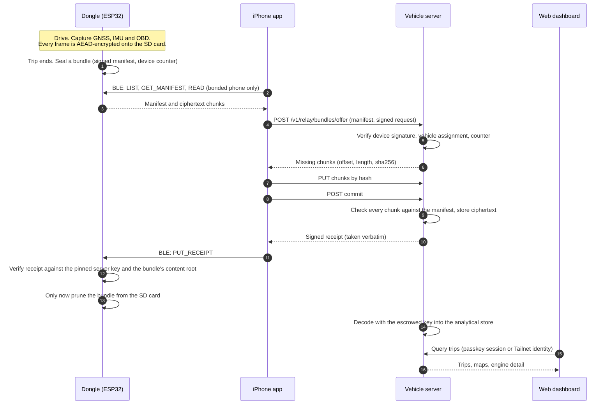
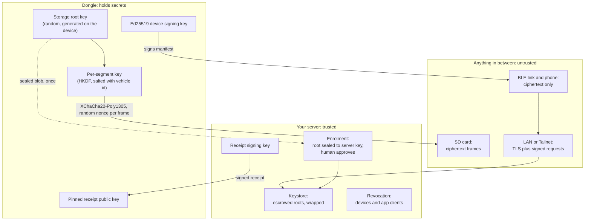
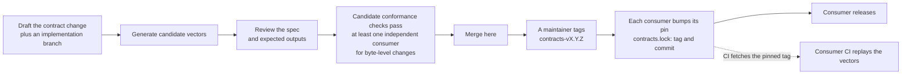
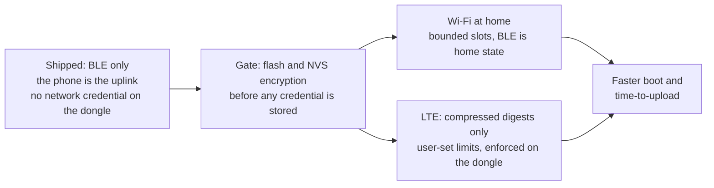
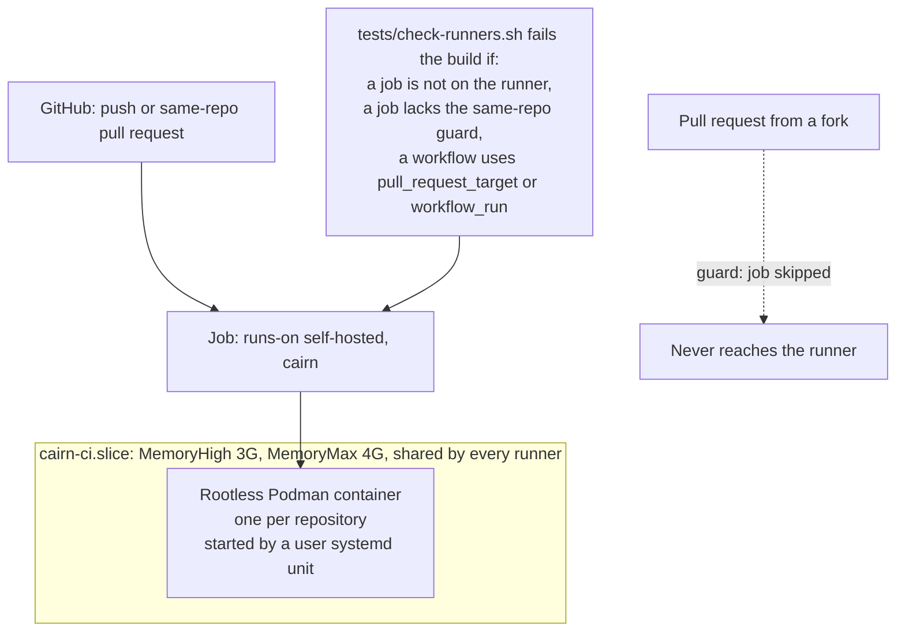

<!-- cairn-nav:start -->
<p align="center"><b>Cairn is a family of five repositories.</b> Each builds, tests and releases on its own; they agree through the shared <a href="https://github.com/ParkWardRR/cairn-driving-log-selfhosted/tree/main/contracts">contracts</a>.</p>

| Part | Repository | What it does | Stack | Docs | Issues | CI |
|---|---|---|---|---|---|---|
| Front door | **[cairn-driving-log-selfhosted](https://github.com/ParkWardRR/cairn-driving-log-selfhosted)** ◀ you are here | Docs, roadmap, shared protocol contracts | Markdown · Go tools | [docs](https://github.com/ParkWardRR/cairn-driving-log-selfhosted/tree/main/docs) | [issues](https://github.com/ParkWardRR/cairn-driving-log-selfhosted/issues) | [CI](https://github.com/ParkWardRR/cairn-driving-log-selfhosted/actions) |
| Dongle | [cairn-esp32-device-firmware](https://github.com/ParkWardRR/cairn-esp32-device-firmware) | In-car recorder: OBD-II, GNSS, IMU to encrypted SD bundles | C++ · C · Rust | [docs](https://github.com/ParkWardRR/cairn-esp32-device-firmware/tree/main/docs) | [issues](https://github.com/ParkWardRR/cairn-esp32-device-firmware/issues) | [CI](https://github.com/ParkWardRR/cairn-esp32-device-firmware/actions) |
| Phone | [cairn-ios-companion-app](https://github.com/ParkWardRR/cairn-ios-companion-app) | BLE relay, GPS assist, server client | Swift · SwiftUI | [docs](https://github.com/ParkWardRR/cairn-ios-companion-app/tree/main/docs) | [issues](https://github.com/ParkWardRR/cairn-ios-companion-app/issues) | [CI](https://github.com/ParkWardRR/cairn-ios-companion-app/actions) |
| Server | [cairn-vehicle-server](https://github.com/ParkWardRR/cairn-vehicle-server) | Verifies, decrypts, stores; serves app and dashboard | Go | [docs](https://github.com/ParkWardRR/cairn-vehicle-server/tree/main/docs) | [issues](https://github.com/ParkWardRR/cairn-vehicle-server/issues) | [CI](https://github.com/ParkWardRR/cairn-vehicle-server/actions) |
| Dashboard | [cairn-vehicle-web-dashboard](https://github.com/ParkWardRR/cairn-vehicle-web-dashboard) | Browser UI: trips, places, engine, health | Nuxt · TypeScript | [docs](https://github.com/ParkWardRR/cairn-vehicle-web-dashboard/tree/main/docs) | [issues](https://github.com/ParkWardRR/cairn-vehicle-web-dashboard/issues) | [CI](https://github.com/ParkWardRR/cairn-vehicle-web-dashboard/actions) |

<sub>Shared: [Roadmap](https://github.com/ParkWardRR/cairn-driving-log-selfhosted/blob/main/ROADMAP.md) · [Install](https://github.com/ParkWardRR/cairn-driving-log-selfhosted/blob/main/INSTALL.md) · [Architecture](https://github.com/ParkWardRR/cairn-driving-log-selfhosted/blob/main/docs/architecture.md) · [Threat model](https://github.com/ParkWardRR/cairn-driving-log-selfhosted/blob/main/docs/threat-model.md) · [Trust model](https://github.com/ParkWardRR/cairn-driving-log-selfhosted/blob/main/docs/trust-model-v3.md) · [Contracts](https://github.com/ParkWardRR/cairn-driving-log-selfhosted/tree/main/contracts) · [Archive of the original monorepo](https://github.com/ParkWardRR/cairn-original-monorepo-archive)</sub>
<!-- cairn-nav:end -->
<h1 align="center">Cairn</h1>
<p align="center"><strong>A driving log for your own car, kept on your own computer.</strong></p>

<p align="center">
  <a href="https://blueoakcouncil.org/license/1.0.0"></a>
  <a href="https://github.com/ParkWardRR/cairn-driving-log-selfhosted/actions/workflows/ci.yml"></a>
  <a href="https://github.com/ParkWardRR/cairn-driving-log-selfhosted/actions/workflows/contracts.yml"></a>
  <a href="https://github.com/ParkWardRR/cairn-driving-log-selfhosted/actions/workflows/docs.yml"></a>
  
  
</p>

<p align="center">
  
</p>
<p align="center"><sub>The dashboard, on invented data: a fictional owner's two weeks of errands and weekend drives.</sub></p>

---

This repository is the **front door** of Cairn: the system documentation, the [roadmap](ROADMAP.md),
the shared [contracts](contracts/) every other repository builds against, and the small Go tools and CI
that keep those honest. The code for each part lives in its own repository (see [the map](#the-repositories)).

**Contents:**
[What it is](#what-it-is-in-plain-words) ·
[Why](#why-use-it) ·
[Where to start](#where-to-start) ·
[How it fits together](#how-the-pieces-fit) ·
[A drive, step by step](#one-drive-from-the-road-to-the-dashboard) ·
[Trust and crypto](#the-trust-model-in-one-page) ·
[Repositories](#the-repositories) ·
[Contracts](#the-contracts) ·
[Docs index](#documentation-index) ·
[Status](#where-things-stand) ·
[Roadmap](#roadmap-in-brief) ·
[Build and run](#build-and-run) ·
[CI](#ci-and-the-self-hosted-runner) ·
[Security and privacy](#security-and-privacy-posture) ·
[FAQ](#faq) ·
[Contributing](#contributing) ·
[License](#license)

## What it is, in plain words

You plug a small device into your car's diagnostic port (the one under the dashboard that a
mechanic uses). It quietly records every drive: where you went, how fast, and how the engine
was behaving. When you get home, your iPhone carries those recordings to a small server that
**you** run (a spare mini PC or a Raspberry Pi is enough). You then open a web page and see
your drives: a map of everywhere you have been, your trips by day, and detailed engine
information if you care about it.

Nothing is sent to a company. There is no account to create and no subscription. If you stop
using it, your data is in files you already own.

Cairn is built first for car enthusiasts who like to look at their own data, and it is meant
to be approachable enough for anyone who simply wants a private record of their driving.

### Why it is built this way

A car's location history is among the most revealing data a person generates: it names your home,
your work, and your routine. Commercial trackers keep it on their servers. Cairn is shaped by the
opposite constraint, and most design decisions follow from it:

- **The recorder must work with no network at all.** Every trip is a valid, sealed, recoverable
  file on the dongle's SD card before any server is involved.
- **Encrypt before anything leaves.** The card, the phone and the wire only ever carry ciphertext.
- **Nothing is deleted on faith.** The dongle deletes a recording only after your server hands back
  a *signed receipt* for exactly that recording.
- **Every part can be replaced.** Formats and protocols are written down, versioned and tested
  ([contracts](contracts/)), so the five repositories agree by specification, not by sharing code.

## Why use it

1. **Useful automatic capture.** Plug it in and drive. Trips are recorded without opening
   any app, and they appear on their own.
2. **Detailed vehicle information.** The engine data behind every trip is there to browse,
   per trip and per vehicle: boost, fuel trims, temperatures, how the car responds when you
   push it.
3. **Control of your data.** It lives on your hardware. Nothing needs an account or a cloud
   service. (Export, import and backup exist today for saved places and for the whole
   store; extending that to every kind of data is a roadmap theme.)
4. **Adaptability.** More than one car, more than one phone. The file and wire formats are
   public and tested ([contracts](contracts/)), so you can read your own data with your own
   tools or extend the system without reverse-engineering it.
5. **Private by design.** The shipped dongle has no Wi-Fi and no network password to leak; data is
   encrypted on the device before it leaves, and only your server can read it.

## Where to start

| You want to... | Start here |
|---|---|
| See what it looks like | The screenshots in the [web dashboard](https://github.com/ParkWardRR/cairn-vehicle-web-dashboard) repository |
| Understand the whole system | The diagrams below, then [docs/architecture.md](docs/architecture.md) |
| Understand how it stays safe | [Trust model](docs/trust-model-v3.md) and [threat model](docs/threat-model.md) |
| Run it yourself | [Build and run](#build-and-run), then each repository's own README and deploy guide |
| Build on it or write a client | The [contracts](contracts/) |
| See where it is going | [ROADMAP.md](ROADMAP.md) |

## How the pieces fit



The dongle deletes a recording only after the server has returned a signed receipt for exactly
that recording, checked against a key built into the dongle. The phone only carries bytes: it
cannot read, alter or forge them.

**Planned, not shipped:** the dongle also uploads by itself over Wi-Fi at home and over LTE, in
addition to BLE. See [Roadmap](#roadmap-in-brief) and the [uplink contract](contracts/uplink/v1/README.md).

### One drive, from the road to the dashboard



The relay and the dongle's side of the offload are specified in
[`sync/v1` section 13](contracts/sync/v1/spec.md) and [`ble/v1/offload.md`](contracts/ble/v1/offload.md).
If any step fails, nothing is lost: the bundle stays on the card until a receipt arrives. The
status of each step on real hardware is under [Where things stand](#where-things-stand).

## The trust model in one page

The organising rule: **the SD card is never the security boundary.** It is a removable cache of
ciphertext. Trust lives in keys the device holds, in the server's keystore, and in identities that
can be revoked. Everything uploaded is untrusted until its signature, vehicle assignment, counter
and integrity chain verify. The full argument is in [docs/trust-model-v3.md](docs/trust-model-v3.md),
and every threat with its mitigation and residual risk is in [docs/threat-model.md](docs/threat-model.md).



**Rule zero: encrypt first.** Data is encrypted on the device before it is stored on the card or
offered to a phone, and for the planned networked dongle no network credential (Wi-Fi password,
SIM PIN, pinned server keys) is provisioned onto a unit until flash and NVS encryption are enabled
on it. That second part is a gate, not an accepted risk; the owner confirmed it on 2026-10-05
([threat model](docs/threat-model.md#rule-zero-encrypt-first)).

| Mechanism | What it does | Where specified |
|---|---|---|
| **Encrypted storage** | Every frame is AEAD-encrypted with a random 24-byte nonce (never derived from the sequence number, because a torn-tail rewrite legitimately reuses a sequence number). Keys are per segment, derived from the device root and salted with the vehicle id, so two cars sharing a dongle are cryptographically separated. Integrity (CRC chain, Merkle root) can be checked without any key | [`format/v3`](contracts/format/v3/spec.md), [trust model section 3](docs/trust-model-v3.md) |
| **Device enrolment** | The dongle emits a blob: its public key plus its storage root *sealed to the server's enrolment key*, signed as proof of possession. A human approves it on a trusted workstation after comparing the fingerprint the dongle shows. No unauthenticated endpoint creates trust | [`enrolment/v1`](contracts/enrolment/v1/spec.md), [trust model section 4](docs/trust-model-v3.md) |
| **App enrolment** | A one-time invitation (10 minute lifetime, single use, stored only as a hash) lets the phone register a P-256 key held in the Secure Enclave. Every request after that is signed, with a timestamp window and a nonce against replay | [`sync/v1`](contracts/sync/v1/spec.md) |
| **Signed receipts** | The server signs a receipt that names a bundle's content root. The dongle prunes only after verifying a receipt against a key pinned in firmware, so a hostile phone cannot forge one, replay one for another bundle, or make the dongle delete anything | [`format/v3`](contracts/format/v3/spec.md), [`ble/v1/offload.md`](contracts/ble/v1/offload.md) |
| **Per-vehicle keys and scope** | A vehicle is explicit in every segment header and manifest. A monotonic device counter is bound to content: the same counter with different content is a forgery or a rolled-back device and is quarantined | [trust model section 2](docs/trust-model-v3.md) |
| **Revocation** | Revoking a device or an app client takes effect on the next request, without a restart. Destroying a stored root crypto-shreds every copy of that device's history, including backups | [trust model section 3.1](docs/trust-model-v3.md) |
| **Tailscale is reachability, not authorisation** | A device on your Tailnet is not thereby a Cairn client. Funnel is never used; the app listener rejects Funnel-marked requests | [trust model section 1](docs/trust-model-v3.md) |

What is **not** claimed: protection from a compromised server (it holds the roots), from an attacker
holding the live, unlocked dongle (revoke it), or from someone who dumps an ESP32 on which flash
encryption is not yet enabled. Honest limits are part of the design; see
[Security and privacy posture](#security-and-privacy-posture).

## The repositories

Cairn is several repositories, each of which can be built, tested and released alone.

| Repository | Responsibility |
|---|---|
| **this one**, [cairn-driving-log-selfhosted](https://github.com/ParkWardRR/cairn-driving-log-selfhosted) | The front door: system documentation, the [roadmap](ROADMAP.md), the shared [contracts](contracts/) and their checker, the link checker, the pin dashboard, the CI runner installer |
| [cairn-esp32-device-firmware](https://github.com/ParkWardRR/cairn-esp32-device-firmware) | The in-car dongle. Captures GNSS, IMU and OBD into encrypted append-only segments, seals bundles, serves BLE (phone GPS in, offload out), verifies receipts and prunes. Has a host test suite and a Rust emulator (C, Rust) |
| [cairn-ios-companion-app](https://github.com/ParkWardRR/cairn-ios-companion-app) | The iPhone app. Feeds the dongle phone GPS over BLE; is becoming an enrolled, signing client of the server; will relay bundles (Swift) |
| [cairn-vehicle-server](https://github.com/ParkWardRR/cairn-vehicle-server) | Your server. Enrols devices and apps, verifies, stores and decodes bundles, issues signed receipts, serves the phone API and the analytical store (Go) |
| [cairn-vehicle-web-dashboard](https://github.com/ParkWardRR/cairn-vehicle-web-dashboard) | The browser dashboard. Reads the analytical store through server-side routes; signs in with a passkey or a Tailnet identity (Nuxt) |
| [cairn-original-monorepo-archive](https://github.com/ParkWardRR/cairn-original-monorepo-archive) | The original single repository, preserved read-only. Every component repository keeps its history |

The split happened on 2026-10-05; the plan and what was executed are in
[docs/repo-split-plan.md](docs/repo-split-plan.md).

## The contracts

[`contracts/`](contracts/) holds the specifications and test vectors that the repositories share.
A repository does not copy them; it pins a release by tag **and** commit (`contracts.lock`) and
fetches that, so a change to a contract cannot reach an implementation unnoticed. The collection is
tagged `contracts-vX.Y.Z` only when contract content changes; the latest is
**`contracts-v0.2.0`** (2026-10-05). Each protocol directory is versioned independently, and a
breaking change adds a new directory (`format/v4`) rather than editing an old one.

| Protocol | What it is | Producers / consumers | Version | Status |
|---|---|---|---|---|
| [`format`](contracts/format/v3/README.md) | Sealed trip bundles: encrypted segments, manifest, receipt, update descriptor | firmware writes; server and emulator read | v3 | **stable**; 59 byte-exact vectors including negatives, reproduced by three implementations (Go, Rust, C) |
| [`enrolment`](contracts/enrolment/v1/README.md) | The sealed enrolment blob and the USB console protocol | firmware produces; server verifies | v1 | **stable**; vectors (including 32 negative blobs and 5 stateful sequences) reproduced by two implementations; exercised on real hardware |
| [`sync`](contracts/sync/v1/README.md) | The phone's API to the server: signing, enrolment, push/pull, snapshot, bundle relay | server implements; app consumes | v1 | **draft**: the server implements it, the iOS app does not yet; 83 generated exchanges, no independent consumer has validated them |
| [`ble`](contracts/ble/v1/README.md) | The dongle's BLE service: phone GPS, status, bundle offload, device info, check-in | firmware serves; app consumes | v1 | companion **stable**; offload implemented on the firmware and a Go reference client but not on the phone; `device-info` and `checkin` **draft** |
| [`store`](contracts/store/v1/README.md) | The analytical store the web dashboard queries (`schema.json`, machine-checked) | server produces; web consumes | v1 | **draft** |
| [`uplink`](contracts/uplink/v1/README.md) | How a dongle with Wi-Fi or LTE uploads bundles itself: device-signed requests, a pinned server key, offer/chunk/commit/receipt | reserved for the firmware; server | v1 | **draft**: spec and 15 vectors only, nothing implements it |
| [`share`](contracts/share/v1/README.md) | A portable trip export with redaction | reserved | v1 | **reserved, draft**: no design until the threat model's sharing section is satisfied |

Version and status are read from [contracts/README.md](contracts/README.md); what changed in each
release, including unreleased documentation edits, is in [contracts/CHANGELOG.md](contracts/CHANGELOG.md).
Vector keys are public test keys committed to a public repository: they protect nothing and must never
be used for anything real.

### The contract-first loop and pinning

A contract change starts here, is proven by an implementation, and only then is adopted by the
others, one pin bump at a time.



Everything that needs the specs reads the directory named by `CAIRN_CONTRACTS` (always the
`contracts/` directory itself). Setting it to a local checkout lets you change a contract and its
implementation together on one machine; release builds refuse the override. No CI job holds
permission to tag or publish: a maintainer does. The rules for what counts as breaking are in
[contracts/README.md](contracts/README.md#versioning-and-releases).

The current pins, generated from each repository's lock files by
[`tools/cmd/pin-dashboard`](tools/README.md) (a weekly workflow opens a pull request when they drift):

<!-- pins:start -->
| Repository | Contracts it is pinned to | Protocols | Also pinned |
|---|---|---|---|
| [cairn-vehicle-server](https://github.com/ParkWardRR/cairn-vehicle-server) | `contracts-v0.2.0` (`ad01bf6`) | ble v1, enrolment v1, format v3, store v1, sync v1 | firmware `a3fe7ef` (interop) |
| [cairn-vehicle-web-dashboard](https://github.com/ParkWardRR/cairn-vehicle-web-dashboard) | `contracts-v0.1.0` (`56d980b`) | store v1 | vehicle server `b0deb01` |
| [cairn-esp32-device-firmware](https://github.com/ParkWardRR/cairn-esp32-device-firmware) | `contracts-v0.2.0` (`ad01bf6`) | ble v1, enrolment v1, format v3 | none |
<!-- pins:end -->

<sub>The iPhone app also carries a `contracts.lock` (at `contracts-v0.2.0`, replaying the `sync/v1` vectors) but is not yet one of the repositories the pin dashboard reads.</sub>

## Documentation index

**In this repository**

| Document | What it is |
|---|---|
| [ROADMAP.md](ROADMAP.md) | Product direction, decisions, invariants, the phase history and what is open |
| [INSTALL.md](INSTALL.md) | Building and installing from source (written for the single repository; see the note under [Build and run](#build-and-run)) |
| [docs/architecture.md](docs/architecture.md) | The component map: system diagram, core rules, listeners, data flow |
| [docs/trust-model-v3.md](docs/trust-model-v3.md) | The normative trust model: actors and paths, vehicles and counters, storage encryption, enrolment, hardening |
| [docs/threat-model.md](docs/threat-model.md) | Assets, boundaries and every threat with mitigation and residual risk, plus the sharing constraints and the planned networked dongle |
| [docs/guarantee-audit.md](docs/guarantee-audit.md) | Every documented guarantee and the test that verifies it, and what is not covered |
| [docs/repo-split-plan.md](docs/repo-split-plan.md) | The plan, outcome and follow-up issues of splitting the monorepo into these repositories |
| [tools/README.md](tools/README.md) | The Go tools and scripts this repository still uses, and what each is for |

**Contracts**

| Document | What it is |
|---|---|
| [contracts/README.md](contracts/README.md) | The protocol table, versioning rules, how to use a pin, how a contract changes |
| [contracts/CHANGELOG.md](contracts/CHANGELOG.md) | Release notes for each `contracts-v*` tag, and unreleased edits |
| [format/v3 README](contracts/format/v3/README.md), [spec](contracts/format/v3/spec.md), [vectors](contracts/format/v3/vectors/README.md) | Bundle format: overview and negative cases, normative layout, the 59 vectors |
| [enrolment/v1 README](contracts/enrolment/v1/README.md), [spec](contracts/enrolment/v1/spec.md) | The sealed enrolment blob and the USB console protocol |
| [sync/v1 README](contracts/sync/v1/README.md), [spec](contracts/sync/v1/spec.md), [vectors](contracts/sync/v1/vectors/README.md) | The phone's API, including the bundle relay (section 13), and its exchange vectors |
| [ble/v1 README](contracts/ble/v1/README.md), [spec](contracts/ble/v1/spec.md), [offload](contracts/ble/v1/offload.md), [device-info](contracts/ble/v1/device-info.md), [checkin](contracts/ble/v1/checkin.md), [golden vectors](contracts/ble/v1/vectors/golden/README.md) | The BLE service, bundle offload with the receipt gate, device information, signed check-in instructions |
| [store/v1 README](contracts/store/v1/README.md) | The analytical store's tables, views, endpoints and compatibility rule |
| [uplink/v1 README](contracts/uplink/v1/README.md), [spec](contracts/uplink/v1/spec.md) | The planned device uplink over Wi-Fi and LTE |
| [share/v1 README](contracts/share/v1/README.md) | The reserved portable trip export |

**In the other repositories** (each has its own README and docs folder): the server's
[deploying](https://github.com/ParkWardRR/cairn-vehicle-server/blob/main/docs/deploying.md),
[device-provisioning](https://github.com/ParkWardRR/cairn-vehicle-server/blob/main/docs/device-provisioning.md),
[tailscale-deployment](https://github.com/ParkWardRR/cairn-vehicle-server/blob/main/docs/tailscale-deployment.md) and
[retention-and-backup](https://github.com/ParkWardRR/cairn-vehicle-server/blob/main/docs/retention-and-backup.md);
the firmware's
[esp32-hardening](https://github.com/ParkWardRR/cairn-esp32-device-firmware/blob/main/docs/esp32-hardening.md),
[flashing-and-testing](https://github.com/ParkWardRR/cairn-esp32-device-firmware/blob/main/docs/flashing-and-testing.md) and
[hardware-roundtrip](https://github.com/ParkWardRR/cairn-esp32-device-firmware/blob/main/docs/hardware-roundtrip.md);
the dashboard's [authentication](https://github.com/ParkWardRR/cairn-vehicle-web-dashboard/blob/main/docs/auth.md).

## Where things stand

Honest status, separating what has run on real hardware from what has only run on a host. The
[roadmap](ROADMAP.md) has the detail per phase.

| State | What |
|---|---|
| **Shipped and tested** (on the real dongle and server) | Capture of GNSS, IMU and OBD; encrypted, sealed storage on the SD card; device enrolment and provisioning; the BLE companion link (phone GPS to the dongle) running on hardware; the Wi-Fi removal (the dongle holds no network credential and has no network stack; the unit that ran older firmware may keep a residual Wi-Fi password in flash until flash encryption is on). The server is deployed on the LAN with enrolment, escrowed keys, vehicle and counter binding. The dashboard is deployed |
| **Host-tested only** | The BLE bundle offload on the firmware (22 host rows, address-sanitizer clean, receipt-gate mutations caught) and its Go reference client; the server's relay, tested end to end with a simulated radio including lost and corrupted notifications, a wrongly pinned dongle and an out-of-scope phone; secure OTA (written and verified on the host, install not yet exercised on hardware) |
| **In progress** | Engine telemetry on the real car (which OBD PIDs it answers); the iPhone app's adoption of enrolment, signing, an encrypted store and sync (a `sync/v1` signing client is under way); Tailnet reach (installed, login pending per the roadmap); tune records, engine profiles and a health summary in the server |
| **Planned** | The first over-the-air offload on real hardware and so the first real trip on the dashboard (**the next milestone**); the iPhone BLE offload client; Wi-Fi and LTE on the dongle ([`uplink/v1`](contracts/uplink/v1/README.md), owner decision 2026-10-05, no committed firmware implements it); flash and NVS encryption (gated, irreversible); enrolled-app challenge-response on BLE; a v2 to v3 data migration; sharing with redaction |

**Hardware constraint.** There is exactly one real dongle, a Freematics ONE+ whose chip is an
ESP32-D0WDQ6 **revision v1.0**. ESP32 Secure Boot V2 needs revision v3.0 or later, so it is not
available on that unit, and the weaker V1 scheme is irreversible and not planned. What applies
instead: application-layer encryption of every frame (shipped), no network credential on the chip
(shipped), flash plus NVS encryption (planned, gated behind a proven OTA path and a sacrificial unit),
signed OTA images (written), and revocation of a stolen dongle. A unit of revision v3.0 or later would
add secure boot V2. Details: [trust model section 7](docs/trust-model-v3.md) and the firmware's
[esp32-hardening](https://github.com/ParkWardRR/cairn-esp32-device-firmware/blob/main/docs/esp32-hardening.md).

## Roadmap in brief

The full document is [ROADMAP.md](ROADMAP.md); this is the short version.

**Product themes**, in the order the owner chose (it is theirs to change). Each is additive to the
contracts and follows the contract-first loop:

1. **History**: statistics for any period; bookmark, tag and search a route.
2. **Vehicle insight**: a tune record so "since the tune" has a meaning, baselines, and a plain "is my car healthy?" view.
3. **Sharing**: pick trips, preview and export a redacted file. A file the owner sends, never a hosted service. The threat model's sharing section comes first.
4. **Approachability**: plain-language pass on every README and the web, with simple views by default.
5. **Data control**: export, import and backup for every store that holds user data.

**Direction changes since the split** (owner, 2026-10-05), which supersede parts of the phase history:



- The dongle **gets Wi-Fi and LTE back**, besides BLE. Security first (the encryption gate); BLE stays the home state and the one radio is time-sliced. LTE carries digests, not bundles, and a digest can never authorise a prune. Not implemented in any committed firmware; the shipped dongle has neither.
- Wi-Fi and LTE are configured from the web UI and the iOS app, sealed to the dongle's key, and the web layer must authenticate before it takes any secret.
- Per-engine YAML profiles, chosen at build time, with the app checking what is installed.
- A v2 to v3 data migration is wanted; a dedicated Bluetooth page in the iOS settings; boot speed and time-to-upload become measured budgets.

**Where things stand by phase:** the data path (phases 1 to 12) is complete; v3 trust, vehicles,
encrypted format and the sync API (19 to 22) are done on the host and partly on hardware; Tailscale
deployment (23) is in progress; chip hardening (24) is planned and gated; iOS adoption (25) is
tracked in issues; "No Wi-Fi" (26) is superseded.

## Build and run

Cairn is built from source; there are no prebuilt release artifacts. Each repository states its
own toolchain, build and test commands in its README; start there.

| Part | Repository | Toolchain |
|---|---|---|
| Server and admin tools | [cairn-vehicle-server](https://github.com/ParkWardRR/cairn-vehicle-server) | Go; PostgreSQL with PostGIS for the decode tests; a C toolchain for the DuckDB store |
| Dashboard | [cairn-vehicle-web-dashboard](https://github.com/ParkWardRR/cairn-vehicle-web-dashboard) | Node.js, Nuxt |
| Dongle firmware and emulator | [cairn-esp32-device-firmware](https://github.com/ParkWardRR/cairn-esp32-device-firmware) | PlatformIO (Arduino on ESP-IDF); Rust for the emulator |
| iPhone app | [cairn-ios-companion-app](https://github.com/ParkWardRR/cairn-ios-companion-app) | Xcode, Swift |
| This repository's tools | here, [`tools/`](tools/README.md) | Go |

A typical order for a fresh install: stand up the server with its deploy guide, enrol the dongle
(the server's device-provisioning guide), flash the firmware, install the app, then point the dashboard
at the server. Remote access is through Tailscale on the host only (never Funnel, never port
forwarding).

> [INSTALL.md](INSTALL.md) predates the split: its paths (`server/`, `firmware/cairn-v2/`, `ui/`)
> are now the roots of the matching repositories. Treat the repositories' own READMEs as current.

To work on this repository:

```bash
cd tools
go vet ./... && go test ./...
go run ./cmd/contract-check ../contracts           # every protocol version complete and valid
go run ./cmd/link-check -check -root ..            # every relative link in every .md resolves
go run ./cmd/pin-dashboard --readme ../README.md   # regenerate the pins block (add --check to only test)
```

## CI and the self-hosted runner

Three workflows run on every push and pull request to `main`; a fourth runs weekly and on demand:

| Workflow | Checks |
|---|---|
| [`ci.yml`](.github/workflows/ci.yml) | The runner policy (`tests/check-runners.sh`, plus a self-test that it can actually fail); `go vet` and `go test` for the tools, including the generators whose tests fail if checked-in vectors drift |
| [`contracts.yml`](.github/workflows/contracts.yml) | Every protocol version under `contracts/` is complete and valid. Whether a vector is *correct* is decided by independent implementations in their own repositories |
| [`docs.yml`](.github/workflows/docs.yml) | Every relative link in every markdown file resolves; links across repositories must be absolute URLs |
| [`pins.yml`](.github/workflows/pins.yml) | Weekly and on demand: regenerates the pins table from the component lock files and opens a pull request on drift. Nothing here tags or publishes a contract |

Every job runs on a **self-hosted runner**, never a GitHub-hosted one. A runner belongs to one
repository (this is a personal account), so each repository has its own, and they all share one
memory cap on a single host that also serves the running system.



- [`tools/runner/install-runner.sh`](tools/runner/install-runner.sh) installs one runner for one repository as a rootless Podman container under a user systemd unit. The registration token is read from the first line of stdin, never an argument, and written only to a `0600` file; the registration is persisted so a restart needs no new token.
- [`tools/runner/cairn-ci.slice`](tools/runner/cairn-ci.slice) is the shared cap. The host also runs production services with limited RAM, and an uncapped parallel build once wedged it; one slice makes the cap hold for the sum of all runners.
- The trusted-code policy exists because the runner executes code on a machine that also serves production: fork pull requests are never run on it, and the two workflow triggers that run with the base repository's privileges on code a stranger influences are banned.

## Security and privacy posture

- **No cloud, no account, no telemetry.** Nothing in the system contacts a third party. The only things that leave the owner's hands are deliberate exports.
- **Encrypted at every hop that is not your server.** The SD card, the BLE link and the phone carry ciphertext only; the server's raw store is the same ciphertext, and keys live in a wrapped keystore apart from the data directory.
- **Authentication supports both passkey and Tailnet identity.** The web dashboard accepts a **passkey** (a WebAuthn session; the only identity that may add or remove credentials, and only when recently used) or a **Tailnet identity** (a device owned by an allowlisted Tailscale login; it can read and change saved places but cannot manage credentials), plus a read-only service token for deploy checks. The phone authenticates to the server with per-request signatures from a Secure Enclave key, revocable on the next request, and Tailnet reachability alone is never a credential.
- **Revocation over cleverness.** A stolen running dongle or a lost phone is handled by one admin action, not by hoping hardware helps.
- **Known weak points, stated:** a static BLE passkey is the weakest part of the dongle bond (a challenge-response with the enrolled app is planned); the server can read everything because it must decode; flash and NVS encryption are not yet on, so a chip dump of the current dongle would reveal its storage root and signing seed; there is no secure boot on the car's unit.
- **Planned networked dongle:** its threats (N1 to N14) are written down and gated *before* the firmware exists. That model's independent review has **not** happened, and the networked dongle must not ship before it does.
- **A public repository holds no real values.** Host names, addresses, keys and identifiers in the documents are placeholders (`user@host`, `<tailnet-name>`); real values live in ignored local files. The vector keys are public test keys.

## FAQ

**Do I need a cloud account or an internet connection?** No. The system works on your LAN, with
optional private remote access over your own Tailnet.

**Does it work without the iPhone?** The recording does: trips are sealed on the dongle's card with no
phone or network. Today the phone is the only way to get them to the server (the dongle's own Wi-Fi
and LTE are planned), so trips stay on the card until a phone offloads them. Nothing is lost
meanwhile, because nothing is deleted without a receipt.

**What happens if my phone is lost or stolen?** Revoke that app client on the server and its requests
stop working on the next call. The phone never held the keys to read trips, and cannot forge a
receipt.

**How do I sign in to the dashboard?** With a passkey, or from a device on your Tailnet whose
Tailscale login you have allowlisted. A first passkey is created from an allowlisted Tailnet device or
with a one-time code on the server. Both are supported on purpose, and neither needs a cloud account.

**Why does the dongle not just upload over Wi-Fi?** The shipped firmware removed it: no network stack
means no network credential to leak. The owner has since decided to bring Wi-Fi and LTE back, but only
after flash and NVS encryption protect the chip, and with the dongle's request signing and pinned server
key specified first ([`uplink/v1`](contracts/uplink/v1/README.md)).

**Why not Secure Boot?** The one real dongle is ESP32 silicon revision v1.0, which cannot do Secure
Boot V2; the V1 alternative is weaker and permanent. See [Where things stand](#where-things-stand).

**Can I run Tailscale on the dongle?** No, not realistically on this chip. Tailscale runs on the
server host and the iPhone.

**Does it work with my car?** It reads standard OBD-II data and is developed on BMW N20 and B58
engines, where fuel trims and mixture say more about health than boost. Per-engine profiles, chosen at
build time, are planned for other cars. There is no Android app in this project.

**Can I share a trip?** Not yet. Sharing is a roadmap theme with its constraints written first
([threat model](docs/threat-model.md#sharing-design-constraints-before-any-design)); it will be a file
you send, never a hosted service.

**Can I read my data without Cairn's software?** That is what the contracts are for: the bundle
format and the analytical store are specified and versioned, and the store can be exported as Parquet.

**Is the old single repository gone?** It is preserved read-only as
[cairn-original-monorepo-archive](https://github.com/ParkWardRR/cairn-original-monorepo-archive).

## Contributing

- **Issues and ideas** go on the repository that owns the work; the roadmap and the
  [split plan](docs/repo-split-plan.md) link the open ones.
- **Changing a protocol** starts here, following [the contract-first loop](#the-contract-first-loop-and-pinning)
  and the rules in [contracts/README.md](contracts/README.md): draft the change with an implementation
  branch, generate vectors (including negative cases), have the spec and expected outputs reviewed, and
  for any byte-level change have at least one independent consumer validate them. Changes are additive
  unless a new version directory is added. A maintainer tags; consumers then bump their pins.
- **Documentation:** keep relative links inside a repository and use absolute URLs across repositories
  (`docs.yml` enforces it). Use placeholders, never real hosts or keys.
- **Before you open a pull request** run the tool checks listed under [Build and run](#build-and-run).
  Pull requests from forks do not run on the self-hosted runner by design, so a maintainer runs the checks.

## License

[Blue Oak Model License 1.0.0](LICENSE).
