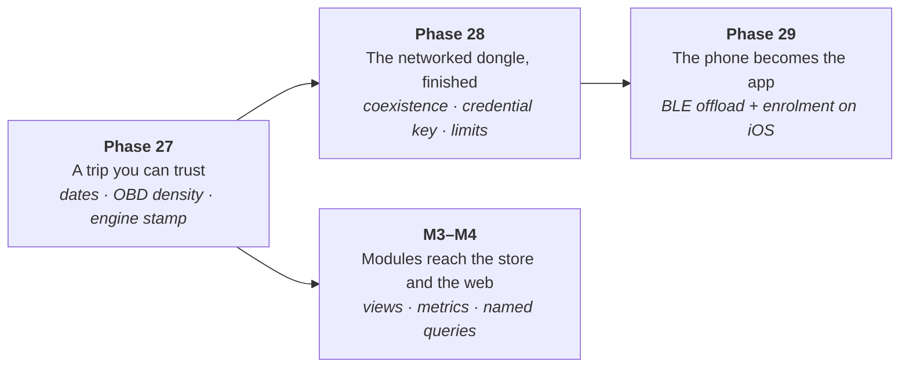

<!-- cairn-nav:start -->

<b>Cairn is a family of six repositories.</b> Each builds, tests and releases on its own; they agree through the shared <a href="https://github.com/ParkWardRR/cairn-driving-log-selfhosted/tree/main/contracts">contracts</a>, and they share this one roadmap.

| Part | Repository | What it does | Stack | Docs | Issues | CI |
|---|---|---|---|---|---|---|
| Front door | **[cairn-driving-log-selfhosted](https://github.com/ParkWardRR/cairn-driving-log-selfhosted)** ◀ you are here | Docs, this roadmap, shared protocol contracts | Markdown · Go tools | [docs](https://github.com/ParkWardRR/cairn-driving-log-selfhosted/tree/main/docs) | [issues](https://github.com/ParkWardRR/cairn-driving-log-selfhosted/issues) | [CI](https://github.com/ParkWardRR/cairn-driving-log-selfhosted/actions) |
| Dongle | [cairn-esp32-device-firmware](https://github.com/ParkWardRR/cairn-esp32-device-firmware) | In-car recorder: OBD-II, GNSS, IMU to encrypted SD bundles | C++ · C · Rust | [docs](https://github.com/ParkWardRR/cairn-esp32-device-firmware/tree/main/docs) | [issues](https://github.com/ParkWardRR/cairn-esp32-device-firmware/issues) | [CI](https://github.com/ParkWardRR/cairn-esp32-device-firmware/actions) |
| Phone | [cairn-ios-companion-app](https://github.com/ParkWardRR/cairn-ios-companion-app) | BLE relay, GPS assist, server client | Swift · SwiftUI | [docs](https://github.com/ParkWardRR/cairn-ios-companion-app/tree/main/docs) | [issues](https://github.com/ParkWardRR/cairn-ios-companion-app/issues) | [CI](https://github.com/ParkWardRR/cairn-ios-companion-app/actions) |
| Server | [cairn-vehicle-server](https://github.com/ParkWardRR/cairn-vehicle-server) | Verifies, decrypts, stores; serves app and dashboard | Go | [docs](https://github.com/ParkWardRR/cairn-vehicle-server/tree/main/docs) | [issues](https://github.com/ParkWardRR/cairn-vehicle-server/issues) | [CI](https://github.com/ParkWardRR/cairn-vehicle-server/actions) |
| Dashboard | [cairn-vehicle-web-dashboard](https://github.com/ParkWardRR/cairn-vehicle-web-dashboard) | Browser UI: trips, places, engine, health | Nuxt · TypeScript | [docs](https://github.com/ParkWardRR/cairn-vehicle-web-dashboard/tree/main/docs) | [issues](https://github.com/ParkWardRR/cairn-vehicle-web-dashboard/issues) | [CI](https://github.com/ParkWardRR/cairn-vehicle-web-dashboard/actions) |
| Modules | [cairn-modules](https://github.com/ParkWardRR/cairn-modules) | Interpretation, separated from the logging core: one package per module | YAML · Rust | [readme](https://github.com/ParkWardRR/cairn-modules#readme) | [issues](https://github.com/ParkWardRR/cairn-modules/issues) | [CI](https://github.com/ParkWardRR/cairn-modules/actions) |

Shared: [Roadmap](https://github.com/ParkWardRR/cairn-driving-log-selfhosted/blob/main/ROADMAP.md) · [Install](https://github.com/ParkWardRR/cairn-driving-log-selfhosted/blob/main/INSTALL.md) · [Architecture](https://github.com/ParkWardRR/cairn-driving-log-selfhosted/blob/main/docs/architecture.md) · [Threat model](https://github.com/ParkWardRR/cairn-driving-log-selfhosted/blob/main/docs/threat-model.md) · [Trust model](https://github.com/ParkWardRR/cairn-driving-log-selfhosted/blob/main/docs/trust-model-v3.md) · [Contracts](https://github.com/ParkWardRR/cairn-driving-log-selfhosted/tree/main/contracts) · [Archive of the original monorepo](https://github.com/ParkWardRR/cairn-original-monorepo-archive)
<!-- cairn-nav:end -->
<h1 align="center">The Cairn roadmap</h1>

<strong>One roadmap for all six repositories: where the project has been, where it is going, and what each repository has to do next.</strong>

  
  
  
  
  

> **This is the only roadmap in the project.** No repository keeps its own. A repository's
> README says what *it* is and what it has running; the plan, the ordering and the
> cross-repository dependencies live here.

**Contents:**
[How to read this](#how-to-read-this) ·
[What happens next](#what-happens-next) ·
[Who owns what](#who-owns-what) ·
[Where Cairn is today](#where-cairn-is-today) ·
[Open defects](#open-defects) ·
[The phase index](#the-phase-index) ·
[Next phases, per repository](#next-phases-per-repository) ·
[Contract pins](#contract-pins-and-what-a-bump-unblocks) ·
[Invariants](#guiding-invariants) ·
[Decisions](#decisions) ·
[Direction changes](#direction-changes-dated) ·
[Deferred](#deferred-deliberately) ·
[The completed record](#the-completed-record)

---

## How to read this

Three words are kept apart on purpose, because conflating them is how a project lies to
itself:

| Word | Means |
|---|---|
| **Proven** | It has run on the real hardware or the real deployment, and the evidence is named — a date, a count, a log line |
| **Built** | The code exists and its tests pass on a host. A large class of bugs is ruled out; driver, timing and radio problems are not |
| **Designed** | A contract, a spec or a plan exists. No implementation is claimed |

Phases are numbered in the order they were *started*, not the order they finish. A phase that
was superseded keeps its number and says what replaced it, so a decision stays traceable.
Module phases are numbered `M1`–`M7` separately, because the module system cuts across every
repository at once.

**Dates are absolute.** "Recently" is not a status.

## What happens next

The next three phases, in order, and nothing is scheduled ahead of them:

| # | Phase | One drive away? | Blocked on |
|---|---|---|---|
| **27** | [A trip you can trust](#phase-27--a-trip-you-can-trust--in-progress) | **Yes.** Every fix is landed and unverified | One drive with a GNSS fix |
| **28** | [The networked dongle, finished](#phase-28--the-networked-dongle-finished--in-progress) | No | BLE/Wi-Fi coexistence, a PKI decision, a config contract |
| **29** | [The phone becomes the app](#phase-29--the-phone-becomes-the-app--in-progress) | No | CoreBluetooth offload wiring, an enrolment screen |
| **M3–M4** | [Modules reach the store and the web](#m1m7--the-module-system--in-progress) | No | Module views, `v_metric_samples`, a web consumer |

Everything else — insight, sharing, data control, chip hardening — is real work with issues
filed, sequenced [below](#next-phases-per-repository) behind these.

## Who owns what

| Repository | Owns | Does not own |
|---|---|---|
| [**front door**](https://github.com/ParkWardRR/cairn-driving-log-selfhosted) | This roadmap, the [contracts](contracts/), the threat and trust models, the contract and link checkers, the pin dashboard, the runner installer | Any product code |
| [**firmware**](https://github.com/ParkWardRR/cairn-esp32-device-firmware) | Capture, sealing, encrypted storage, the receipt-gated prune, the BLE service, the Wi-Fi and LTE uplinks, OTA, the engine-profile generator | What a reading *means*; anything needing a key the server holds |
| [**iOS app**](https://github.com/ParkWardRR/cairn-ios-companion-app) | Phone GPS assist, the BLE offload relay, the signing client, the on-phone trip browser, CarPlay | Decryption of a bundle; any authority to delete one |
| [**server**](https://github.com/ParkWardRR/cairn-vehicle-server) | Enrolment, intake, receipts, key escrow, decode, the analytical store, the app API, the local admin API | Presentation; any interpretation a module owns |
| [**dashboard**](https://github.com/ParkWardRR/cairn-vehicle-web-dashboard) | Every browser page, passkey and Tailnet sign-in, place naming, annotations, the web tier's deploy | Reading bundles; writing to the analytical store |
| [**modules**](https://github.com/ParkWardRR/cairn-modules) | One package per interpretation — boost, fuel economy, trims, driving style, the speedometer check, place kinds — and `modgen` | The logging core |

The split happened on 2026-10-05; the plan and what was executed are in
[docs/repo-split-plan.md](docs/repo-split-plan.md). `cairn-modules` was added on 2026-10-08.
The original single repository is preserved read-only as
[cairn-original-monorepo-archive](https://github.com/ParkWardRR/cairn-original-monorepo-archive).

## Where Cairn is today

### Proven on hardware, or in the live deployment

| What | Evidence |
|---|---|
| **Capture, seal, encrypted storage** | The car's dongle (ESP32-D0WDQ6 rev v1.0) records GNSS, IMU and OBD into AEAD-encrypted append-only segments and seals signed v3 bundles. Every frame encrypted; the card is a cache of ciphertext |
| **Enrolment and key escrow** | The real device's sealed enrolment blob was unsealed by the server and its storage root escrowed as version 1, byte-identical to the Go reference. The dongle is assigned to the 428i |
| **The BLE offload chain** | 2026-10-06: nine bundles pulled over BLE in 62 s, nine receipts verified against the firmware-pinned key **on the device**, nine bundles pruned. Carried by `cmd/cairn-phone`, the Go reference phone, on macOS |
| **Wi-Fi uplink** | 2026-10-07: four bundles delivered over mTLS and pruned on verified receipts (`env:cairn-wifiup`) |
| **LTE uplink** | 2026-10-07: attached to T-Mobile US (PLMN 311480, −77 dBm), TLSv1.2 ECDHE-ECDSA-AES128-GCM through the public Funnel ingress in 5.2 s, 158,906 bytes uploaded, receipt verified, bundle pruned. Then a whole trip unattended: 1,295,714 B in 386 s, 0.23% overhead |
| **TLS verification, from the failing side** | `env:cairn-tlsneg` pins a wrong CA and the handshake is **rejected** (NOT_TRUSTED, `-0x2700`) while the correct CA verifies. Server side: no client certificate → refused; the right CommonName from an untrusted CA → refused, because identity rests on the chain and not the name |
| **The server, deployed** | Intake, receipts, escrow, vehicle and counter binding, the app API, the local admin API, the in-memory analytical store. The ledger of the first nine trips reads `offered → committed → receipt_issued → decode_queued`, every one `"path":"ble-relay"` |
| **The dashboard, deployed** | Every route authenticated by **both** passkeys and Tailnet identity; period statistics; bookmarks, tags, notes and search; the Phones page with QR enrolment and revocation; device-vs-phone GPS comparison; backup and restore; trip images |
| **The iPhone app, on a device** | TestFlight build 10. The BLE link and bond reuse across dongle reboots, one-QR setup, the Trips tab with route maps, the CarPlay car screen signed and running on hardware, passkey sign-in to the dashboard from Settings |
| **Snapshot and restore** | A cold snapshot of the server's state, restored into a scratch stack and booted — as a CI job and as the last step of every deploy |

### Built, not yet proven

| What | What is missing |
|---|---|
| Secure OTA | The install path is written and host-verified; it has never run on the dongle ([firmware #11](https://github.com/ParkWardRR/cairn-esp32-device-firmware/issues/11)) |
| The UTC-basis and OBD-sampling fixes | Landed; they need one drive with a GNSS fix to confirm ([firmware #38](https://github.com/ParkWardRR/cairn-esp32-device-firmware/issues/38), [#37](https://github.com/ParkWardRR/cairn-esp32-device-firmware/issues/37)) |
| Check-in, the config receiver, the uplink manager, the digest generator | Host-tested in the firmware; not all wired into the production build |
| `sync/v1` on the phone | The server implements it and publishes 83 exchange vectors. The app's client is built and vector-checked, but no screen drives enrolment ([iOS #18](https://github.com/ParkWardRR/cairn-ios-companion-app/issues/18), [#31](https://github.com/ParkWardRR/cairn-ios-companion-app/issues/31)) |
| Module derivations | `boost.boost_psi` is a real module-owned column in the server. No module view, metric or named query exists yet |
| The phone's own GPS in a real trip | The live store holds **zero** phone positions: nobody has yet driven with the app armed during a recorded trip. The GPS-compare panel was tested against a synthetic track |

### Designed, nothing built

[`share/v1`](contracts/share/v1/README.md) — reserved, and the [threat model's sharing
constraints](docs/threat-model.md#sharing-design-constraints-before-any-design) come first;
[`uplink/v1`](contracts/uplink/v1/README.md) — a spec and 15 vectors, while the firmware still
uses the legacy device listener; the v2 → v3 data migration; multi-phone arbitration;
multi-dongle selection.

### Constraints that shape every plan

- **One dongle, no spare.** Freematics ONE+ Model B, ESP32-D0WDQ6 **revision v1.0**. eFuse
  burns — flash encryption, NVS encryption, secure boot, JTAG disable — are ruled out on it,
  and Secure Boot V2 does not exist on this silicon at all. See
  [Phase 34](#phase-34--chip-hardening-on-replacement-hardware--planned-gated).
- **Radio placement is a real limiter.** BLE failed service discovery at −94 dBm; Wi-Fi dropped
  mid-upload with `MISSING_ACKS`. The cellular modem has its own antenna and is unaffected,
  which is why LTE succeeded on a bundle Wi-Fi lost. Move the dongle off a USB 3 hub before
  blaming a transport.
- **The dongle is bus-powered.** Switching the car off cuts power mid-capture, so a bundle is
  almost always sealed on a *later* boot, after a resume. Anything that must survive a trip has
  to survive a resume — this is exactly what broke every trip's date.
- **`cairn.alpina.casa` has no public DNS record**, and the `Cairn Private CA` private key does
  not exist on the prod host or the Mac. The LTE path therefore goes through Tailscale Funnel,
  and TLS runs on the ESP32 rather than in the modem, because Funnel needs SNI and the
  SIM7600's `enableSNI` is undocumented on this firmware revision.
- **CI runners are registered per repository.** Four repositories use the Podman Linux runners;
  `cairn-ios-companion-app` has its own macOS runner, because `CairnRuntime` imports
  CoreBluetooth, CoreLocation, UIKit and CryptoKit and will not build on Linux.

## Open defects

Every open defect across the six repositories, newest first. A fix that has landed but has not
been confirmed on hardware is **Built**, not **Proven** — the issue stays open until a drive
says otherwise.

| Repo | Issue | Defect | State |
|---|---|---|---|
| firmware | [#39](https://github.com/ParkWardRR/cairn-esp32-device-firmware/issues/39) | A bundle did not record which engine profile produced it | **Built.** The seal stamps the profile into `firmware_version` (31 of 32 bytes used); manifest key 29 `engine_profile` now exists in `contracts-v0.5.0`, so the first-class field can replace the suffix |
| firmware | [#38](https://github.com/ParkWardRR/cairn-esp32-device-firmware/issues/38) | Every trip dated 1970: the UTC basis lived only in RAM, and was anchored at the wrong instant | **Built.** A CRC'd `utcbasis.bin` sidecar survives a resume, and the basis is now UTC at monotonic zero. One new storage-matrix row (41 → 42). Needs a drive with a fix |
| firmware | [#37](https://github.com/ParkWardRR/cairn-esp32-device-firmware/issues/37) | Blocking OBD reads starved the sensing task: 766 s of a 1002 s drive empty, and GNSS starved with it | **Built.** 350 ms per read, fail-fast after two misses, and partial multi-PID batches accepted instead of discarded. Bench power reports `obd=absent`, so this path cannot run on the desk |
| firmware | [#34](https://github.com/ParkWardRR/cairn-esp32-device-firmware/issues/34) | A Wi-Fi slot is never announced to the phone, and the check-in is a no-op | Open. Both are unreleased `ble/v1` fields |
| firmware | [#33](https://github.com/ParkWardRR/cairn-esp32-device-firmware/issues/33) | Static DRAM is the binding constraint; the remaining manifest buffers need a platform alloc shim | Open |
| firmware | [#32](https://github.com/ParkWardRR/cairn-esp32-device-firmware/issues/32) | Lowering `CAIRN_MAX_CHUNKS` strands already-sealed bundles; one 1.17 MB bundle is stranded now | Open. The constant is part of the on-card compatibility surface: raise freely, lower only knowing what is already sealed |
| firmware | [#31](https://github.com/ParkWardRR/cairn-esp32-device-firmware/issues/31) | Wi-Fi cannot associate while the BLE controller is initialised — `HANDSHAKE_TIMEOUT` after 25 s, measured three times | Open. Wi-Fi is gated off in production and LTE carries the data |
| firmware | [#6](https://github.com/ParkWardRR/cairn-esp32-device-firmware/issues/6) | A Wi-Fi password may remain readable in the dongle's flash | Open. Rotate, erase or encrypt |
| firmware | [#5](https://github.com/ParkWardRR/cairn-esp32-device-firmware/issues/5) | The local BLE passkey is weak, and a session is not authenticated by an enrolled challenge | Open. The shipping pairing (MITM + DISPLAY_ONLY) must be restored with it |
| server | [#42](https://github.com/ParkWardRR/cairn-vehicle-server/issues/42) | `cairn-phone` nil-pointer dereference during BLE service discovery | Open — recovered at runtime, still a defect |
| firmware | — | **Seven legacy v2 bundles (4.76 MB) are stranded.** Their manifests are v2 and both ends are v3, so no transport can move them. They sort first, so a transfer budget must not be charged for a bundle that failed to open | A prov-console command to drop pre-v3 bundles is chosen and not built ([#32](https://github.com/ParkWardRR/cairn-esp32-device-firmware/issues/32)) |

## The phase index

Every phase the project has had, with its state. The condensed record of each completed phase
is [at the end](#the-completed-record); the full checkbox detail is in this file's git history.

### Era 1 — the v2 core data path (to 2026-10-01)

| Phase | What it delivered | State |
|---|---|---|
| 1 | Bundle format v2: framed records, a CRC chain, a CBOR manifest, Ed25519, 25 vectors | **complete** (format since superseded by v3) |
| 2 | Server raw-first ingest: mTLS, manifest-first, hash-addressed chunks, durable receipts | **complete** |
| 3 | The Rust emulator and the fault-injection matrix | **complete** — 16 rows, 0 skipped |
| 4 | Schema and decode workers: idempotent, reproducible, partitioned | **complete** |
| 5 | The firmware project, A/B partitions, card logging | **complete** |
| 6 | Capture lifecycle: four regions, journalled transitions, the pre-roll ring | **complete** |
| 7 | Framed storage and recovery; a 20-row property matrix | **complete** |
| 8 | Sync and the receipt-gated prune | **complete** |
| 9 | Degraded states as a bitmap; policy tuning | **partly open** → rescheduled as Phase 17 |
| 10 | The admin ledger and the guarantee audit | **complete** |
| 11 | Secure OTA: a separate update key, verify-before-download, hash-from-flash | **complete on the host** |
| 12 | Hardware bring-up: four defects only real hardware could find | **complete** |

### Era 2 — turning records into answers (2026-10-02 → )

| Phase | What it delivered | State |
|---|---|---|
| 13 | Engine telemetry on the real car: boost, mixture, trims, fuel level, MAP saturation | **in progress** — which PIDs this DME answers is still open |
| 14 | The in-memory analytical store (`cairn-tsdb`): rebuild-from-raw, a reproducibility gate, Parquet snapshots | **done** |
| 15 | Analysis views: drive summary, trim map, boost curve, pulls, speed agreement | **in progress** |
| 16 | Surfacing it: the Nuxt dashboard | **in progress** |
| 17 | Close out Phase 9 with real traces: tune the start/stop thresholds, event-adaptive sampling | **planned** |
| 18 | Hardening: the storage-full matrix row, the OTA install on hardware | **planned** |

### Era 3 — v3 trust, transport and vehicle scope (2026-10-04 → )

Designed as one coherent model in [docs/trust-model-v3.md](docs/trust-model-v3.md), after an
external architecture review asked for one security model across encrypted device storage,
authenticated multi-transport sync and a vehicle-scoped data model — rather than three
independent features. Breaking changes were authorised; v2 is dead.

| Phase | What it delivered | State |
|---|---|---|
| 19 | Vehicles, assignments and the device counter; intake binds the manifest to them | **done** |
| 20 | App identity and the sync API: invitations, per-request P-256 signatures, push/pull/ack | **done; deployed on the LAN** |
| 21 | Bundle format v3: encrypted segments, 59 vectors, three agreeing implementations | **done** |
| 22 | Firmware keys, counter, assignment, secrets off the card | **done except BLE session auth** |
| 23 | Tailscale and deployment hardening | **in progress** |
| 24 | ESP32 chip hardening | **reassigned** → [Phase 34](#phase-34--chip-hardening-on-replacement-hardware--planned-gated) |
| 25 | iOS companion adoption | **in progress** → [Phase 29](#phase-29--the-phone-becomes-the-app--in-progress) |
| 26 | "No Wi-Fi: the phone is the uplink" | **superseded** the same day by [#19](https://github.com/ParkWardRR/cairn-driving-log-selfhosted/issues/19). Its BLE offload shipped and is one of three paths |

### Era 4 — the networked dongle and the module system (2026-10-07 → )

| Phase | What it is | State |
|---|---|---|
| 27 | [A trip you can trust](#phase-27--a-trip-you-can-trust--in-progress) | **in progress** |
| 28 | [The networked dongle, finished](#phase-28--the-networked-dongle-finished--in-progress) | **in progress** |
| 29 | [The phone becomes the app](#phase-29--the-phone-becomes-the-app--in-progress) | **in progress** |
| M1–M7 | [The module system](#m1m7--the-module-system--in-progress) | **M1, M2 and M3's derivations done** |
| 30 | [Insight: history, health and engine-aware views](#phase-30--insight-history-health-and-engine-aware-views--in-progress) | **in progress** |
| 31 | [Sharing and data control](#phase-31--sharing-and-data-control--planned) | **planned** |
| 32 | [Release engineering: flash it from a browser](#phase-32--release-engineering-flash-it-from-a-browser--planned) | **planned** |
| 33 | [Speed: boot, time-to-upload, time-to-visible](#phase-33--speed-boot-time-to-upload-time-to-visible--planned) | **planned** |
| 34 | [Chip hardening on replacement hardware](#phase-34--chip-hardening-on-replacement-hardware--planned-gated) | **planned, gated** |
| 35 | [Routes, stretches and marking a drive](#phase-35--routes-stretches-and-marking-a-drive--planned-two-decisions-open) | **planned, two decisions open** |

---

# Next phases, per repository

Each phase states why it exists, what closes it, and what is required **from each repository**.
A row with no issue is work that still needs one filed.

## Phase 27 — A trip you can trust — **in progress**

The 2026-10-07 drive proved the network and failed the capture. LTE carried 1.29 MB unattended,
and the trip it carried holds 239 OBD samples across 1002 s with 766 s of it empty, dated 1970,
with 6.7 km of distance discarded by a 5 s gap filter that the sampling starvation tripped.
Every fix for that is landed and **none of it is verified**.

**Closes when:** one drive produces a trip with a correct date, OBD coverage proportional to its
duration, a distance that matches the route, and a manifest naming the engine profile that
produced its numbers.

| Repo | Required | Issue |
|---|---|---|
| firmware | Confirm the UTC basis survives a resume and is anchored at monotonic zero, on a drive with a fix | [#38](https://github.com/ParkWardRR/cairn-esp32-device-firmware/issues/38) |
| firmware | Confirm OBD density: 350 ms per read, fail-fast after two misses, partial batches accepted. Bench power cannot exercise it (`obd=absent`) | [#37](https://github.com/ParkWardRR/cairn-esp32-device-firmware/issues/37) |
| firmware | Move the engine-profile stamp from the `firmware_version` suffix to manifest key 29 | [#39](https://github.com/ParkWardRR/cairn-esp32-device-firmware/issues/39) |
| firmware | Establish which PIDs this DME really answers and record the set in `docs/`. `BOOST_CONTROL` (0x70) reports `support=1` and returns `NO DATA`; ethanol content (0x51/0x52) is unconfirmed | Phase 13 |
| firmware | **Pedal position.** `throttle_pct` is PID 0x11, the throttle *plate* angle: on this drive-by-wire N20 it read 32–34% during the one confirmed 8.6 psi boost event, so wide-open throttle is not identifiable from it. 0x49/0x4A are in the `pidtest` probe list, not in the profile | [#27](https://github.com/ParkWardRR/cairn-esp32-device-firmware/issues/27) |
| firmware | Write `UTC_SYNC` from a client so the phone time source stops being wired-and-unexercised. `cairn-phone` is the cheap way to test it without a drive | — |
| server | Nothing new. `v_trip_summary`'s 5 s gap filter is correct — the missing fixes were the bug, not the filter | — |
| dashboard | Confirm the trip page shows a real date, and the GPS-compare panel against **real** phone rows | [#14](https://github.com/ParkWardRR/cairn-vehicle-web-dashboard/issues/14) |
| iOS | Drive with the app armed, so the phone's GPS lands in a recorded trip for the first time | — |
| front door | Nothing. The contract work — `TIME_OBSERVATION`, manifest key 29, `pedal_pct` — shipped in `contracts-v0.5.0` | — |

## Phase 28 — The networked dongle, finished — **in progress**

The dongle is a network device: LTE carries bundles unattended, and Wi-Fi is proven in a
dedicated environment. Three things keep it from being finished — Wi-Fi cannot coexist with BLE,
the network credentials sit in plaintext flash, and nothing a user sets can reach the device.

**Closes when:** a user can add a Wi-Fi network and a monthly data cap from the web UI or the
phone, the dongle receives both sealed to its own key, enforces the cap, and uses whichever
transport is available — without a credential being readable from a flash dump.

| Repo | Required | Issue |
|---|---|---|
| firmware | **Wi-Fi/BLE coexistence.** `NimBLEDevice::deinit(true)` lets Wi-Fi associate, but the next scan panics `InstrFetchProhibited` at PC 0. Needs a safe NimBLE teardown, or a Wi-Fi slot scheduled where BLE is already down (the standby path) | [#31](https://github.com/ParkWardRR/cairn-esp32-device-firmware/issues/31) |
| firmware | **Where the credential key lives between boots.** RAM-only costs autonomy; NVS re-creates the plaintext secret under another name; an unwrap over the bonded BLE link has no wire format, replay rule or no-phone-for-a-week recovery yet | [#18](https://github.com/ParkWardRR/cairn-esp32-device-firmware/issues/18) |
| firmware | Rotate or erase the residual Wi-Fi password in flash | [#6](https://github.com/ParkWardRR/cairn-esp32-device-firmware/issues/6) |
| firmware | LTE data accounting and limits, enforced on the dongle: daily, monthly and per-trip caps, roaming, pause | [#21](https://github.com/ParkWardRR/cairn-esp32-device-firmware/issues/21) |
| firmware | Announce the Wi-Fi slot, and make the check-in real | [#34](https://github.com/ParkWardRR/cairn-esp32-device-firmware/issues/34) |
| firmware | A platform alloc shim, so the remaining manifest buffers leave static DRAM | [#33](https://github.com/ParkWardRR/cairn-esp32-device-firmware/issues/33) |
| firmware | A prov-console command to drop pre-v3 bundles, so the stranded v2 bundles stop heading the queue | [#32](https://github.com/ParkWardRR/cairn-esp32-device-firmware/issues/32) |
| front door | `contracts/config/v1`: device configuration and usage reports, sealed to the device key | [#27](https://github.com/ParkWardRR/cairn-driving-log-selfhosted/issues/27) |
| front door | The device uplink protocol for direct upload, so the dongle stops using the legacy device listener | [#22](https://github.com/ParkWardRR/cairn-driving-log-selfhosted/issues/22), [`uplink/v1`](contracts/uplink/v1/README.md) |
| front door | The threat-model and trust-model update for a networked dongle, including where the credential key lives | [#23](https://github.com/ParkWardRR/cairn-driving-log-selfhosted/issues/23) |
| front door | `contracts/digest/v1`, kept for the record only: a digest can never authorise a prune, so it is **not** on the uplink path | [#26](https://github.com/ParkWardRR/cairn-driving-log-selfhosted/issues/26) |
| server | A device configuration service: desired and reported state per device, sealed to the device key | [#24](https://github.com/ParkWardRR/cairn-vehicle-server/issues/24) |
| server | A device uplink endpoint — device-authenticated, same semantics as the relay — then retire the `:8443` mTLS listener, device certificates and the network OTA endpoints | [#21](https://github.com/ParkWardRR/cairn-vehicle-server/issues/21), [front door #7](https://github.com/ParkWardRR/cairn-driving-log-selfhosted/issues/7) |
| server | Digest ingest: show a digest as a provisional trip, supersede it with the full bundle, account for usage | [#25](https://github.com/ParkWardRR/cairn-vehicle-server/issues/25) |
| server | Fix the `cairn-phone` nil dereference in BLE discovery | [#42](https://github.com/ParkWardRR/cairn-vehicle-server/issues/42) |
| dashboard | Network and LTE settings: Wi-Fi networks, consumption, limits and alerts. The web layer authenticates before it takes any secret — true since 2026-10-06 | [#16](https://github.com/ParkWardRR/cairn-vehicle-web-dashboard/issues/16) |
| dashboard | A device page showing the uplink path per bundle, the firmware build, the installed engines and boot timing | [#14](https://github.com/ParkWardRR/cairn-vehicle-web-dashboard/issues/14) |
| iOS | Provision Wi-Fi and LTE settings onto the dongle over BLE, never over the USB console | [#28](https://github.com/ParkWardRR/cairn-ios-companion-app/issues/28) |
| iOS | Keep LTE usage, limits and the Wi-Fi network list in step with the server and the dongle | [#30](https://github.com/ParkWardRR/cairn-ios-companion-app/issues/30) |

> **The PKI blocker, stated once.** The `Cairn Private CA` private key does not exist anywhere,
> so no device client certificate can be issued; `server.pem`'s SAN covers `cairn.alpina.casa`
> only; and `cairn.alpina.casa` has no public DNS record. Regenerating the PKI is low risk — no
> client certificate was ever issued and the firmware pins no CA — and whatever replaces it must
> carry both the LAN name and the Funnel name. Until then the LTE path depends on Funnel, and
> TLS has to terminate on the ESP32 rather than in the modem.

## Phase 29 — The phone becomes the app — **in progress**

The iPhone app is real: it is on TestFlight, it pairs, it feeds the dongle GPS, it browses
trips, it signs into the dashboard with a passkey, and CarPlay runs on hardware. What it is not
yet is the *relay* — the Go reference phone still carries every bundle — and no screen drives
enrolment.

**Closes when:** the app pairs with the dongle, offloads a bundle, uploads it under its own
enrolled Secure-Enclave identity, hands back the receipt and the dongle prunes — with no Mac
involved.

| Repo | Required | Issue |
|---|---|---|
| iOS | **CoreBluetooth offload wiring**: the durable per-bundle state machine, state restoration, background `URLSession`. The codec, session and transfer checks landed 2026-10-06; `internal/offloadclient` and `cmd/cairn-phone` are the working reference | [#14](https://github.com/ParkWardRR/cairn-ios-companion-app/issues/14) |
| iOS | An enrolment flow: replace the unauthenticated snapshot with an enrolled client, driven by a screen | [#13](https://github.com/ParkWardRR/cairn-ios-companion-app/issues/13) |
| iOS | Implement `sync/v1` against the contracts and run its vectors, so the spec can leave draft | [#18](https://github.com/ParkWardRR/cairn-ios-companion-app/issues/18), [#31](https://github.com/ParkWardRR/cairn-ios-companion-app/issues/31) |
| iOS | BLE session authentication and dongle identity verification | [#9](https://github.com/ParkWardRR/cairn-ios-companion-app/issues/9) |
| iOS | Fast connect and fast offload: state restoration, background reconnect, connection parameters | [#29](https://github.com/ParkWardRR/cairn-ios-companion-app/issues/29) |
| iOS | Multiple dongles (the model, selection, per-dongle state) and multiple phones per car | [#26](https://github.com/ParkWardRR/cairn-ios-companion-app/issues/26), [#19](https://github.com/ParkWardRR/cairn-ios-companion-app/issues/19) |
| iOS | Bump the contracts pin — the app is on `contracts-v0.2.0`, three releases behind | — |
| iOS | Drive the CarPlay screen. Apple **approved** the Driving Task entitlement on 2026-10-08, the signed build runs on hardware, and a distribution export carries the capability — but the car screen has not been seen running, in the simulator or a head unit. Then the drive test: cold launch from the head unit, locked phone, disconnect and reconnect | — |
| iOS | Phase 1's two remaining rows, both of which need a drive: background wake from suspended **and** from system-terminated, and the accuracy, battery and write-rate comparison against the dongle's own receiver | — |
| iOS | Trip snapshot sync still calls an unauthenticated `/api/snapshot?format=tar` the committed server does not serve; move it to the signed `/v1/snapshot` | [#7](https://github.com/ParkWardRR/cairn-ios-companion-app/issues/7) |
| firmware | `BARO_ALT`, `UTC_SYNC`, `OBD_LIVE` and `DEVICE_STATUS` characteristics. The app side of all four is built and vector-tested and **dormant**, because no firmware build exposes them — `UTC_SYNC` excepted, which the dongle now reads and no client writes | — |
| firmware | An enrolled-app challenge–response at session start, a per-session write counter, the device fingerprint exposed for the app to verify. Then **restore the shipping pairing** (MITM + DISPLAY_ONLY + authenticated characteristics): the current build is Just Works with bonds cleared each boot | [#5](https://github.com/ParkWardRR/cairn-esp32-device-firmware/issues/5) |
| firmware | Arbitration and enrolment when several phones share one dongle | [#9](https://github.com/ParkWardRR/cairn-esp32-device-firmware/issues/9) |
| server | Drive the relay path from the emulator matrix, not only the simulated BLE link | Phase 26 |
| front door | Keep the `ble/v1` offload and device-info vectors the single source both sides replay | — |

> The macOS pairing failure that forced Just Works must be **understood**, not worked around,
> before the shipping pairing goes back.

## M1–M7 — The module system — **in progress**

Interpretation — boost, fuel economy, trims, driving style, the speedometer check, place kinds —
is leaving the GPS-logging core, so that *"a new metric can be added by configuration or a
documented extension point, not by editing core code"* finally becomes true. One module is one
package carrying its dongle, server, web and app parts together. Plan:
[docs/module-system-plan.md](docs/module-system-plan.md).

Owner's decisions (2026-10-08): a **sixth repository** rather than a tree in the contracts repo;
a module **declares the PIDs it needs** and `enginegen` merges them; **declarative at runtime**
for server, web and iOS and **codegen** for the firmware; **all six** modules carved out, not a
subset.

| Stage | What | State |
|---|---|---|
| **M1** | [`engine/v1`](contracts/engine/v1/README.md) (both halves of an engine profile in one document) and [`module/v1`](contracts/module/v1/README.md) (manifest and named-query schemas, 39 vectors), both draft | **done** 2026-10-08 |
| **M2** | `cairn-modules` with `modgen` in Rust — validate, hash, select, emit. The **second independent implementation** of `module/v1`, passing all 39 vectors | **done** 2026-10-08 |
| **M3** | Module derivations in the server (`internal/modules`, `applyDerivations`), ordered topologically and refusing a cycle. `boost` owns `boost.boost_psi` | **derivations done**; views, metrics and queries remain |
| **M4** | The web consumes a module's `ui` block: labels, units, thresholds and cards from the module, not hard-coded N20 assumptions | **planned** |
| **M5** | The firmware's `enginegen` merges the PIDs modules declare | **planned** |
| **M6** | The iOS app consumes a module's `ios` block | **planned** |
| **M7** | All six modules carved out of the core | **planned** |

### What M3's remainder needs, per repository

| Repo | Required | Issue |
|---|---|---|
| server | Module views from `views[]`; `v_metric_samples` generated from module metrics instead of a hard-coded `VALUES` list; `POST /q/<module>/<name>`; the per-vehicle module block in `/capabilities`; module-set identity folded into the store digest | [#22](https://github.com/ParkWardRR/cairn-vehicle-server/issues/22) |
| modules | Carve out fuel economy, trims, driving style, the speedometer check and place kinds; add the `nuxt` and `swift` emit targets once M4 and M6 give them a consumer | — |
| dashboard | Engine-aware views: labels, units and thresholds from the profile and the module | [#13](https://github.com/ParkWardRR/cairn-vehicle-web-dashboard/issues/13) |
| dashboard | Bump the contracts pin from `contracts-v0.1.0`, and the store pin to whatever version the module work lands | [#10](https://github.com/ParkWardRR/cairn-vehicle-web-dashboard/issues/10) |
| firmware | A temporarily flashable build that runs a battery of tests against a new engine and dumps data, so a new profile can be developed from evidence | [#27](https://github.com/ParkWardRR/cairn-esp32-device-firmware/issues/27) |
| front door | Promote `engine/v1` and `module/v1` out of draft once each README's release gate is met | [#20](https://github.com/ParkWardRR/cairn-driving-log-selfhosted/issues/20), [#14](https://github.com/ParkWardRR/cairn-driving-log-selfhosted/issues/14) |

Two rules found the hard way, both now normative:

- **A derivation's confinement is a whitelist, not a denylist.** Every identifier must be a
  column of its own table, a type, a keyword, or one of a short scalar-function list. The first
  attempt was a denylist and it let `read_csv('/etc/passwd')` through — DuckDB's reader
  functions outgrow any denylist.
- **An introduced derived column is not a grandfathered one.** A column a module *adds* is
  all-null without its module; `boost_psi` and `lambda_ratio` keep the core's definition until a
  module takes over, because nulling them would break every existing deployment. And a module
  hashes its manifest and the files the manifest names — **not** its directory, so a README edit
  cannot change the store digest.

## Phase 30 — Insight: history, health and engine-aware views — **in progress**

History shipped: statistics for any period, bookmarks, tags, notes and search. What remains is
the part that answers *"how is my car doing, and what changed since the tune?"*

**Closes when:** a page answers "is my car healthy?" in plain words, and "since the tune" has a
meaning the data can defend.

| Repo | Required | Issue |
|---|---|---|
| server | A per-vehicle tune record, baselines and a health summary | [#15](https://github.com/ParkWardRR/cairn-vehicle-server/issues/15) |
| server | Engine profiles driving engine codes, labels and derived metrics from `engine/v1`, rather than being hard-coded | [#22](https://github.com/ParkWardRR/cairn-vehicle-server/issues/22) |
| server | A richer demo store: a second engine, a tune record, bundles on different paths, a dongle with LTE usage | [#31](https://github.com/ParkWardRR/cairn-vehicle-server/issues/31) |
| dashboard | Tune comparison, baselines, trends, and a plain health summary | [#4](https://github.com/ParkWardRR/cairn-vehicle-web-dashboard/issues/4) |
| dashboard | Cards for the Phase 15 views, each showing its sample count and the age threshold it applied | Phase 16 |
| front door | Theme tracking, and the additive `store/v1` changes each view needs | [#10](https://github.com/ParkWardRR/cairn-driving-log-selfhosted/issues/10), [#9](https://github.com/ParkWardRR/cairn-driving-log-selfhosted/issues/9) |
| firmware | More PIDs only if a view needs one. Sample density is the limiter, not bus access | Phase 13 |
| iOS | Surface the health summary and the tune record in the Garage | — |

**Why trims lead.** The car is an N20 428i on a BM3 Stage 1 tune at roughly E41. For this engine
the fuel trims and the mixture say more about health than boost does — and a boost figure has to
be read as `map_kpa` against `baro_kpa`, because `boost_psi` and `maf_cgps` are mostly null in
the current store and `boost_psi` goes negative where it does populate.

## Phase 31 — Sharing and data control — **planned**

Two themes that travel together, because both are about the owner's data leaving on the owner's
terms.

**Closes when:** the owner can export a chosen set of trips as a portable file with privacy
zones applied, and every store that holds user data can be exported, imported and backed up.

| Repo | Required | Issue |
|---|---|---|
| front door | **The threat model's sharing section comes first.** No `share/v1` design until it is satisfied | [#11](https://github.com/ParkWardRR/cairn-driving-log-selfhosted/issues/11), [`share/v1`](contracts/share/v1/README.md) |
| front door | Data-control theme tracking across every surface | [#13](https://github.com/ParkWardRR/cairn-driving-log-selfhosted/issues/13) |
| server | Export, import and backup for every store that holds user data; anything that issues or checks a share token | [#16](https://github.com/ParkWardRR/cairn-vehicle-server/issues/16) |
| server | An optional S3-compatible object store (Garage) for the content-addressed store | [#19](https://github.com/ParkWardRR/cairn-vehicle-server/issues/19) |
| server | The v2 → v3 data migration, one-way, confirmed by the owner | [#18](https://github.com/ParkWardRR/cairn-vehicle-server/issues/18) |
| dashboard | Choose trips, preview exactly what the recipient gets, export a redacted file | [#7](https://github.com/ParkWardRR/cairn-vehicle-web-dashboard/issues/7) |
| iOS | A share sheet for trips | [#22](https://github.com/ParkWardRR/cairn-ios-companion-app/issues/22) |

Backup, restore and shareable trip images already ship in the dashboard, and the app's own
encrypted store already exports and imports.

## Phase 32 — Release engineering: flash it from a browser — **planned**

Today, installing Cairn on a dongle means a Mac, PlatformIO and a serial cable. That is a wall
in front of every other feature.

**Closes when:** a person with a dongle and a Chromium browser can flash it, enrol it and see a
trip, without a toolchain.

| Repo | Required | Issue |
|---|---|---|
| firmware | Publish flashable release artifacts: a merged image, a manifest and checksums | [#24](https://github.com/ParkWardRR/cairn-esp32-device-firmware/issues/24) |
| firmware | Exercise the OTA install, rollback and power-loss-during-update on hardware | [#11](https://github.com/ParkWardRR/cairn-esp32-device-firmware/issues/11) |
| dashboard | Web-based flashing on browsers that support WebSerial | [#17](https://github.com/ParkWardRR/cairn-vehicle-web-dashboard/issues/17) |
| server | Nothing new; enrolment already takes a sealed blob over the console | — |
| front door | Finish the split's local cleanup and confirm the redirects; keep [INSTALL.md](INSTALL.md) honest about six repositories | [#16](https://github.com/ParkWardRR/cairn-driving-log-selfhosted/issues/16) |
| front door | Contract hardening, each item releasable on its own | [#14](https://github.com/ParkWardRR/cairn-driving-log-selfhosted/issues/14) |

## Phase 33 — Speed: boot, time-to-upload, time-to-visible — **planned**

Three budgets, measured end to end rather than guessed per component. Cold boot is already down
from ~11 s to ~3 s. LTE throughput is ~3 KB/s, bounded by the 115200 UART and an `AT+CIPSEND`
round trip per 1024 bytes — **not** by the radio, so do not infer cellular throughput from it.

| Repo | Required | Issue |
|---|---|---|
| front door | System-wide budgets, and how each one is measured | [#25](https://github.com/ParkWardRR/cairn-driving-log-selfhosted/issues/25) |
| firmware | T0 → first sample, → BLE ready, → first upload; then optimise | [#19](https://github.com/ParkWardRR/cairn-esp32-device-firmware/issues/19) |
| firmware | Re-measure the per-chunk LTE cost at the production 8 KiB chunk size after Phase 27 | [#35](https://github.com/ParkWardRR/cairn-esp32-device-firmware/issues/35) |
| server | Time-to-visible: a budget from upload to the trip on the dashboard; accept chunks from several paths | [#23](https://github.com/ParkWardRR/cairn-vehicle-server/issues/23) |
| front door | Multipath, swarm-style chunk transfer stays an **exploration only** | [#24](https://github.com/ParkWardRR/cairn-driving-log-selfhosted/issues/24) |

Also here: **the parked current draw is still unmeasured.** It needs a meter, not a terminal, and
it remains the single most useful measurement left in the system
([firmware #10](https://github.com/ParkWardRR/cairn-esp32-device-firmware/issues/10)).

## Phase 34 — Chip hardening on replacement hardware — **planned, gated**

Formerly Phase 24, and formerly a gate in front of Wi-Fi and LTE. It could never open: the car's
chip is revision v1.0, eFuse burns are ruled out on the only unit, no sacrificial unit was ever
bought, and Secure Boot V2 does not exist on this silicon. Gating the network on it blocked the
network permanently instead of ordering it.

**It is not cancelled — it is reassigned** to whatever hardware replaces this dongle (revision
v3.0 or later). Prerequisites, unchanged: the OTA install exercised on hardware; the build
migrated to `framework = arduino, espidf` with a checked-in `sdkconfig.defaults`; the chip
revision read off the real unit; and a sacrificial unit through the whole procedure in
development mode before release mode touches a unit that matters.
([firmware #7](https://github.com/ParkWardRR/cairn-esp32-device-firmware/issues/7))

What applies to the unit in the car instead: application-layer AEAD on every frame (shipped), a
credential key the chip cannot reconstruct alone (Phase 28), signed OTA images (written), and
revocation of a stolen dongle.

## Phase 35 — Routes, stretches and marking a drive — **planned, two decisions open**

The owner's brief of 2026-10-08. Two halves that only pay off together: a **shape** for a drive
richer than one flat polyline, and a way to **mark something while driving** without looking at a
screen. The marks are what make the shapes worth having — "I drove this road" is only interesting
once you can say *this* part of it, and *that* felt wrong. Design, worked through:
[routes-and-marking.md](https://github.com/ParkWardRR/cairn-ios-companion-app/blob/main/docs/routes-and-marking.md).

**Nothing has started, and two decisions need the owner before any code does.**

1. **Naming.** "Segment" is already taken three times in Cairn: the AEAD-encrypted on-card storage
   unit in `format/v3` (a frozen contract), the app's `DriveSegmenter` 10-minute gap split, and the
   server's drive/stop/gap segmentation. A fourth meaning makes every conversation ambiguous.
   *Recommendation: use **stretch***, which the brief already offers, and leave "segment" to storage.
2. **Hierarchy.** "Several routes make up a trip" inverts how Cairn uses "trip" today, where a trip
   is one drive and a route is the line it drew. The brief's sense works if a trip is the whole
   outing — drive to the canyon, run the loop, drive home — but that is a different boundary from the
   one the server's derived trip builder already uses. Either redefine the boundary, or put the
   outing above the trip under a new name.

**Closes when:** a drive can be marked by voice with the phone locked, and the mark is found
afterwards on the right stretch, carrying the telemetry that was actually live at the time.

| Repo | Required | Issue |
|---|---|---|
| front door | Settle the two decisions above, then the additive `store/v1` views for routes and stretches and a `sync/v1` carrier for marks | — |
| server | Route and stretch tables, the out-and-back / loop / one-way classifier, and stretch matching across drives so the same road recognises itself | — |
| iOS | `DriveMark` in CairnCore: kind, timestamp, drive id, optional location, and **the telemetry actually held at that moment with its freshness** — never a fabricated reading. Plus a reconciliation pass once the dongle's data for that window arrives | — |
| iOS | One-tap marking from the Drive tab, the Action button, a Control Center control, a Lock Screen Live Activity, and a mark button on the CarPlay Now deck — the first *write* the car screen does, and it must not touch recording state | — |
| iOS | App Intents and App Shortcuts for the spoken phrases, running without launching the UI. "Is my drive recording?" answers off the same evidence rule as the CarPlay HUD, which only claims recording on the dongle's own fresh word — **the negative answer is the feature**: a logger that cannot say "I can't confirm" is not trustworthy | — |
| iOS | Store a location track per drive (Phase 3 work, still open) — a route cannot be classified without one, which makes retention and delete-all matter | — |
| dashboard | Draw a route with its shape named, stretches selectable, marks on the route map and the speed trace, and search by mark kind | — |
| firmware | Only if "save a clip either side of the tap" is to be exact. A phone-side ring buffer of the last N seconds works with today's firmware and holds only what BLE delivered; asking the dongle for the window is complete but needs a new characteristic. *Recommendation: ship the ring buffer first* | — |

---

## Contract pins, and what a bump unblocks

A repository does not copy a contract; it pins a release by tag **and** commit in
`contracts.lock` and fetches that, so a contract change cannot reach an implementation
unnoticed. The latest release is **`contracts-v0.5.0`**. The live table is generated into the
[README](README.md) by `tools/cmd/pin-dashboard`.

| Repository | Pinned to | Behind by | What a bump unblocks |
|---|---|---|---|
| server | `contracts-v0.5.0` | — | current |
| firmware | `contracts-v0.5.0` | — | current |
| modules | `contracts-v0.4.0` | 1 | the §7 identity correction, which `modgen` already implements ahead of its pin |
| iOS app | `contracts-v0.2.0` | 3 | `engine/v1`, `module/v1`, `DEVICE_INFO` out of draft, the `TIME_OBSERVATION` record, manifest key 29 |
| dashboard | `contracts-v0.1.0` | 4 | every `store/v1` addition since 1.0, including the period views and the module surface |

**Two consequences worth stating.** The firmware's engine schema now lives in the contracts
repository, and `scripts/fetch-contracts.sh` verifies that the tag resolves to the pinned commit
— so any firmware change needing a new field in `contracts/engine/v1/acquisition.schema.json` is
gated on a maintainer tagging a release (`CAIRN_CONTRACTS=<path>` overrides the fetch for local
validation only). And **adding a capture field means editing two files**:
`contracts/engine/v1/acquisition.schema.json` (`$defs/field`) and
`contracts/module/v1/module.schema.json` (`$defs/engine_field`), or `modulecheck`'s vocabulary
check fails CI by design. It has already caught one drift.

Contract status, versioning rules and the release gates are in
[contracts/README.md](contracts/README.md); what changed in each release is in
[contracts/CHANGELOG.md](contracts/CHANGELOG.md).

## Guiding invariants

These are not goals. They are properties every change is checked against, and a phase that would
break one does not ship.

1. **A sealed bundle is never mutated.** It is either locally recoverable, remotely
   receipt-confirmed, or both.
2. **No byte is deleted without a locally verified signed receipt.** Time, storage pressure and
   operator impatience are all insufficient justification. This is why a compressed digest can
   never be the cellular path: a digest's acknowledgement cannot authorise a prune, so it would
   never free the card.
3. **Ordering truth is `(boot_id, monotonic_seq)`, never wall-clock UTC.** GNSS time jumps; UTC
   is an annotation with an uncertainty, not an index.
4. **Honest incompleteness beats fabricated continuity.** A trip with a marked GNSS gap is
   useful; a route interpolated from stale fixes is not.
5. **Anything derived is disposable and must prove it reproduces.** Raw bundles are
   authoritative. A derived store carries the digest that shows its rebuild matched, and is not
   served when it does not.
6. **Every clock can lie in a way that parses**, so a plausibility floor lives once, at the point
   a time observation becomes a basis — not per source. The SIM7600 answers with its 1980 build
   default before NITZ; a GNSS receiver with no fix yields a flawless 2000-01-01.

### What the work must not foreclose

- **Trip identity stays stable and portable.** Sharing needs an id that survives export and
  import. Today it is the boot id; do not change it casually.
- **Per-vehicle scoping stays** (`vehicle_id` through the store and the API): insight and sharing
  are both per vehicle.
- **The store contract stays additive.** New views are added; existing ones are not repurposed.
- **Every store keeps an export path**, and user data never moves somewhere an export cannot
  reach.
- **The web layer keeps working with no cloud.**
- **Privacy zones are a first-class idea**, so the place engine and saved places stay reachable
  from the export path.

### Reasons to use it, as acceptance tests

| Reason | A release is not done until |
|---|---|
| Useful automatic capture | a drive is captured and visible without opening any app |
| Detailed vehicle information | the OBD detail is browsable per trip and per vehicle |
| Control of data | every store holding user data can be exported, imported and backed up, and nothing requires an account or a cloud service |
| Adaptability | a new vehicle, a new place kind or a new metric can be added by configuration or a documented extension point, not by editing core code — which is what the [module system](#m1m7--the-module-system--in-progress) exists to deliver |

## Decisions

| Decision | Choice |
|---|---|
| Firmware | An ESP-IDF application with `arduino-esp32` as a component, keeping the vendored FreematicsPlus drivers. Rebuild the application, not the hardware access — this project already contains one failed custom HAL |
| Stack shape | C and C++ (firmware), Go (server, tools), Rust (emulator, `modgen`), Nuxt/TypeScript (dashboard), Swift (iOS), plus SQL and shell/systemd deploy |
| Retired 2026-10-05 | Odin tools, MoonBit plugins, the Gleam orchestrator, the Zig bundle and CLI tools, the v1 Go ingest, the Rust trajectory tool, the Mojo experiments, the v1 Compose/Podman stack. Optional side tooling that no longer fed anything on the v3 path; all of it is in git history |
| Analytical store | **In-memory DuckDB** behind a small Go service, rebuilt from the CAS on every start. The data is tiny and the useful questions are ASOF joins across streams polled at different rates — OBD against boost against GNSS. InfluxDB 3 was rejected as UTC-keyed and, as far as was checked, without ASOF; QuestDB as a memory-mapped JVM on a 7.3 GB box shared with the runner |
| Analytical time key | `(boot_id, mono_ms)`, never UTC. UTC rides along as a column |
| v1 | **Dead.** No reader, no migration, no compatibility |
| v2 | **Dead as of 2026-10-04.** Replaced by v3 (`CRN3`, manifest v3); a one-way data migration is now wanted ([server #18](https://github.com/ParkWardRR/cairn-vehicle-server/issues/18)) |
| Storage encryption | Application-layer AEAD per frame, because the ESP32 has no SD encryption hardware. XChaCha20-Poly1305 with a random nonce per frame, since a seq-derived nonce would be reused after a torn-tail rewrite. The server escrows each device's root; the card alone cannot decrypt |
| App authentication | **Per-request P-256 signatures**, not mTLS: `tailscale serve` terminates TLS, so a client certificate cannot reach Cairn on the Tailnet path |
| Web authentication | **Both** passkeys and Tailnet identity. The passkey relying party is the LAN origin; the Tailnet origin uses Tailnet identity instead |
| Assignment validity | Judged by the device's monotonic counter, **not** the clock (invariant 3) |
| Counter reuse | A counter bound to different content is a forgery or a rolled-back device: quarantine, never ingest |
| Server-side raw data | Stays ciphertext in the CAS; keys live in a wrapped keystore apart from the data directory. Destroying a root crypto-shreds every copy, including backups |
| LTE payload | **Whole sealed bundles, not digests** (2026-10-07) — see invariant 2. Compression is not worth building either: a trip is about 230 KB, and `gzip -9` reduces AEAD ciphertext only to 90% of raw (measured) |
| Module delivery | A sixth repository; a module declares the PIDs it needs; declarative at runtime for server, web and iOS, codegen for the firmware |
| Tagging a contract release | A maintainer, never CI |

Target hardware is **classic ESP32** (Xtensa LX6, WROVER with PSRAM), not an S3. There is no
secure element, and the eFuse flash-encryption key cannot be read or derived from by software,
so the root key is a random value in NVS — flash encryption would protect it by protecting the
flash it lives in, which is exactly what this unit cannot have.

## Direction changes, dated

The record of what was decided and then overturned, so a document that still says the old thing
can be recognised as stale rather than followed.

| Date | Change |
|---|---|
| 2026-10-04 | v3 authorised as a breaking change: encrypted storage, authenticated multi-transport sync and a vehicle-scoped data model, designed as **one** model rather than three features |
| 2026-10-05 | The monorepo is split into five repositories; the front door keeps the docs and the contracts |
| 2026-10-05 | **"No Wi-Fi: the phone is the uplink."** Superseded the same day |
| 2026-10-05 | **The dongle gets Wi-Fi and LTE back**, to put boot speed and time-to-upload first ([#19](https://github.com/ParkWardRR/cairn-driving-log-selfhosted/issues/19)). Security first: flash and NVS encryption before any stored credential |
| 2026-10-05 | A one-way **v2 → v3 data migration is wanted**, reversing "no migration" |
| 2026-10-07 | **LTE carries whole sealed bundles, not compressed digests.** The property that made digests attractive is the one that kills them: an acknowledgement that cannot authorise a prune never frees the card. `lib/cairn_digest` is kept but unused by the uplink |
| 2026-10-07 | **The credential gate is answered without eFuse burns.** "Phase 24 first" could never open on revision v1.0 silicon. In its place: credentials under a key the chip cannot reconstruct alone, derived with the server's help from the already-escrowed device root. It is narrower than flash encryption and must not be written up as more — `K_root` and the signing seed stay readable from an extracted chip, and serial reflashing stays possible |
| 2026-10-07 | **Shipping beat the gate.** Credentials are in plaintext flash in the gitignored `include/secrets.h`, and the transports are live. A knowing trade, not an oversight: a flash dump permits uploading **as** this device and reading what it uploads, but not deleting anything, because a prune requires a server-signed receipt verified on-device |
| 2026-10-07 | The **LTE hardware is confirmed**: a SIMCOM SIM7600A-H answered on the car's own dongle. Earlier notes calling the modem absent were reading an unpowered socket |
| 2026-10-08 | **A module system**, in a sixth repository, with all six interpretations carved out of the core |
| 2026-10-08 | Time is collected from **every** source — GNSS, the cellular network, the phone — and the backend chooses. The manifest basis stays first-wins; the `TIME_OBSERVATION` records are the evidence trail |

## Deferred deliberately

| Deferred | Reason |
|---|---|
| A v1 reader or migration | v1 is dead. Not deferred — refused |
| Persisting the analytical store | A rebuild is ~60 ms. Revisit only if one exceeds ~5 s |
| InfluxDB / QuestDB | Evaluated and rejected for this data and this machine; see [Decisions](#decisions) |
| Arbitrary user plugins | Retired 2026-10-05 with the MoonBit plugin system. The [module system](#m1m7--the-module-system--in-progress) is the sanctioned extension point instead |
| MinIO | A CAS directory on ZFS is sufficient; keep the abstraction, skip the daemon. Garage is the optional alternative ([server #19](https://github.com/ParkWardRR/cairn-vehicle-server/issues/19)) |
| TimescaleDB | Native range partitioning first; adopt only on measured need. Analytical reads go to the in-memory store, which lowers that need further |
| GPU acceleration for analysis | No demonstrated need |
| `previous_bundle_root` enforcement | The field is populated; detecting deleted historical bundles is a different threat model from detecting corruption |
| ESP32 deep sleep | Not possible on this board: the IMU interrupt is not routed to an RTC-capable GPIO, so there is no wake-on-motion source — the official Freematics firmware polls for the same reason. Timer-wake deep sleep would reset on every wake, and boot mounts the card and runs a recovery scan, which is more costly than the polling it would replace. Standby instead powers peripherals down, clocks the CPU to 80 MHz and light-sleeps between polls |
| Compressing the cellular payload | Measured: `gzip -9` takes AEAD ciphertext to 90% of raw, and a 2 GB plan already carries some nine thousand trips |

---

# The completed record

What each finished phase delivered, and the evidence. The full checkbox detail — every property
matrix row and the reasoning behind each design choice — is in this file's git history.

## Era 1 — the v2 core data path

**Why it was rebuilt.** Two architecture reviews concluded v1's design was sound but only
correct on the happy path, and asked for the system to become *auditable across failures*.
Cross-checking the reviews against the code found that three of their recommendations were live
defects rather than future concerns: only `samples.bin` was uploaded, so OBD, IMU, health and
event data was silently discarded on every sync; pruning was not receipt-gated and retention was
measured with `millis()`, which resets on every deep sleep; and transport was plain HTTP on 8080,
not the mTLS on 8443 the docs claimed. The core data path was rebuilt from a clean slate rather
than remediated in place — no format compatibility, no migration, no reissued receipts.

| Phase | Delivered |
|---|---|
| **1 — Bundle format v2** | A normative spec with byte layouts; a Go reference implementation; framed records with `boot_id`, a monotonic `seq`, CRC-32 and a `prev_crc32` chain; a deterministic-CBOR Ed25519-signed manifest; three distinct identifiers (`bundle_id`, `content_root`, `transfer_hash`); nine payload schemas carrying fix type, HDOP, accuracy, satellites and source flags, so precision the receiver never reported is never inferred; UTC as an estimate with its own uncertainty, separate from the ordering key; an explicit `GNSS_GAP` record so absence is recorded rather than interpolated; 25 deterministic conformance vectors |
| **2 — Server raw-first ingest** | mTLS on 8443 with a private CA and a denylist; a manifest-first upload answering with missing chunk indices only; chunks accepted **by hash**, never by byte offset; a content-addressed raw store kept object-like for a later swap; a durable signed receipt persisted *before* it is returned; a persistent signing key that refuses to start ephemeral outside dev mode; idempotency keyed on `content_root` rather than a connection or request id; per-device rate limits and quotas; transport identity bound to the manifest's claimed identity; revocation effective with no restart |
| **3 — Emulator and fault injection** | A Rust implementation of format v2, byte-identical to the Go reference on all 22 committed vectors; a fault-injection layer with named interrupt points; a device lifecycle model; **16 matrix rows passing, 0 skipped**, reproducible from a printed seed and asserting against durable state rather than stdout. What it proves: a frame durably written is always recoverable; a sealing failure never discards captured data; a torn tail is isolated with an exact discarded byte count; a flipped bit is detected at its own frame; a 30 s backwards UTC jump leaves every frame in sequence and flagged; no verified receipt ⇒ never pruned; a retry always converges on exactly one receipt; a rotated signing key cannot induce a prune. The harness also found what review had not: a clock-jump test that edited a frame after the fact was rejected as `CHAIN_BREAK`, and a `FaultPoint` declared but never constructed turned out to be a missing matrix row |
| **4 — Schema and decode workers** | Fresh migrations across raw, normalized and derived layers; range-partitioned sample tables with on-demand monthly partitions **and a default partition**, so a decode can never fail for want of one; `geom` as a stored generated column, so the geometry cannot drift from the coordinates it represents; a decode worker in its own process consuming the outbox; reprocessing as a queued job; a derived trip builder with drive/stop/gap segmentation and daily rollups; MQTT publishing semantic idempotent state only, verified against a real broker. **Idempotent**: every write upserts on a deterministic key or deletes the bundle's rows first, in one transaction. **Reproducible**: `output_digest` hashes the derived output, so a decoder upgrade appears as a second row at a higher version and comparing digests shows exactly which bundles a change altered. And a sync completes with the database *closed* — ingest has no database dependency, so an outage delays the derived view and nothing more |
| **5 — Firmware project** | A/B OTA slots from the first commit (two 1.69 MB app slots, `otadata`, `nvs_keys`, `errlog`, `coredump`); NVS holding the device id derived from the eFuse MAC, so wiping NVS does not change which vehicle the data came from; a boot self-test covering CRC-32 through the ROM path, SHA-256, Ed25519 sign/verify/tamper-reject, a framed write, a seal and a live sync; verbose SD logging, RAM-buffered before the card mounts so a mount failure is itself diagnosable, capped at 16 MiB and suspended below 64 MiB free — a testing aid must not be able to cost a trip |
| **6 — Capture lifecycle** | Four independent state regions — capture, bundle, connectivity, health — because losing the network must not end a trip and a degraded sensor must not stop capture; every transition journalled with its trigger, reason code and **the policy version in force**, so a decision in the data stays explainable after the thresholds change; confidence-scored evidence from IMU RMS, OBD speed and GNSS speed, with separate start and stop thresholds, since stopping requires the *absence* of evidence; `GNSS_GAP` recorded rather than interpolated; a 45 s pre-roll ring, so a real drive recovers its first seconds while a parked car produces nothing; and **one transition controller owning all state while sensing only reports facts**, pinned to core 0 — a correctness fix, because the IMU used to be read in the same loop pass that wrote frames, so during a 30 ms card write no samples were taken and the RMS a window reported was computed over whatever moments happened to miss I/O |
| **7 — Framed storage and recovery** | Append-only framed segments rotated at 1 MiB, with one chain across all of them and a separate journal chain; a portable C11 implementation passing all 25 vectors, clean under ASan and UBSan; Ed25519 vendored from TweetNaCl and checked *two* ways — verifying a Go-produced signature, and signing compared byte-for-byte against it — because Ed25519 is deterministic, so a subtly wrong field implementation cannot survive that; a **streaming** recovery scan, so a segment far larger than DRAM is recoverable with one frame resident, with the device and the vectors driving one body of code; a crash-safe seal that writes the manifest *before* moving the directory; and a 20-row property matrix that tears real files mid-frame and mid-header, flips payload bytes, forges receipts and interrupts seals — against exactly the code the device runs |
| **8 — Sync and the receipt-gated prune** | A manifest-first offer with chunks addressed by hash and streamed from the card, so a 256 KiB chunk never needs to fit in DRAM; the receipt verified against a **pinned** server key **and** matched to the uploaded `content_root`, because a valid signature over a different bundle is not an acknowledgement of this one; receipts persisted outside the bundle directory and stored *before* being acted on, since the receipt is the durable evidence and the bundle bytes are not; a transactional prune replayed at boot; and an unconfigured key pruning **nothing**. The CA is compiled into firmware because it is the trust anchor, while the client certificate is rotatable — and running it for real found a defect the script would otherwise have shipped: macOS LibreSSL defaults to SHA-1, which Go rejects while sending a misleading `unknown ca` alert |
| **9 — Degraded states** | The degraded states as a **bitmap**, defined in the spec and implemented across the firmware and Go. The spec had declared a bitmap and defined one nowhere, and the firmware was writing a scalar `0/1/2` into a field every decoder would read as a bitmap. A bitmap rather than a severity is the whole point: a low battery, a missing fix and a full card are different problems with different fixes, and a scalar forces a priority between them and discards the rest — the old code reported `Critical` for the battery while silently losing the fact that position was unavailable too. Decoders preserve unknown bits, so a bundle from newer firmware stays interpretable. *Policy tuning on real traces remains open as Phase 17* |
| **10 — Ledger and documentation** | An append-only admin ledger over the bundle lifecycle, on disk rather than in PostgreSQL so the audit trail cannot quietly give ingest a database dependency, and with a nil ledger disabling recording rather than failing an upload — an audit trail with veto power over the data it audits is the wrong shape. Every refusal must carry a reason, enforced in `Append` rather than trusted to call sites, because those entries are written on error paths where it is easiest to forget. And every documented guarantee mapped to the row that verifies it in [docs/guarantee-audit.md](docs/guarantee-audit.md) — writing which found two guarantees with no test at all, one of them deferring to a test that did not exist |
| **11 — Secure OTA** | Signed images verified before swap with a **separate update key**, because the receipt key says "this data is safe to delete" while the update key says "this code is safe to run" — so the update key never lives on the server. Then the ordering, which is the part that matters: verify the descriptor signature **before** downloading, or a hostile server can make the device write megabytes into its spare slot on demand; hash the image **read back out of flash**, because hashing the download proves the transfer and not the write; set the boot partition **last**. A post-boot self-test marks the image valid only after the card mounts, since an image that boots but cannot reach its storage is not a working image. Never updates with unreceipted bundles pending, mid-trip, or on an unhealthy *or unknown* supply. Version ordering **refuses rather than guesses** |
| **12 — Hardware bring-up** | First contact with the real dongle, 2026-10-01, and four defects a green test suite could not have found. **The ESP32 ROM CRC-32 wrapper dropped the final xorout**, returning the raw shift register — internally consistent, so the device never noticed, and every trip it recorded would have been rejected by the verifier. **Sealing overflowed the 8 KB loop-task stack**, and the canary panic became a reboot loop, because boot resumes the open capture and re-appends frames each cycle; the counter reached 92. **The standby blocker logged every 20 ms**, burying 160 KB of a 174 KB capture. **`-dev` minted an ephemeral receipt key** even with a persistent seed on disk, so the server signed receipts no device had pinned, the device rejected all of them, and nothing on either side logged an error. Then the full loop on hardware — capture → seal → offer → commit → receipt → verify against the pinned key → prune — with mutual TLS attributed to the device by its certificate CommonName, and standby with wake-on-motion found in the card logs, including a `GNSS_GAP` written unprompted when the receiver dropped out |

> **The methodology that paid for itself:** check documented claims against the code, and
> mutation-test every new test. The CRC defect is the clearest argument for
> cross-implementation conformance vectors existing at all — it was undetectable from inside the
> device, and the device was the only thing that could reveal it.

## Era 2 — insight

| Phase | Delivered |
|---|---|
| **14 — The analytical store** | `cairn-tsdb`: the CAS and the card copied into a private scratch CAS, each bundle decoded **twice** through the production decoder, loaded into an in-memory DuckDB and reconciled row for row against what the decoder produced. A build that fails or does not reproduce is not served, and the previous store keeps serving. Keyed on `(boot_id, mono_ms)`; `v_telemetry` ASOF-joins boost and GNSS onto each OBD poll and exposes the age columns. Locked down: one read-only statement per request, an always-rolled-back transaction, external file and network access disabled, a loopback bind. Golden `output_digest` pins, so a decoder change fails a test instead of silently shifting every number. Reload on receipt; parity asserted against PostgreSQL; `/metrics`; a Parquet snapshot export; a card mirror script; authentication required before any non-loopback bind. **Persisting it is deliberately out of scope** — volatility is the design, and the trigger to reconsider is a measured one: a rebuild exceeding ~5 s |
| **15 — Analysis views** | `v_drive_summary`; `v_trim_map` (STFT/LTFT binned by RPM and load, ASOF-joined to the nearest boost reading within 2 s — for an ethanol blend the long-term trim is the honest signal); `v_boost_curve` (excluding stale and MAP-saturated readings); `v_pulls` (gap-and-island WOT detection with peak boost, mean lambda and trims per pull); `v_speed_agreement` (OBD against GNSS, 3D fix required). **Every view filters on the `*_age_ms` columns it relies on and says so** — an ASOF join always finds *something*, so staleness has to be an explicit predicate, never a default |
| **16 — The dashboard** | A Nuxt + Vue app with ECharts, Leaflet and Pinia, reading the store through server-side routes and never arbitrary SQL. Dashboard, trip list and detail with a speed-coloured route, Boost & Power, Fuel & Tune, Analytics, Behavior, Calibration, fuel economy, places, device health, and GNSS outlier filtering across every surface. Since then: authentication on every route, period statistics, bookmarks, tags, notes and search, the Phones page, GPS-source comparison, backup and restore, and a plain simple-by-default view with the detailed pages one click away |

## Era 3 — v3 trust, transport and vehicle scope

| Phase | Delivered |
|---|---|
| **19 — Vehicles, assignments, counters** | A vehicle registry (`engine_code` as a label and not an identity; the VIN sealed at rest with only the last four readable) and explicit device→vehicle assignments. **Assignment validity by counter order, not wall clock**: a bundle under a superseded assignment is refused, a late upload from before the switch is not. Per-device monotonic counters bound to `content_root` — the same pair is an idempotent duplicate, the same counter with different content is a **conflict** (a forgery, or a cloned or rolled-back device), and holes are reported as missing rather than refused. Per-device storage-root escrow, wrapped with the device and version bound as AAD, write-once, with `Destroy` for crypto-shredding. Intake binds the manifest at **commit**, before the receipt, so an abandoned offer spends nothing and two racing offers cannot both win; every refusal carries a reason. `vehicle_id` through decode, tsdb, PostgreSQL (a non-destructive migration), the snapshot endpoint and the UI, with a two-car test that shares boot ids and timestamps so only `vehicle_id` can separate the cars, and four join mutations each caught |
| **20 — App identity and the sync API** | One-time invitations (hash-at-rest, a 10-minute TTL, single use) and enrolment with proof of possession, on P-256 so the key can live in the Secure Enclave; a bad proof does not burn the code. Per-request signature authentication (a ±120 s window, a nonce cache, the body hash in the signed string, a uniform 401) and 1-hour bearer tokens re-checked against the registry on every use, so revocation kills them. Transport classification; Tailscale Serve identity headers honoured **only** from loopback and only when trusted explicitly; Funnel-marked requests rejected. `push`/`pull`/`ack` over a durable append-only log with torn-tail recovery, server-assigned ordering, idempotency by operation id, per-field revisions and an opaque repeatable cursor with a reset epoch. An append-only audit log that a test greps for payload markers, coordinates, tokens, signatures, public keys and the VIN. Published, test-pinned vectors for the signing string and the canonical-JSON content hash. **Exercised end to end over the LAN** against verified TLS, including a revocation that took effect on the next request |
| **21 — Bundle format v3** | A `CRN3` 128-byte segment header carrying `vehicle_id`, `assignment_id`, `storage_key_version` and `device_counter`; every frame AEAD-encrypted with the CRC chain and Merkle root computed over **ciphertext**, so structure, torn tails and integrity all verify without a key; XChaCha20-Poly1305 with a random 24-byte nonce per frame and AAD binding both headers; HKDF-SHA256 per-segment keys salted with `vehicle_id`. Conformance vectors including auth-tag tamper, frame transplant, wrong vehicle, wrong key version and manifest/segment mismatch, each stating a structural verdict (no key) **and** a keyed verdict. **Three implementations agree**: Go, a Rust port (33/33 vectors, a fault matrix 20/20 against a live v3 server, 11 mutations each caught) and a C firmware port (33/33, 9/9 primitive known answers, re-sealing every decrypted vector frame to the vector's exact bytes, fault matrix 41/41, clean under ASan/UBSan, 8 mutations each caught) |
| **22 — Firmware keys and secrets** | `K_root` generated on first boot with the hardware RNG and stored in NVS; the enrolment blob sealed to the server's enrolment key (X25519, HKDF, XChaCha20-Poly1305) and signed for proof of possession, **verified on the car's dongle** byte-identically to the Go reference; the device bundle counter in NVS, **reserved and made durable before the first segment header exists** — it is in every header and authenticated into every frame, so it cannot wait until seal — and committed again before the manifest is signed, so a bundle that never seals leaves a reported gap rather than a reused counter; resume above the server's counter floor, raise-only; the mTLS client key moved off the card with legacy copies erased at boot; and a serial provisioning protocol that never runs during a trip, times out when idle, commits credentials atomically to two slots and echoes no secret, which is canary-tested |
| **23 — Deployment hardening** *(in progress)* | The keystore master key in `/etc/cairn`, outside the data directory and handed to the services as a systemd credential; the legacy v1 unit that silently took `:8443` the moment the real server stopped, disabled; the 2026-10-05 repository cleanup. **Still open:** the Tailscale login approval and tag, `tailscale serve` fronting the loopback listener, a restore tested with the master key held apart from the data, systemd hardening for the app listener, and MQTT scoped by device and vehicle |
| **26 — BLE offload** *(superseded as a strategy; the code shipped)* | Wi-Fi, HTTP upload, the TLS client and HTTP OTA fetch removed, cutting the image from ~1.1 MB to ~0.45 MB — and all restored in Era 4. The BLE offload protocol (`LIST`, `GET_MANIFEST`, `READ`, `PUT_RECEIPT`, `ABORT`, a `TRIP_ACTIVE` refusal, standby held while a phone works), 22 host rows, ASan clean, with nine mutations of the receipt gate each caught, and golden vectors generated from the firmware's own module so a test fails if they drift. The server's `/v1/relay/bundles/*` reusing the intake core, scoped by the manifest's vehicle at every step, with an end-to-end test that needs no radio — including lost and corrupted notifications, a wrongly pinned dongle, an out-of-scope phone and SD bit rot. **And the real run, 2026-10-06:** nine bundles in 62 s, nine receipts verified on the device, nine bundles pruned |

---

This roadmap is reviewed as a whole, not patched. If a line here disagrees with a repository's
README, the README is describing what it has running and this document is describing what is
planned — and if they disagree about what has <i>run</i>, this document is wrong, and the fix
belongs here.

