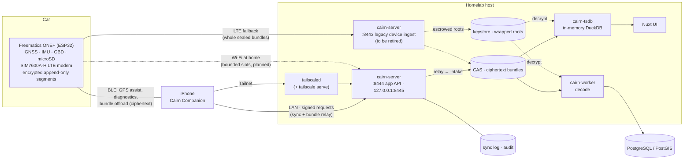

# Architecture

Cairn is an offline-first car journal: an **in-vehicle recorder** that works with
no network, a **homelab server** that receives, verifies and stores what it
records, and an **iOS companion** that is both the dongle's GPS assist and a
first-class client of the server. No cloud account is involved at any point.

The trust model that ties these together is in
[trust-model-v3.md](trust-model-v3.md); this page is the component map.

## System



### Transport paths

The dongle has three transport paths, tried in order of preference:

1. **BLE → iPhone → Tailscale/LAN → server** (shipped). The phone pulls
   sealed bundles over BLE and uploads them. The preferred everyday path.
2. **Wi-Fi at home** (planned). Bounded slots when parked near a known
   network; BLE is the home state and the one radio is time-sliced.
3. **LTE fallback** (working since 2026-10-07). Carries **whole sealed bundles**,
   not digests — the owner reversed the digest plan, because a digest earns no
   receipt and so can never authorise a prune, which means a digest-only path
   never frees the card. Compression was measured and dropped: sealed segments
   are AEAD ciphertext that `gzip -9` reduces only to 90% of raw, and a trip is
   about 230 KB anyway. User-set monthly caps are still to be enforced on the
   dongle ([firmware #21](https://github.com/ParkWardRR/cairn-esp32-device-firmware/issues/21)).
   The SIM7600A-H on the car's dongle is LTE-FDD B2/B4/B12 only, so no B71 and
   no B13 — Verizon is out. TLS runs on the ESP32 rather than in the modem,
   because the Tailscale Funnel ingress requires SNI; measured throughput is
   ~3 KB/s, bounded by the 115200 UART and an `AT+CIPSEND` round trip per
   1024 bytes.

The full cellular design, including connectivity paths to the homelab, radio
scheduling, data budgets, and privacy constraints, is in
[lte-cellular-design.md](lte-cellular-design.md).

## Core rules

1. **The device never needs the server to complete a drive.** Every trip is a
   valid, sealed, recoverable bundle on the card before any network exists.
2. **The card is never the security boundary.** It holds ciphertext only; trust
   roots live in device-held keys, the server's keystore and revocable
   identities.
3. **Everything uploaded is untrusted until it verifies**: signature, vehicle
   assignment, counter and integrity chain.
4. Raw, sealed bundles are authoritative; everything derived is disposable and
   must prove it reproduces (ROADMAP invariants 1–5).

Cairn's core is GPS logging management — capture, custody, receipt-gated prune,
decode, trips. Everything that *interprets* the readings (boost, fuel economy,
fuel trims, driving style, speedometer error, place kinds) is still inside that
core today; [module-system-plan.md](module-system-plan.md) is the plan to move it
out into modules that carry their dongle, server, web and iOS parts in one
package. None of it is implemented.

## Components

### Device — Freematics ONE+ Model B (`firmware/cairn-v2`)

Classic ESP32 WROVER. Captures GNSS, IMU and OBD into append-only,
CRC-chained, **AEAD-encrypted** segments; seals them into Ed25519-signed
bundles; **has no Wi-Fi and no network credentials**: the enrolled phone pulls
sealed bundles over BLE and uploads them for it ([ble-offload.md](../contracts/ble/v1/offload.md)).
It prunes a bundle only after verifying a signed server receipt (handed back by the
phone) against a key pinned in firmware. The BLE service also accepts phone GNSS
fixes. No LTE. Tailscale does not run here.

### Server (`server/`, Go)

| Package | Role |
|---|---|
| `format` | Bundle format (frames, segments, manifest, Merkle, receipts, update descriptors) — the reference implementation; C firmware and Rust emulator must agree byte-for-byte |
| `internal/devices` | Enrolment, signing key, revocation (effective immediately) |
| `internal/vehicles` | Vehicles and device→vehicle assignments |
| `internal/counters` | Per-device monotonic counter bound to content; replay/rollback detection |
| `internal/keystore` | Escrowed per-device storage roots, wrapped; crypto-shredding |
| `internal/intake` | Manifest-first, hash-addressed, resumable upload; issues signed receipts |
| `internal/cas`, `outbox`, `ledger`, `receipts` | Raw store, decode queue, lifecycle audit, receipt signing |
| `internal/clients`, `syncapi`, `audit` | Enrolled app identities, sync protocol, audit trail |
| `internal/decode`, `store`, `worker` | Idempotent, reproducible decode into PostgreSQL/PostGIS |
| `internal/tsdb`, `cmd/cairn-tsdb` | In-memory DuckDB analytical view, rebuilt from the CAS and card on every start |
| `cmd/cairn-admin` | Vehicles, assignments, invitations, client revocation |
| `cmd/cairn-verify`, `cairn-ledger`, `cairn-push`, `cairn-signfw` | Verifier, ledger reader, SD-to-server pusher, offline firmware signing |

### UI (`ui/`, Nuxt 3)

Reads the analytical store through server-side routes proxying to `cairn-tsdb`;
never SQL from the browser.

### iOS companion (separate repository)

BLE GPS assist plus, in v3, an enrolled server client with an encrypted local
store, a durable outbox and local-first/Tailnet-fallback sync. See ROADMAP
Phase 25.

### Side tooling (optional, must not affect a drive)

The Rust emulator (`emulator/`): a byte-level conformance check of bundle
format v3 against the committed vectors, and a fault-injection matrix. The
former Gleam, MoonBit, Odin and Zig tooling was retired on 2026-10-05; see
ROADMAP.md "Decisions".

## Data flow

```text
capture → AEAD frames on SD → seal (manifest: vehicle, assignment, counter, key version)
   → BLE offload to the phone → relay offer → chunks by hash → commit → signed receipt
   → receipt handed back over BLE → verified prune
        ↓
   CAS (ciphertext) → decode with escrowed key → PostgreSQL / DuckDB → UI, app sync

   (planned) Wi-Fi at home or LTE fallback → same offer/chunk/commit/receipt protocol
```

## Listeners

| Listener | Auth | Audience |
|---|---|---|
| `:8443` device ingest | mTLS required at handshake | **legacy**: no dongle uses it now; retired once the relay is proven (Cairn #7) |
| `:8444` app API | server TLS; signed requests | iOS app on LAN |
| `127.0.0.1:8445` app API | loopback HTTP; signed requests; Tailscale Serve headers trusted only from loopback | iOS app over the Tailnet |
| `127.0.0.1:8480` cairn-tsdb | loopback | UI server |
| *(planned)* device uplink | TLS 1.3; pinned SPKI; device-signed requests | Dongle over Wi-Fi or LTE ([uplink/v1](../contracts/uplink/v1/spec.md)) |

Remote access is **Tailscale only**, on the host, never Funnel, never port
forwarding. See [tailscale-deployment.md](https://github.com/ParkWardRR/cairn-vehicle-server/blob/main/docs/tailscale-deployment.md).
The planned device uplink is a narrow, authenticated surface for the dongle
only; see [lte-cellular-design.md](lte-cellular-design.md) §3 for the
connectivity path options and [uplink/v1 §8](../contracts/uplink/v1/spec.md)
for reachability.

## Deployment

systemd units on the VM (`deploy/systemd`: `cairn-server`, `cairn-tsdb`, `cairn-ui`),
installed by `deploy/deploy-v3.sh` and `deploy/deploy-ui.sh`; Caddy fronts the UI
only. PostgreSQL and any MQTT broker are installed on the host separately and are
not shipped in this repository (schema: `deploy/migrations/`). See
[deploying.md](https://github.com/ParkWardRR/cairn-vehicle-server/blob/main/docs/deploying.md).
