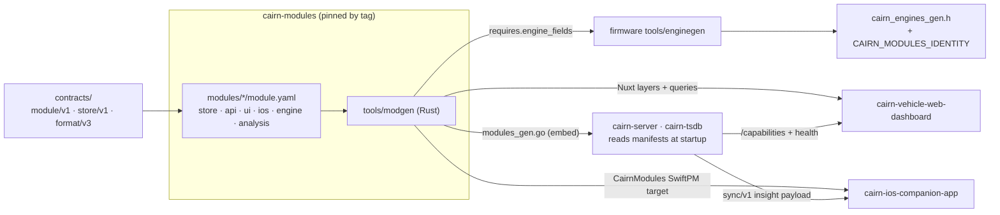

# Module system plan

**Status: plan, nothing implemented.** Written 2026-10-08. The decisions in
§2 were taken by the owner; everything else is a proposal.

Cairn's core is GPS logging management: capture a drive, seal it, get it off the
card against a verified receipt, decode it, keep it. Everything that *interprets*
the readings — boost, fuel economy, fuel mixture, driving style, speedometer
error, place kinds — is a separate concern that currently lives inside the core.
This plan separates them into **modules**, where one module is a single package
that carries its dongle, server, web and iOS parts together.

It is the delivery mechanism for an invariant that has been stated since the
rebuild and never built:

> **Adaptability** — a new vehicle, a new place kind or a new metric can be added
> by configuration or a documented extension point, not by editing core code.
> — [ROADMAP.md](../ROADMAP.md) "Reasons to use it, as acceptance tests"

## 1. Why now

Two half-module systems already exist and have drifted:

| Thing | Schema | Lives in | Owns |
|---|---|---|---|
| Firmware engine profiles | `cairn.engine/v1-draft` | `cairn-esp32-device-firmware/engines/*.yaml`, generated to C by `tools/enginegen` (Rust) | PIDs, formulas, cadence, wake/sleep, supply |
| Server analysis profiles | `cairn.engine-analysis/v0` | `cairn-vehicle-server/internal/engine/profiles/*.json` | labels, ranges, warn/check limits, thresholds |

They "share an engine id (bmw-n20) and nothing else" — the server package says so
in its own doc comment. `contracts/engine/v1`
([#20](https://github.com/ParkWardRR/cairn-driving-log-selfhosted/issues/20)) was
meant to settle this and is still unreleased. Everything else is scattered:

| Surface | Where boost/fuel/behaviour logic sits today |
|---|---|
| Server | `internal/tsdb/schema.go` — the `boost` table, `v_boost_curve`, `v_pulls`, `v_trim_map`, `v_metric_samples`, `v_health_stats`, `v_tune_effect`, `v_speed_agreement`; `internal/insight/health.go` (306 lines of per-metric sentences); `format/payload.go` `OBDExtended.BoostPSI()`/`Lambda()`; `internal/syncapi/local.go:346` serving health to the phone |
| Web | 6 of 12 pages (`boost.vue` 282, `economy.vue` 307, `fuel.vue` 376, `behavior.vue` 289, `calibration.vue` 166, `places.vue` 761); 10 `server/api/analytics/*` routes; `useFuelMath.ts`; `shared/utils/placeKinds.ts`; a `detail: true` flag hard-coded per nav item in `SidebarNav.vue`; a `PAGE_SCOPES` table in `useVehicle.ts`; **88 raw SQL strings** in `deploy/required-queries.json` |
| iOS | `PayloadDecoder.swift` `boostKpa`/`maf`/`hasBoost`; one hard-coded Boost gauge at `MainView.swift:325`; a literal table list at `TripSyncClient.swift:213` |
| Dongle | `engines/*.yaml` → `lib/cairn_engine/gen/cairn_engines_gen.h`; `src/sensors.cpp`, `src/pidtest.cpp` |

The cost is visible in three places. Adding a metric means editing a core view, a
core decode path, a core nav array, a core scope table and regenerating a
checked-in list of 88 SQL strings. Nothing states which metrics a given car can
even support, so pages render empty rather than absent. And `v_tune_effect` and
`v_metric_samples` already contain the giveaway — a hard-coded metric list,
`CROSS JOIN (VALUES ('boost_psi'), ('lambda'), ('ltft_pct'), ('stft_pct'))`,
sitting inside generic machinery that would otherwise be entirely reusable.

### This is not the retired plugin system

The MoonBit/WASM plugin system was retired on 2026-10-05, and arbitrary user
plugins are listed under "Deferred deliberately" because they "would need the raw
format, decoder ABI, receipt semantics and replay tooling to be stable first".
That judgement stands. The difference:

| Retired plugins | Modules |
|---|---|
| Shipped executable code (WASM) to a host | Ship **declarations only**: manifests, SQL, Swift/Vue source compiled in |
| Loaded at runtime by the server | Validated at startup; firmware and UI parts are generated and compiled |
| Third-party, arbitrary | First-party, in one audited repo, released by tag |
| Could touch the raw path | Cannot. A module never sees a sealed bundle, a key, a receipt or a prune decision |
| Invisible in the store digest | Folded into store identity and the reproducibility report (§7) |

A module is closer to a DuckDB view plus a Nuxt layer plus a YAML file than to a
plugin. No new interpreter is added on any host: derived values are **SQL
expressions evaluated by DuckDB**, and the only expression VM involved is the one
the firmware already has (`lib/cairn_engine/cairn_expr.c`).

## 2. Decisions taken

| Question | Decision |
|---|---|
| Where does a module package live? | **A sixth repository, `cairn-modules`.** One directory per module holding all four surfaces' parts. Consumed by pin, the way `contracts/` already is |
| What may a module change on the dongle? | **It declares the fields and candidate PIDs it needs; `enginegen` merges them** against the selected engine profile and fails the build on conflict. The firmware still records only what it was generated to record |
| Build-time or runtime? | **Declarative at runtime for server, web and iOS; code generation for the firmware.** No module ever ships executable code to a host |
| Which modules first? | All six: `boost`, `fuel-economy`, `fuel-mixture`, `driving-style`, `speedometer-check`, `places` |

## 3. The core / module line

**Core — never a module.** The raw path and the identity of a drive.

- `format/v3`: frames, segments, manifest, Merkle, receipts, update descriptors.
  Record *layouts* are core; a module never defines a byte.
- Identity and authority: devices, clients, vehicles, assignments, counters,
  keystore, revocation.
- Transport and custody: BLE offload, relay, uplink, intake, CAS, outbox, ledger,
  receipts, receipt-gated prune.
- Decode of raw fields into the base tables: `bundles`, `position`, `imu`, `obd`,
  `boost`, `status`, `transition`, `gap`, `tune`.
- Trip identity and shape: `v_boot_start`, `v_drive_summary`, `v_trip_summary`,
  `v_telemetry`, `v_vehicles`, `v_reproducibility`; route, stops, timeline.
- Generic analysis machinery: `v_metric_samples`, `v_health_stats`,
  `v_tune_effect` stay core — but **parameterised by the module-contributed
  metric list** instead of a literal `VALUES` clause.
- The shell: auth, nav, vehicle selector, trip list, device page, export/import.

**Modules — interpretation.** Six to start:

| Module | What it means |
|---|---|
| `boost` | Gauge pressure from MAP and baro; boost against RPM; WOT pull detection; peak boost |
| `fuel-economy` | MPG estimated from MAF, lambda and ethanol blend; per-trip economy; load-zone comparison |
| `fuel-mixture` | Short/long-term trims, lambda, the trim map, drift against the post-tune baseline, the health sentences |
| `driving-style` | IMU peaks, harsh-event counts, smoothness |
| `speedometer-check` | OBD speed against GNSS speed, with fix-type and staleness gating |
| `places` | Place kinds, their icons and keyword matching, the places page |

Three borderline calls, made explicitly:

- **`places` is a module, stop detection is core.** Finding that the car stopped
  is part of knowing the trip's shape. Deciding that the stop was a gym is
  interpretation, and "a new place kind" is named in the adaptability invariant.
- **Tune records are core, tune interpretation is `fuel-mixture`.** The vehicle
  registry is the one place a tune is written (`internal/vehicles/tunes.go`);
  "a tune is not a fault" is a rule about trims.
- **The `boost` table is core; `boost_psi` and `lambda_ratio` are module-owned
  derivations** that land in it (§5.1). The table name is grandfathered — it is
  pinned by `store/v1` and named in 88 committed queries, and renaming it buys
  nothing.

## 4. What a module is

```text
cairn-modules/
├── MODULES.md                    # the catalogue and its status table
├── contracts.lock                # which contracts this module set was built against
├── schema/
│   ├── module.schema.json        # cairn.module/v1, JSON Schema
│   └── SPEC.md                   # normative text: what a schema cannot state
├── modules/
│   └── boost/
│       ├── module.yaml           # the manifest (§5)
│       ├── README.md             # what it claims and where the numbers came from
│       ├── store/
│       │   ├── derive.yaml       # derived columns, as SQL expressions
│       │   ├── views.sql         # v_boost_curve, v_pulls
│       │   └── tests/*.yaml      # synthetic rows + the answer, known in advance
│       ├── api/
│       │   └── queries.yaml      # named, parameterised queries — no raw SQL in the webapp
│       ├── ui/                   # a Nuxt layer
│       │   ├── nuxt.config.ts
│       │   ├── module.ts         # nav entry, route, vehicle scope, icon
│       │   ├── pages/boost.vue
│       │   └── components/*.vue
│       ├── ios/
│       │   └── Boost.swift       # optional; metric descriptors are generated
│       ├── engine/
│       │   └── requires.yaml     # fields and candidate PIDs, for enginegen
│       └── analysis/
│           └── signals.yaml      # labels, ranges, warn/check limits, per engine id
├── tools/
│   └── modgen/                   # Rust, sibling of enginegen: validate + emit
└── vectors/                      # valid and negative manifests
```

`modgen` is deliberately a sibling of `enginegen`: same language, same shape
(`profile.rs`/`emit.rs`/`vectors.rs`), same rule that it enforces what JSON
Schema cannot — ids match directory names, SQL parses, required fields exist in
the store contract, no two modules claim the same derived column, a stub claims
nothing. `cairn-modules` depends on `contracts` and on **nothing else**, so the
dependency graph stays acyclic and module tests run against fixtures and a bare
DuckDB, never a live server.

## 5. The manifest

`cairn.module/v1`, sketched for `boost`:

```yaml
schema: cairn.module/v1
id: boost
version: 1
name: Boost and pulls
status: derived                   # stub | derived | verified, as engine profiles use it
sources:
  - "MAP minus barometric is gauge pressure; see format/v3 §4.10 and
     OBDExtended.BoostGaugeKPa in the server's reference implementation"

# What the store must already hold. Checked against contracts/store/v1/schema.json
# at validation time, so a typo fails modgen rather than a page.
requires:
  store:
    - boost.map_kpa
    - boost.baro_kpa
    - obd.rpm
    - obd.throttle_pct
  engine_fields:                  # from engine/v1's acquisition `field` enum
    - map_kpa
    - baro_kpa
    - rpm
    - throttle_pct

# Columns this module defines on core tables. SQL expressions, evaluated by
# DuckDB during load. Exactly one module may own a column.
derives:
  - column: boost.boost_psi
    type: DOUBLE
    expr: "CASE WHEN map_kpa < 255 AND baro_kpa > 0
                THEN (map_kpa - baro_kpa) * 0.1450377 END"
    note: "null, never zero, when MAP is saturated or baro is unknown"

# Metrics this module contributes to the generic machinery: v_metric_samples,
# v_health_stats, v_tune_effect, the trip-insight list, dashboard highlights.
metrics:
  - key: boost_psi
    label: Boost
    unit: psi
    sample: pull                  # one observation per WOT pull
    source_view: v_pulls
    source_column: peak_boost_psi
    trip_insight: { label: "Peak boost", agg: max, precision: 1 }
    dashboard_highlight: true
    ios_gauge: { field: boostKpa, label: Boost, unit: kPa, precision: 1 }

views: [store/views.sql]
queries: api/queries.yaml

ui:
  route: /boost
  nav: { label: Turbo, group: detail, order: 20, icon: lightning-bolt }
  vehicle_scope: single           # a boost curve pooled over two engines is nothing
```

### 5.1 Derived columns and the store contract

`boost_psi` and `lambda_ratio` are computed today in `internal/decode` from
`format.OBDExtended`, and they are declared columns of the `boost` table in
`store/v1`. Moving their *definition* into a module must not change the column,
its type or its values. So:

1. `modgen` emits the derivations; the tsdb loader applies them after the base
   insert, in module id order.
2. A migration test asserts the new path is **byte-identical** on the committed
   conformance vectors to what `internal/decode` produces now.
3. `store/v1`'s `schema.json` keeps the columns. The contract does not change;
   only who defines them does. The `OBDExtended.BoostPSI()` helper stays in
   `format` as the reference implementation the vectors pin — the module's SQL is
   tested against it, not instead of it.

If a module that owns a derived column is not loaded, the column exists and is
all-null, which is the same thing the store already says about a car that never
reported MAP. That keeps `store/v1` honest with any module set.

## 6. How each surface consumes a module



### Server (Go) — runtime manifests, DuckDB as the evaluator

`cairn-tsdb` reads validated manifests from `CAIRN_MODULES` at startup (default
`./.modules/modules`, mirroring how `CAIRN_CONTRACTS` already resolves), in
module id order:

1. Check each `requires.store` entry against the live catalogue — the same
   `information_schema` read `Capabilities()` already does in
   `internal/tsdb/contract.go`. A module whose requirements are missing is marked
   unavailable with a reason, not dropped silently.
2. Apply `derives` after the base insert.
3. Create module views from `store/views.sql`.
4. Generate `v_metric_samples` from the union of module `metrics` — replacing the
   hard-coded `VALUES ('boost_psi'), ('lambda'), ('ltft_pct'), ('stft_pct')`.
5. Register named queries from `api/queries.yaml`, and serve them at
   `POST /q/{module}/{name}` with bound parameters.

`internal/engine` and `internal/insight` merge with `analysis/signals.yaml`:
`engine.Profile` keeps its shape, but signals arrive from the module that owns
the metric rather than from a per-engine file listing everything. `insight`'s
three rules survive untouched — they are the best thing in the codebase and the
module system exists to give them more metrics to apply to:

- Unknown is not "ok".
- A thin sample is not a verdict.
- A tune is not a fault.

`internal/syncapi/local.go:346` keeps serving `insight.Health(profile, stats)`;
the findings list simply grows with the module set.

### Web (Nuxt) — a module's `ui/` is a Nuxt layer

Nuxt cannot load a `.vue` file at runtime and should not try. Each module's
`ui/` directory **is** a Nuxt layer, contributing pages, components and server
routes by convention. `modgen emit --nuxt` writes the generated `extends` array
and a module registry; `nuxt.config.ts` reads it.

This deletes three hard-coded tables:

| Today | After |
|---|---|
| `navItems` in `SidebarNav.vue`, with `detail: true` per entry | Built from each module's `ui.nav`, filtered by availability |
| `PAGE_SCOPES` in `useVehicle.ts` | Each module's `ui.vehicle_scope` |
| `deploy/required-queries.json`, 88 raw SQL strings | Generated from module `api/queries.yaml`; the deploy check still runs, now against a list nobody hand-maintains |

The 10 `server/api/analytics/*` routes become thin calls to named queries. Raw
SQL leaves the web repo entirely — which is the rule Phase 16 already states
("never from the browser directly and never via arbitrary SQL") carried one layer
further in.

### iOS (Swift) — generated descriptors, hand-written views only where needed

Swift cannot load code at runtime either. `modgen emit --swift` generates a
`CairnModules` SwiftPM target containing **data**: metric descriptors (field,
label, unit, precision) and trip-detail section descriptors. The live-telemetry
grid in `MainView.swift` iterates descriptors instead of hard-coding
`Metric("Boost", …)` at line 325. `PayloadDecoder` stays core — it decodes a
`format/v3` record, and record layouts are core.

The app's richer analysis arrives over `sync/v1` as the insight payload the
server already produces, so a new module usually needs **no iOS change at all**.
That is the point of making iOS's participation narrow: the phone is the uplink
and a reader, not a sixth place to reimplement a trim map.

`TripSyncClient.swift:213`'s literal table list comes from the snapshot's own
manifest instead.

### Dongle (C) — modules declare fields, `enginegen` still decides

`modgen` computes the union of `requires.engine_fields` across the selected
module set and hands it to `enginegen` as an input. `enginegen` keeps full
ownership of PIDs, formulas, cadence, cold slots and wake/sleep, and gains one
job: resolve required fields against the selected engine profile and **fail the
build** when a module needs a field the profile does not provide.

The existing `make` targets extend rather than change:

| Target | Gains |
|---|---|
| `engines-validate` | also validates `requires.engine_fields` against the module set |
| `engines-gen` / `engines-check` | the generated header carries `CAIRN_MODULES_IDENTITY` |
| `firmware ENGINES=...` | accepts `MODULES=...` |

A module cannot make the dongle poll a PID that the engine profile does not
declare. It can only say "I need `map_kpa`" and be told no. With one dongle and
no spare, that asymmetry is the whole safety argument: the failure mode is a
build error on the Mac, never a changed polling loop in the car.

## 7. Capability gating, identity, reproducibility

### Three gates, in order

| Gate | When | Asks | Answer when it fails |
|---|---|---|---|
| **Engine** | build/flash | does the engine profile provide the fields? | `enginegen` fails the build |
| **Data** | runtime, per vehicle | does *this car* have rows? | module hidden — not an empty page |
| **Knowledge** | runtime, per engine | are limits known for this engine? | readings shown, verdicts withheld |

The data gate extends `GET /capabilities`, which already reports the live
catalogue rather than a list someone last edited, with a per-vehicle per-module
block: available / unavailable, the reason, and the sample count. The web shell
reads it once (next to the existing `loadVehicles()` prefetch) and builds the nav
from it. A B58 with a stub profile therefore shows its boost curve and says
nothing about whether the number is normal — which is what `insight` already
does for single metrics, applied to whole modules.

### Identity

A module set changes what a derived store contains, so by invariant 5 —
*anything derived is disposable and must prove it reproduces* — it must be part
of that store's identity. The firmware already solved this:

```
CAIRN_ENGINES_IDENTITY_STRING "engines=bmw-b58@1/930622f33a7bccaa,bmw-n20@1/a4b59069372600e8 build=233059c7cc9e4b3e"
```

Mirror it exactly. Each module hashes to a content digest; the sorted
`id@version/digest` list becomes `CAIRN_MODULES_IDENTITY`, which is:

- folded into the tsdb store contract digest and reported by `GET /status`;
- a column in `v_reproducibility`, so a rebuild under a different module set is
  **visibly** a different rebuild rather than a silent mismatch;
- compiled into the firmware header and reported in `DEVICE_INFO`;
- recorded in each repo's `modules.lock` next to `contracts.lock`.

### Not negotiable

A module never: sees plaintext bundle bytes, holds or derives a key, influences
whether a receipt verifies, influences a prune, or adds a network listener. The
threat model needs one new section saying so, and `modgen` enforces it
structurally — there is no manifest field through which any of it could be asked
for.

## 8. Migration

Per-module inventory. Every path is real and was read while writing this.

| Module | Server | Web | iOS | Dongle |
|---|---|---|---|---|
| `boost` | `v_boost_curve`, `v_pulls`; `OBDExtended.BoostGaugeKPa`/`BoostPSI`; `boost_psi` derivation; `insight.Boost` | `boost.vue` (282); `analytics/boost-curve`, `boost-detail` (41), `pulls`; peak-boost in `trips/[bootId]/insights` and `dashboard/highlights` | `boostKpa`/`hasBoost` descriptors; `MainView.swift:325` | `map_kpa`, `baro_kpa` |
| `fuel-economy` | — (all derivation is client-side today) | `economy.vue` (307); `analytics/fuel-economy` (65); `useFuelMath.ts` (37); `trips/[bootId]/fuel`; ethanol blend in `stores/ui.ts` | — | `maf_cgps` |
| `fuel-mixture` | `v_trim_map`; the metric list behind `v_metric_samples`/`v_health_stats`/`v_tune_effect`; `insight.Lambda/LTFT/STFT`; `lambda_ratio` derivation; `Generic()` profile | `fuel.vue` (376); `analytics/trim-map` (27), `fuel-health` (40); avg-lambda in `insights` and `highlights` | health findings over `sync/v1` — no change | `lambda_e4`, `fuel_trim_short_pct`, `fuel_trim_long_pct` |
| `driving-style` | IMU peak/event aggregation | `behavior.vue` (289); `analytics/imu` (18) | — | — (IMU is core capture) |
| `speedometer-check` | `v_speed_agreement` | `calibration.vue` (166); `analytics/speed-agreement` | — | `speed_kph` |
| `places` | — | `places.vue` (761); `places.get`, `places/saved/*`; `shared/utils/placeKinds.ts`; `docs/places.md` | — | — |

Stays core: `v_gnss_sources` (GNSS provenance — internal versus phone fix),
`v_boot_start`, `v_telemetry`, `v_drive_summary`, `v_trip_summary`, the `boost`
table itself, `PayloadDecoder`, `internal/vehicles/tunes.go`.

`analytics.vue` (230, "Engine details") stops being a page that queries things
and becomes a shell page that renders whatever cards the available modules
contribute.

### Phases

Each phase ends green and deployed; nothing is half-migrated across a release.

**M1 — the contract. Landed 2026-10-08, as a draft; not yet tagged.**
[`contracts/engine/v1`](../contracts/engine/v1/) absorbed the two engine-profile
drafts as the *acquisition* and *analysis* halves of one document, closing the
drift noted in §1 and the substance of
[#20](https://github.com/ParkWardRR/cairn-driving-log-selfhosted/issues/20); its
`field` enum is now the shared capture vocabulary.
[`contracts/module/v1`](../contracts/module/v1/) followed: the manifest and
named-query schemas, the normative spec, and 39 vectors.

Both are **draft**, and both keep their in-document identifiers (`-draft`, `v0`),
so no producer or consumer had to change — promoting a directory makes a contract
citable, promoting an identifier claims the bytes are settled, and only the first
was true. Each carries its own release gate; `contracts-v0.4.0` is a maintainer's
call, not CI's.

Two checkers came with them, both in the contracts repository:
`tools/enginelang` is a third, independent implementation of the formula language
written from the spec rather than ported from the firmware's Rust — it passed all
105 expression vectors on its first complete run, which is what the draft spec
named as its release gate. `tools/modulecheck` validates manifests, and its two
most valuable checks need the whole contracts tree: `requires.store` resolved
against `store/v1`, and the capture-field enum compared with `engine/v1`'s.

*No code moved. Nothing broke.*

**M2 — the repo and the generator.** Create `cairn-modules`. Port `enginegen`'s
shape into `modgen`: validate, hash, emit Go/Nuxt/Swift/field-set artefacts.
`modules/boost/` exists as a manifest and `README.md` with **no implementation**
— the vector case that proves a declaration-only module validates and generates
nothing. CI: `modgen` tests, schema conformance, DuckDB-only store tests.

**M3 — server, one module.** `cairn-tsdb` loads manifests, applies derivations,
creates module views, generates `v_metric_samples`, serves named queries.
`boost` becomes the first real module. The gate is the byte-identical
derivation test (§5.1) plus the server's existing required gate,
`tests/interop/run.sh`. `GET /capabilities` gains the per-vehicle module block.
Deploy; confirm the dashboard is unchanged.

**M4 — web, one module.** `boost`'s `ui/` becomes a Nuxt layer; nav and
`PAGE_SCOPES` are generated; `required-queries.json` is generated for the boost
queries and hand-maintained for the rest. Acceptance tests in
`tests/acceptance/routes.acceptance.test.ts` must pass unchanged — the route
still exists, it is just no longer declared in the dashboard repo.

**M5 — the rest of the six.** `fuel-mixture`, `fuel-economy`,
`speedometer-check`, `driving-style`, `places`, in that order: mixture first
because it is the one that exercises the generic machinery hardest, places last
because it is the largest page and touches no engine field. By the end,
`required-queries.json` is fully generated and no raw SQL remains in the web
repo.

**M6 — iOS and the dongle.** `CairnModules` SwiftPM target; `MainView` iterates
descriptors; `TripSyncClient` reads the snapshot manifest. `modgen` feeds
`requires.engine_fields` to `enginegen`; `CAIRN_MODULES_IDENTITY` lands in the
generated header and in `DEVICE_INFO`. **Flash only after a host build and the
emulator conformance matrix pass** — one dongle, no spare.

**M7 — close the invariant.** Add a module from scratch, touching no core repo,
and record how long it took. Until that has happened the adaptability acceptance
test is not met, whatever the architecture diagram says.

## 9. What this buys, and what it does not

Closes: the engine-profile drift and `contracts/engine/v1`; the hand-maintained
88-query manifest; the empty-page problem (a module with no data is absent, not
blank); the adaptability acceptance test; the hard-coded metric list inside
otherwise generic health machinery.

Does **not** do: third-party or user-authored modules (still deferred, for the
reasons already recorded); runtime-loadable code of any kind; anything to the raw
path, the format, the receipt chain or the prune rule; a sixth place to
reimplement analysis on the phone.

## 10. Risks

| Risk | Mitigation |
|---|---|
| A fifth pin to keep in sync across five repos | `modules.lock` next to `contracts.lock`, same tooling, same `contractcheck`-style CI gate. The cost is real and was accepted with the sixth-repo decision |
| Reproducibility silently breaks when module sets differ | Module identity folded into the store digest and `v_reproducibility` (§7). Build this in M3, not later |
| Derived columns change value during migration | Byte-identical test against the committed conformance vectors; `format`'s helper stays as the reference |
| Six Nuxt layers slow the build or collide on component names | Prefix components per module in the generated layer config; measure build time at M4 and stop if it regresses |
| Scope creep — "everything is a module" | §3 is the line. The raw path is never a module. If a change needs a new manifest field that touches custody, the answer is no |
| One dongle, no spare | The firmware third is last (M6), is a build-time failure by construction, and flashes only after host build plus emulator matrix |
| `places` is the largest migration and the least module-shaped | Last in M5, and it is allowed to stay a module that contributes no metric and no engine field — the vector case from M2 |

## Open questions

1. Does `cairn-modules` vendor `contracts/` or fetch it? Fetching is consistent;
   vendoring makes `modgen` hermetic. Decide at M2.
2. `v_metric_samples` is generated from module metrics — does a module get to
   define its own sampling unit (per-pull, per-boot, per-trip), or is that a
   closed enum? Closed is safer; `boost` needs per-pull and the trims need
   per-boot, so two is already the minimum.
3. Should `insight`'s sentence templates move into modules? They are the most
   careful prose in the project and the most likely thing to be degraded by
   templating. Leaning: the *limits* move, the sentences stay in `internal/insight`.
